# 📚 backbone-rest — Technical Documentation

> **PRX Backbone REST** · Backoffice Management Service · v0.0.2
>
> *Java 21 · Spring Boot 3.5.8 · OAuth2 / Keycloak · PostgreSQL · AWS S3 / Cloudflare R2*

---

## Table of Contents

1. [Project Overview](#1-project-overview)
2. [Technology Stack](#2-technology-stack)
3. [Architecture Overview](#3-architecture-overview)
4. [Domain Module Layout](#4-domain-module-layout)
5. [API Reference](#5-api-reference)
6. [Security Architecture](#6-security-architecture)
7. [Data Flow](#7-data-flow)
8. [Configuration & Environment Variables](#8-configuration--environment-variables)
9. [External Integrations](#9-external-integrations)
10. [Build & Quality Gates](#10-build--quality-gates)
11. [Containerization](#11-containerization)
12. [Testing Strategy](#12-testing-strategy)
13. [Key Source Files](#13-key-source-files)

---

## 1. Project Overview

`backbone-rest` is the central **backoffice REST service** of the PRX platform. It manages core system entities — users, roles, features, people, contacts, applications, and profile images — exposing a versioned API surface under `/api/v1/*`.

| Property | Value |
|---|---|
| **Name** | PRX Backbone REST |
| **Description** | Management service for system entities |
| **Group ID** | `com.prx.backbone` |
| **Artifact ID** | `backbone-rest` |
| **Version** | `0.0.2` |
| **Package Root** | `com.prx.backoffice` |
| **API Base Path** | `/api/v1/*` |
| **Bootstrap Class** | `PrxBackofficeRestApplication` |

---

## 2. Technology Stack

### Runtime

| Layer | Technology | Version |
|---|---|---|
| Language | Java | 21 |
| Framework | Spring Boot | 3.5.8 |
| Web | Spring MVC + Jersey | Spring Boot managed |
| Security | Spring Security + OAuth2 Resource Server | Spring Boot managed |
| Persistence | Spring Data JPA / Hibernate | Spring Boot managed |
| Object Mapping | MapStruct | 1.6.3 |
| JWT (Session) | JJWT (io.jsonwebtoken) | 0.12.3 |
| OpenAPI Docs | springdoc-openapi-starter-webmvc-ui | 2.6.0 |
| Cloud Config | Spring Cloud Config + Bootstrap | 2025.0.1 |
| Secret Management | Spring Cloud Vault | Spring Cloud managed |
| Service Discovery | Netflix Eureka Client | Spring Cloud managed |
| Object Storage | AWS SDK v2 (S3 API) | 2.21.0 |
| JSON | Jackson + Gson + org.json | Spring Boot managed |
| DB Driver | PostgreSQL JDBC | 42.7.7 |

### Build & Quality

| Tool | Version | Purpose |
|---|---|---|
| Maven | System | Build tool |
| maven-compiler-plugin | 3.14.1 | Java 21 compilation + MapStruct AP |
| maven-surefire-plugin | 3.5.2 | Test runner |
| maven-pmd-plugin | 3.28.0 | Static analysis (fails build on violations) |
| jacoco-maven-plugin | 0.8.14 | Code coverage gate |
| springdoc-openapi-maven-plugin | 1.4 | OpenAPI spec generation at integration-test phase |
| SonarCloud | — | External quality analysis |

---

## 3. Architecture Overview

### High-Level Architecture

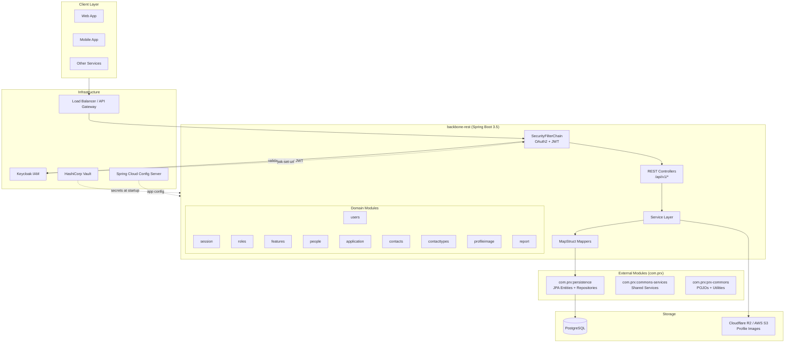

### Layered Request Flow

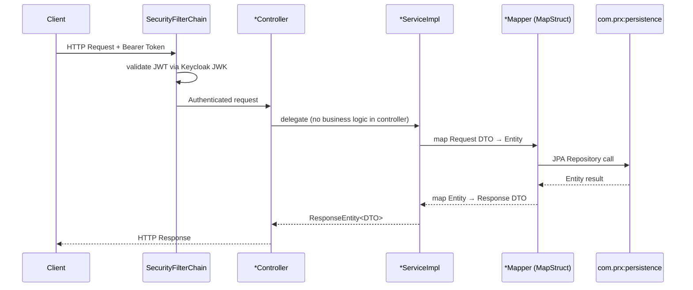

---

## 4. Domain Module Layout

Each business domain is organized in an identical three-layer structure:

```
src/main/java/com/prx/backoffice/
├── v1/
│   ├── <domain>/
│   │   ├── api/
│   │   │   ├── controller/
│   │   │   │   ├── <Domain>Api.java        ← Interface: endpoint mappings + OpenAPI annotations
│   │   │   │   └── <Domain>Controller.java ← Implementation: delegates to service
│   │   │   └── to/                         ← Request / Response Transfer Objects
│   │   ├── mapper/
│   │   │   └── <Domain>Mapper.java         ← MapStruct interface
│   │   └── service/
│   │       ├── <Domain>Service.java        ← Service interface
│   │       └── <Domain>ServiceImpl.java    ← Implementation (returns ResponseEntity<?>)
```

### Interface-First Controller Pattern

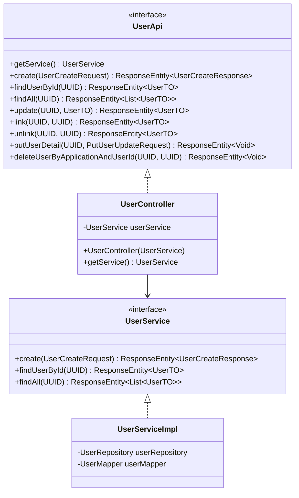

> **Rule**: `*Api` carries `@RequestMapping` + OpenAPI annotations. `*Controller` only overrides and delegates.

---

## 5. API Reference

### Endpoint Map

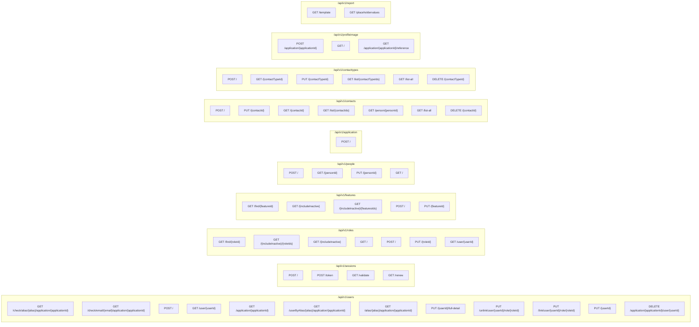

### Detailed Endpoint Table

#### Users (`/api/v1/users`)

| Method | Path | Description | Response |
|---|---|---|---|
| `GET` | `/check/alias/{alias}/application/{applicationId}` | Checks if user alias is available | `204` / `404` |
| `GET` | `/check/email/{email}/application/{applicationId}` | Checks if user email is available | `204` / `404` |
| `POST` | `/` | Creates a new user | `201 UserCreateResponse` |
| `GET` | `/user/{userId}` | Finds user by UUID | `200 UserTO` |
| `GET` | `/application/{applicationId}` | Lists all users for an application | `200 List<UserTO>` |
| `GET` | `/userByAlias/{alias}/application/{applicationId}` | Finds user by alias | `200 UserTO` |
| `GET` | `/alias/{alias}/application/{applicationId}` | Finds user alias by alias | `200 UserAliasTO` |
| `PUT` | `/{userId}/full-detail` | Full user update | `200 UserTO` |
| `PUT` | `/unlink/user/{userId}/role/{roleId}` | Unlinks role from user | `200 UserTO` |
| `PUT` | `/link/user/{userId}/role/{roleId}` | Links role to user | `200 UserTO` |
| `PUT` | `/{userId}` | Partial user detail update | `202` / `406` |
| `DELETE` | `/application/{applicationId}/user/{userId}` | Deletes user | `204` / `404` |

#### Sessions (`/api/v1/sessions`)

| Method | Path | Description | Response |
|---|---|---|---|
| `POST` | `/` | Generate session token by alias/password | `200 SessionResponse` |
| `POST` | `/token` | Generate session token by email/password | `200 SessionResponse` |
| `GET` | `/validate` | Validate session token (header: `session-token`) | `200 Boolean` |
| `GET` | `/renew` | Renew session token (header: `session-token`) | `200 SessionResponse` |

#### Roles (`/api/v1/roles`)

| Method | Path | Description | Response |
|---|---|---|---|
| `GET` | `/find/{roleId}` | Find role by ID | `200 Role` |
| `GET` | `/{includeInactive}/{roleIds}` | List roles by status + IDs | `200 List<Role>` |
| `GET` | `/{includeInactive}` | List roles by status | `200 List<Role>` |
| `GET` | `/` | List all roles | `200 List<Role>` |
| `POST` | `/` | Create role | `200 Role` |
| `PUT` | `/{roleId}` | Update role | `200 Role` |
| `GET` | `/user/{userId}` | List roles by user | `200 List<Role>` |

#### Features (`/api/v1/features`)

| Method | Path | Description | Response |
|---|---|---|---|
| `GET` | `/find/{featureId}` | Find feature by ID | `201 Feature` |
| `GET` | `/{includeInactive}` | List features by status | `200 List<Feature>` |
| `GET` | `/{includeInactive}/{featuresIds}` | List features by status + IDs | `200 List<Feature>` |
| `POST` | `/` | Create feature | `201 Feature` |
| `PUT` | `/{featureId}` | Update feature | `202 Feature` |

#### People (`/api/v1/people`)

| Method | Path | Description | Response |
|---|---|---|---|
| `POST` | `/` | Create person | `200 Person` |
| `GET` | `/{personId}` | Find person by ID | `200 Person` |
| `PUT` | `/{personId}` | Update person | `200 Person` |
| `GET` | `/` | List all people | `200 List<Person>` |

#### Application (`/api/v1/application`)

| Method | Path | Description | Response |
|---|---|---|---|
| `POST` | `/` | Create application | `201 Application` |

#### Contacts (`/api/v1/contacts`)

| Method | Path | Description | Response |
|---|---|---|---|
| `POST` | `/` | Create contact | `200 Contact` |
| `PUT` | `/{contactId}` | Update contact | `200 Contact` |
| `GET` | `/{contactId}` | Find contact by ID | `200 Contact` |
| `GET` | `/list/{contactIds}` | List contacts by IDs | `200 List<Contact>` |
| `GET` | `/person/{personId}` | List contacts by person | `200 List<Contact>` |
| `GET` | `/list-all` | List all contacts | `501` (not implemented) |
| `DELETE` | `/{contactId}` | Delete contact | `200 String` |

#### Contact Types (`/api/v1/contacttypes`)

| Method | Path | Description | Response |
|---|---|---|---|
| `POST` | `/` | Create contact type | `200 ContactType` |
| `GET` | `/{contactTypeId}` | Find contact type by ID | `200 ContactType` |
| `PUT` | `/{contactTypeId}` | Update contact type | `200` / `404` / `400` |
| `GET` | `/list/{contactTypeIds}` | List contact types by IDs | `200 List<ContactType>` |
| `GET` | `/list-all` | List all contact types | `200 List<ContactType>` |
| `DELETE` | `/{contactTypeId}` | Delete contact type | `200 ContactType` |

#### Profile Image (`/api/v1/profileimage`)

| Method | Path | Description | Response |
|---|---|---|---|
| `POST` | `/application/{applicationId}` | Upload profile image | `201 PostProfileImageResponse` |
| `GET` | `/` | Get profile image bytes | `200 byte[]` |
| `GET` | `/application/{applicationId}/reference` | Get profile image reference | `200 GetProfileImageReferenceResponse` |

#### Report (`/api/v1/report`)

| Method | Path | Description | Response |
|---|---|---|---|
| `GET` | `/template` | Generate Word document from template | `200 Resource (octet-stream)` |
| `GET` | `/placeholdervalues` | Extract placeholder values from template | `200 List<String>` |

---

## 6. Security Architecture

### Overview

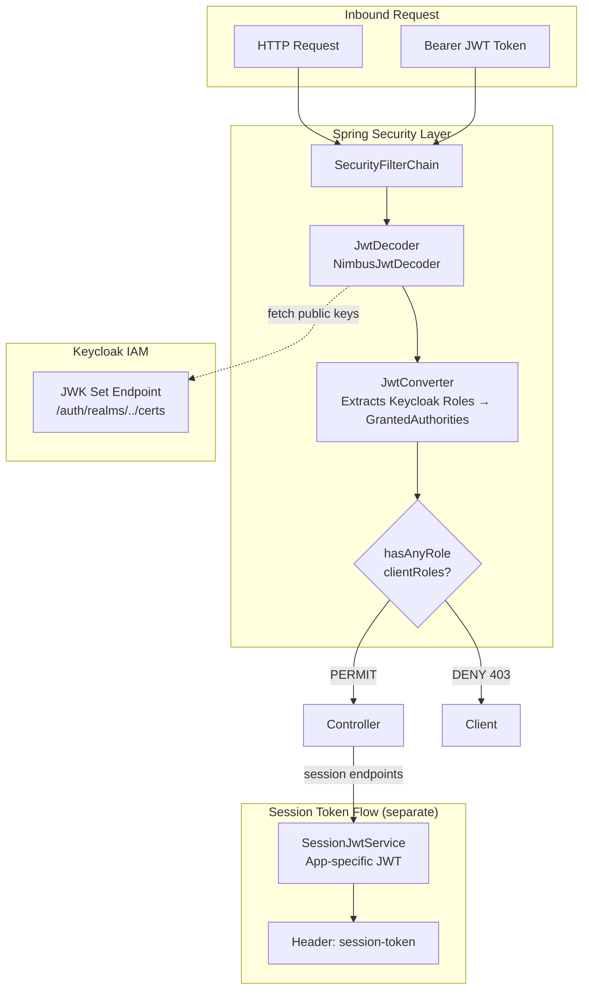

### Security Configuration (`SecurityConfig.java`)

| Rule | Detail |
|---|---|
| **Session policy** | `STATELESS` — no server-side sessions |
| **Swagger endpoints** | `PERMIT_ALL` (`/swagger-ui/**`, `/v3/api-docs/**`) |
| **GET /v1/\*\*** | Requires role membership in `app.clientRoles` (default: `backbone-rest-client`) |
| **All other requests** | `authenticated()` |
| **OAuth2 resource server** | `NimbusJwtDecoder` — validates against Keycloak JWK Set URI |
| **SSL** | TLS 1.3 enforced; JKS keystore + truststore loaded at startup |

### JWT Converter (`JwtConverter.java`)

Converts Keycloak JWTs → Spring Security `AbstractAuthenticationToken`. Extracts realm roles and client-specific roles from the `realm_access` and `resource_access` claims and maps them to `GrantedAuthority` objects with the `ROLE_` prefix.

### Session JWT Flow (`SessionJwtService` / `SessionServiceImpl`)

Separate from OAuth2 validation. Used by session endpoints to mint and validate short-lived application-specific JWTs.

| Constant | Value |
|---|---|
| `SESSION_TOKEN_KEY` | `"session-token"` |
| Token claim `"type"` | `"session-token"` |

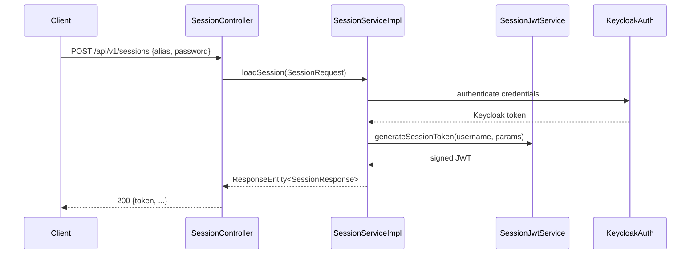

---

## 7. Data Flow

### Typical CRUD Request

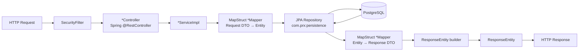

### MapStruct Mappers

| Domain | Mapper | Key Mappings |
|---|---|---|
| `users` | `UserMapper` | `UserEntity ↔ UserTO`, `UserCreateRequest → UserEntity` |
| `users` | `ApplicationRoleUserMapper` | `ApplicationRoleUser ↔ DTO` |
| `session` | `UserAliasMapper` | `UserAlias ↔ UserAliasTO` |
| `roles` | `RoleMapper` | `RoleEntity ↔ Role (POJO)` |
| `features` | `FeatureMapper` | `FeatureEntity ↔ Feature`, custom expressions via `FeatureMapperUtil` |
| `people` | `PersonMapper` | `PersonEntity ↔ Person (POJO)` |
| `application` | `ApplicationMapper` | `ApplicationEntity ↔ Application (POJO)` |
| `contacts` | `ContactMapper` | `ContactEntity ↔ Contact (POJO)` |
| `contacttypes` | `ContactTypeMapper` | `ContactTypeEntity ↔ ContactType (POJO)` |

---

## 8. Configuration & Environment Variables

### `bootstrap.yml` Structure

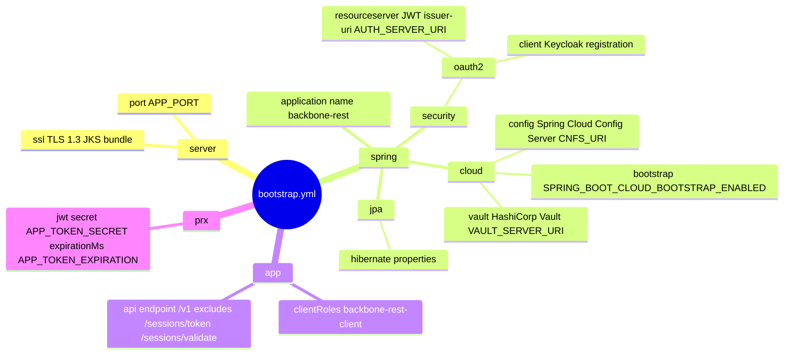

### Required Environment Variables

| Variable | Purpose | Example / Default |
|---|---|---|
| `APP_PORT` | Server port | `8082` |
| `APP_TOKEN_SECRET` | Session JWT signing secret | *(secret)* |
| `APP_TOKEN_EXPIRATION` | Session JWT expiry (ms) | `3600000` |
| `AUTH_SERVER_URI` | Keycloak realm issuer URI | `https://<keycloak>/realms/<realm>` |
| `AUTH_CERT_URI` | Keycloak JWK cert path | `/protocol/openid-connect/certs` |
| `AUTH_CLIENT_ID` | Keycloak client ID | `backbone-rest` |
| `AUTH_CLIENT_SECRET` | Keycloak client secret | *(secret)* |
| `SSL_KEYSTORE_LOCATION` | JKS keystore classpath location | `keystore.jks` |
| `SSL_KEYSTORE_PASSWORD` | Keystore password | *(secret)* |
| `SSL_KEYSTORE_TYPE` | Keystore type | `JKS` |
| `SSL_TRUSTSTORE_LOCATION` | Truststore classpath location | `keystore.jks` |
| `SSL_TRUSTSTORE_PASSWORD` | Truststore password | *(secret)* |
| `SSL_TRUSTSTORE_TYPE` | Truststore type | `JKS` |
| `VAULT_ENABLED` | Enable HashiCorp Vault | `true` |
| `VAULT_TOKEN` | Vault access token | *(secret)* |
| `VAULT_SERVER_URI` | Vault server URI | `http://prx-qa.vault.tst:8200` |
| `CNFS_URI` | Config Server URI | `https://prx-qa.config-server.tst` |
| `CNFS_PORT` | Config Server port | `443` |
| `SPRING_BOOT_PROFILE_ACTIVE` | Active Spring profile | `remote-supabase` |
| `SPRING_CLOUD_CONFIG_LABEL` | Config label/branch | `Develop` |
| `SPRING_BOOT_CLOUD_BOOTSTRAP_ENABLED` | Enable cloud bootstrap | `true` |
| `LOGGING_TRACE_ENABLED` | Enable trace logging | `true` |
| `REPSY_ACCOUNT_USER` | Repsy registry username | *(secret)* |
| `REPSY_ACCOUNT_PASSWORD` | Repsy registry password | *(secret)* |

---

## 9. External Integrations

### PRX Private Modules (Repsy Registry)

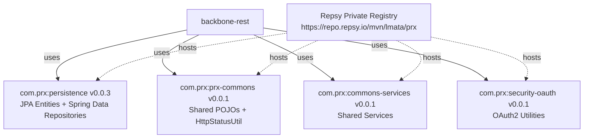

> **Module boundary rule**: `backbone-rest` never creates or modifies JPA entity classes. All entities live in `com.prx:persistence`.

### Cloudflare R2 / AWS S3 (Profile Images)

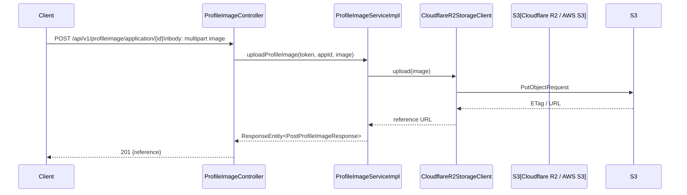

### HashiCorp Vault

Runtime secrets (database passwords, JWT secrets, OAuth credentials) are sourced from Vault at startup via Spring Cloud Vault. The KV backend is `PRX`, with a default context matching `app.name` (`backbone-rest`).

### Spring Cloud Config Server

Non-secret application configuration is served by the Spring Cloud Config Server at `${CNFS_URI}`. Profile and label filtering allows environment-specific configs (`SPRING_BOOT_PROFILE_ACTIVE`, `SPRING_CLOUD_CONFIG_LABEL`).

### Netflix Eureka

The application registers itself with Eureka for service discovery within the PRX platform.

---

## 10. Build & Quality Gates

### Build Lifecycle

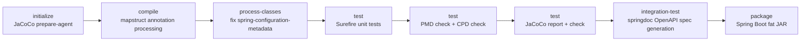

### Quick Commands

```bash
# Fast compile check (MapStruct AP included)
mvn -DskipTests compile

# Full gate: unit tests + PMD + JaCoCo
mvn test

# Focused test class
mvn -Dtest=UserServiceImplTest test

# Package fat JAR → target/backbone-rest.jar
mvn -DskipTests package
```

### PMD Configuration (`ruleset.xml`)

- Bound to `test` phase; build **fails** on any violation (`failOnViolation=true`, `failurePriority=5`)
- CPD (copy-paste detection) also checked via `cpd-check` goal
- Excluded from checks: `*Application.*`, `exceptions`, `util`, `config`, `controller`, `mapper`, `security`, `producer`, `interceptor` packages

### JaCoCo Coverage Gates

| Element | Counter | Metric | Minimum |
|---|---|---|---|
| `PACKAGE` | `LINE` | `COVEREDRATIO` | `0` (currently permissive; threshold configurable) |
| `PACKAGE` | `BRANCH` | `COVEREDRATIO` | `0` (currently permissive) |

> Coverage reports are generated under `target/site/jacoco/`. SonarCloud integration reads from `site/jacoco/jacoco.xml`.

### Repsy Private Registry

```xml
<!-- settings.xml / ci_settings.xml -->
<server>
  <id>PRX-Repsy</id>
  <username>${REPSY_ACCOUNT_USER}</username>
  <password>${REPSY_ACCOUNT_PASSWORD}</password>
</server>
```

---

## 11. Containerization

### Dockerfile Summary

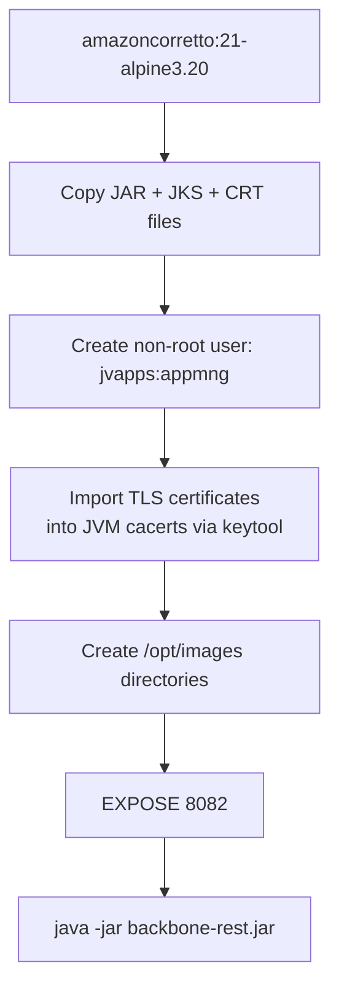

| Property | Value |
|---|---|
| **Base image** | `amazoncorretto:21-alpine3.20` |
| **Exposed port** | `8082` |
| **Runtime user** | `jvapps` (group: `appmng`) — non-root |
| **Working directory** | `/usr/local/runme` |
| **JAR name** | `backbone-rest.jar` |
| **Certificates imported** | Auth server, Config server, Service monitor, Wildcard |
| **Image directory** | `/opt/images` (for profile images) |

### Running the Container

```bash
docker run -d \
  -p 8082:8082 \
  -e APP_PORT=8082 \
  -e AUTH_SERVER_URI=https://... \
  -e VAULT_ENABLED=true \
  -e VAULT_TOKEN=... \
  # ... (all required env vars)
  backbone-rest:latest
```

---

## 12. Testing Strategy

### Test Structure

```
src/test/java/com/prx/backoffice/
├── MockLoaderBase.java                   ← Shared mock loader base class
├── PrxBackofficeRestApplicationTest.java ← Spring Boot smoke test
├── config/
│   └── SecurityKeycloakTestConfig.java   ← Security test configuration
├── util/                                 ← Unit tests for utilities
├── v1/
│   ├── <domain>/
│   │   ├── api/to/                       ← DTO unit tests
│   │   ├── service/
│   │   │   ├── <Domain>ServiceTest.java        ← Interface contract tests
│   │   │   └── <Domain>ServiceImplTest.java    ← Implementation unit tests (Mockito)
│   │   └── api/controller/
│   │       └── <Domain>ApiTest.java            ← Controller slice tests
│   └── util/
│       ├── FeatureTemplateTest.java      ← Test data builders
│       ├── PersonTemplateTest.java
│       └── RoleTemplateTest.java
```

### Frameworks & Tools

| Tool | Purpose |
|---|---|
| **JUnit 5.14.1** | Test lifecycle, assertions |
| **Mockito 5.21.0** | Mocking service/repository dependencies |
| **Spring `@WebMvcTest`** | Controller slice tests (security filter included) |
| **`SecurityKeycloakTestConfig`** | Injects test-safe security beans |
| **JaCoCo** | Coverage instrumentation and reporting |

### Test Coverage Domains

| Domain | Service Test | Impl Test | Controller Test | DTO Test |
|---|---|---|---|---|
| users | ✅ | ✅ | ✅ | ✅ |
| session | ✅ | ✅ | — | ✅ |
| roles | ✅ | ✅ | — | ✅ |
| features | ✅ | ✅ | — | ✅ |
| people | ✅ | ✅ | — | ✅ |
| application | ✅ | ✅ | ✅ | — |
| contacts | ✅ | ✅ | — | ✅ |
| contacttypes | ✅ | ✅ | — | — |
| profileimage | — | ✅ | — | — |
| report | — | — | — | — |

---

## 13. Key Source Files

### Production Sources

| File | Path | Purpose |
|---|---|---|
| `PrxBackofficeRestApplication` | `com/prx/backoffice/` | Spring Boot entry point — component scan for `com.prx` |
| `SecurityConfig` | `security/config/` | Security filter chain, JWT decoder, RestTemplate with SSL |
| `JwtConverter` | `security/jwt/` | Keycloak JWT → Spring `GrantedAuthority` conversion |
| `SessionJwtService` | `v1/session/services/` | App-specific JWT interface; `SESSION_TOKEN_KEY` constant |
| `SessionServiceImpl` | `v1/session/services/` | Credential validation + session token minting |
| `UserApi` | `v1/users/api/controller/` | All user endpoint definitions + OpenAPI annotations |
| `UserController` | `v1/users/api/controller/` | User endpoint implementation; delegates to `UserService` |
| `UserServiceImpl` | `v1/users/service/` | User business logic; returns `ResponseEntity<?>` |
| `UserMapper` | `v1/users/mapper/` | MapStruct mapper: `UserEntity ↔ UserTO` |
| `CloudflareR2StorageClient` | `v1/profileimage/client/` | AWS SDK v2 S3 client for Cloudflare R2 |
| `DataSourceSslConfig` | `config/` | JPA datasource SSL configuration |
| `MessageUtil` | `util/` | User-facing message lookup by key |
| `KeystoreUtil` | `util/` | SSL bundle construction from keystore properties |
| `JwtUtil` | `util/` | JWT utility helpers |
| `LogDefault` | `aop/` | Custom annotation for AOP-based method logging |
| `CloudflareR2Properties` | `property/` | `@ConfigurationProperties` for R2 storage |
| `SecurityProperties` | `property/` | `@ConfigurationProperties` for SSL/security |

### Configuration Files

| File | Path | Purpose |
|---|---|---|
| `bootstrap.yml` | `src/main/resources/` | All runtime configuration (SSL, OAuth, Vault, Config Server, JPA) |
| `default.env` | Root | Default non-secret environment variable values |
| `ruleset.xml` | Root | PMD ruleset — enforced at `test` phase |
| `ci_settings.xml` | Root | Maven `settings.xml` for CI/CD (Repsy credentials via env vars) |
| `pom.xml` | Root | Maven build descriptor, dependency management, plugin config |
| `Dockerfile` | Root | Container image definition (Amazon Corretto 21 Alpine) |
| `backbone_rest-openapi.yaml` | `src/main/resources/META-INF/` | OpenAPI 3.x API contract artifact |

---

## Appendix: Cross-Cutting Concerns

### AOP — Logging

`@LogDefault` annotation can be applied to methods, fields, and parameters to trigger structured logging. Configured with a `LogActionKey` enum and a `MessageType` enum for consistent log message formatting.

### Message Internationalization

`MessageUtil` provides user-facing messages via message keys defined in:
- `UserMessageKey` — user-related messages
- `RoleMessageKey` — role-related messages
- `FeatureMessageKey` — feature-related messages
- `PersonMessageKey` — person-related messages
- `RoleFeatureMessageKey` — role-feature link messages
- `ApplicationMessageKey` — application-related messages
- `BackboneMessage` — generic backbone messages

### CORS

All controllers declare `@CrossOrigin(origins = "*")`. Production traffic should restrict origins at the API Gateway / Load Balancer level.

### OpenAPI / Swagger UI

Available at runtime (non-production) at:
- **Swagger UI**: `https://<host>:<port>/swagger-ui/index.html`
- **API Docs JSON**: `https://<host>:<port>/v3/api-docs`

Both paths are `PERMIT_ALL` in the security filter chain.

---

*© Luis Antonio Mata Mata — PRX Dev Innova. All rights reserved.*

