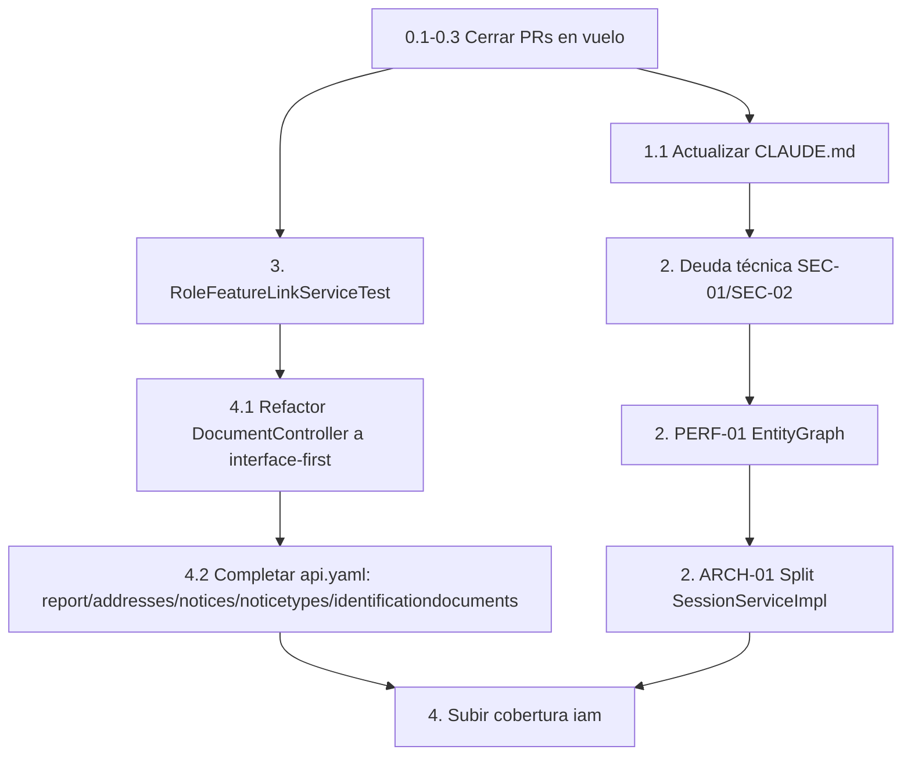

# Roadmap de Desarrollo — backbone-rest
### Plan de acción para retomar y completar el desarrollo

---

| Campo | Valor |
|---|---|
| **Generado** | 2026-09-20 |
| **Rama de referencia** | `bug/role-link-application` |
| **Basado en** | Auditoría de repo, `git log`, `mvn test`/`pmd:check`/JaCoCo, Dependabot API, inspección de los 18 módulos de dominio |
| **Estado** | Para revisión — ajustar prioridades según disponibilidad |

---

## 0. Punto de partida (resumen, no repetir el detalle ya discutido)

- `develop` está sano: 616 tests, 0 violaciones PMD, JaCoCo 58% de cobertura global.
- La rama `bug/role-link-application` tiene el fix de Role↔Application↔Feature commiteado y pusheado; el `pom.xml` con la remediación de las 39 alertas de Dependabot está **listo pero sin commitear**.
- MCAM (M2M auth) está **completo** — CRUD, tokens, rotación, Redis, auditoría, tests, todo presente.
- El proyecto tiene **18 módulos de dominio** en `v1/`, no los 10 que documenta `CLAUDE.md` (`addresses`, `iam`, `identificationdocuments`, `managedclient`, `notices`, `noticetypes`, `rolefeatures`, `servicetype` faltan en el doc).
- El almacenamiento de imágenes de perfil **sí usa Cloudflare R2** vía el cliente externo `com.umdc.commons.services.cloudflare.r2.client.CloudflareR2StorageClient` (corrijo algo que dije mal antes: no es una feature fantasma, está integrada y testeada — solo que la clase vive en la librería `commons-services`, no en este repo).

---

## 1. Fase 0 — Cerrar lo que está en vuelo (esta semana)

| # | Tarea | Detalle |
|---|---|---|
| 0.1 | Decidir y commitear la remediación de seguridad (`pom.xml`) | Ya validada (tests + PMD + `mvn package` en verde). Definir si va en `bug/role-link-application` o en una rama/PR `security/dependabot-remediation` separada — recomendado **separarla**, porque es un cambio de infraestructura sin relación con el fix de roles y así el reviewer no mezcla contextos. |
| 0.2 | Abrir PR de `bug/role-link-application` → `develop` | Ya tiene todo verde; no bloquear por lo de seguridad si se separa. |
| 0.3 | Abrir PR de la remediación de seguridad | Referenciar los GHSA IDs cerrados en la descripción para que Dependabot los reconcilie al mergear. |
| 0.4 | Confirmar la rama remota `dependabot/maven/maven-55f3996f77` | Puede solaparse con lo que ya arreglaste a mano — revisar y cerrar si queda redundante. |

---

## 2. Fase 1 — Higiene de repo y documentación (1–2 días)

| # | Tarea | Por qué |
|---|---|---|
| 1.1 | Actualizar la lista de "Domain Modules" en `CLAUDE.md` | Están documentados 10 de 18 módulos reales. Cualquier agente (`java-developer`, `api-designer`, etc.) que confíe en ese doc está trabajando con un mapa incompleto. |
| 1.2 | Decidir destino de `docs/plans/`, `docs/prompts/`, `docs/requirements/`, `docs/analysis_summary.md`, `docs/report-improve-action.md` | Son documentación real y útil (igual que este archivo) pero siguen sin trackear. Recomendado: trackearlos bajo `docs/` como memoria institucional del proyecto. |
| 1.3 | Resolver `.DS_Store` (7 ubicaciones), `.ai/`, `.codegraph/`, `.continue/config.json`, `prod-ca-2021.crt` | Quedaron pendientes de una sesión anterior. Mínimo: `.gitignore` para `.DS_Store` y `*.crt`; decidir si `.ai/`, `.codegraph/`, `.continue/` son tooling personal (ignorar) o config de equipo (trackear). |
| 1.4 | Revisar `memory/` dentro del repo | Es memoria de un agente viviendo en el árbol de trabajo — normalmente no debería vivir en un repo compartido. Moverla fuera o excluirla. |

---

## 3. Fase 2 — Deuda técnica ya identificada, aún sin ejecutar

Esto viene de `docs/report-improve-action.md` (jun/2024) y sigue vigente porque revisé el código actual y ninguno de estos puntos se resolvió:

| ID | Módulo | Acción | Prioridad | Agente sugerido |
|---|---|---|---|---|
| SEC-01 | `session` | Job `@Scheduled` para purgar JTI expirados de `JtiDenyListService` (evita crecimiento indefinido) | Alta | `java-developer` |
| SEC-02 | `security` | Documentar/verificar rotación de `APP_TOKEN_SECRET` vía Vault | Alta | `security-auditor` |
| PERF-01 | `users` | `@EntityGraph` en `UserRepository.loadUserAlias` (evitar N+1 en roles/alianzas) | Media | `database-architect` |
| ARCH-01 | `session` | Descomponer `SessionServiceImpl` (tiene `@SuppressWarnings("PMD.GodClass")`) | Media | `java-developer` |
| ARCH-02 | general | `@LogDefault` uniforme en todos los `*ServiceImpl` | Baja | `java-developer` |

---

## 4. Fase 3 — Cobertura de tests: los puntos ciegos reales

JaCoCo global marca 58%, pero el promedio esconde módulos con cobertura casi nula:

| Módulo | Archivos main | Archivos test | Estado |
|---|---|---|---|
| `report` | 4 | 1 (solo un cliente de test, no tests unitarios reales) | **Sin cobertura real** |
| `rolefeatures` | 1 | 0 | **Sin test dedicado** (`RoleFeatureLinkService` solo se ejerce indirectamente vía `RoleServiceImplTest`/`FeatureServiceImplTest`) |
| `iam` | 22 | 4 | Ratio muy bajo para un módulo de auditoría/permisos |
| `addresses`, `notices`, `noticetypes`, `identificationdocuments`, `servicetype` | 6–7 c/u | 2 c/u | Cobertura mínima pero presente |

**Acción recomendada:** priorizar `test-writer` en este orden: `RoleFeatureLinkServiceTest` (nuevo, cubre el servicio compartido que creaste en esta rama) → `DocumentServiceImplTest`/`DocumentControllerTest` → subir cobertura de `iam`.

---

## 5. Fase 4 — Completar/normalizar módulos existentes

| # | Módulo | Hallazgo | Acción |
|---|---|---|---|
| 4.1 | `report` (`DocumentController`/`DocumentService`) | Código de **2021** (`@version 1.0.0, 27-12-2021` en el JavaDoc). Viola las convenciones obligatorias: sin `*Api.java` (no interface-first), sin `@Operation`/`@ApiResponses`, usa `@GetMapping` para subir archivos multipart (semánticamente debería ser `POST`). Es el único módulo de los 18 sin interfaz `*Api`. | Refactor con `/add-endpoint` o `java-developer`: extraer `DocumentApi.java`, migrar a `POST`, agregar OpenAPI. |
| 4.2 | `report`, `addresses`, `notices`, `noticetypes`, `identificationdocuments` | **Ninguno de estos 5 módulos está documentado en `api.yaml`** (0 coincidencias). | Usar `api-designer` para auditar y completar el spec — hoy el contrato público real es más grande que lo documentado. |
| 4.3 | `managedclient` (MCAM) | Ya completo según su propio plan (`docs/plans/mcam-implementation-plan.md`), incluyendo `ManagedClientMaintenanceService` (limpieza de `prevSecretHash`, Risk R-05 del plan). | Solo falta confirmar que el JaCoCo de este paquete específico cumple el ≥80% que el plan pedía como compromiso de equipo (no gate de build). |

---

## 6. Fase 5 — Seguridad continua (proceso, no solo el parche puntual)

| # | Tarea |
|---|---|
| 5.1 | Establecer cadencia de revisión de Dependabot (ej. semanal) en vez de descubrirlo por el mensaje de `git push`. |
| 5.2 | Documentar en `CLAUDE.md` el patrón de overrides usado hoy (`tomcat.version`, `bouncycastle.version`, etc. como properties + `dependencyManagement`) para que la próxima remediación siga el mismo estilo. |
| 5.3 | Rotar el `VAULT_TOKEN` que quedó expuesto en texto plano en `default.env` durante esta sesión (nunca llegó a git, pero por higiene). |
| 5.4 | Confirmar si hay un flujo de `git push` automatizado a `develop` sin PR — dado que vimos commits directos a `develop` en el historial reciente; si el equipo crece, formalizar branch protection. |

---

## 7. Backlog priorizado (orden sugerido de ejecución)

**Prioridad inmediata (esta semana):** 0.1 → 0.2/0.3 → 1.1 → 3 (test de `RoleFeatureLinkService`, es el código más nuevo y menos probado).

**Corto plazo (próximas 2–3 semanas):** Fase 2 completa (deuda de seguridad/arquitectura de `session`) + 4.1 (refactor de `report`).

**Mediano plazo:** 4.2 (completar `api.yaml`) + subir cobertura de `iam` — no bloquean nada, pero cierran la brecha entre "lo que la API realmente hace" y "lo que está documentado/testeado".

---

*Este documento se actualiza a mano — no hay automatización que lo mantenga sincronizado con el código. Revisar y tachar ítems conforme se completen.*
