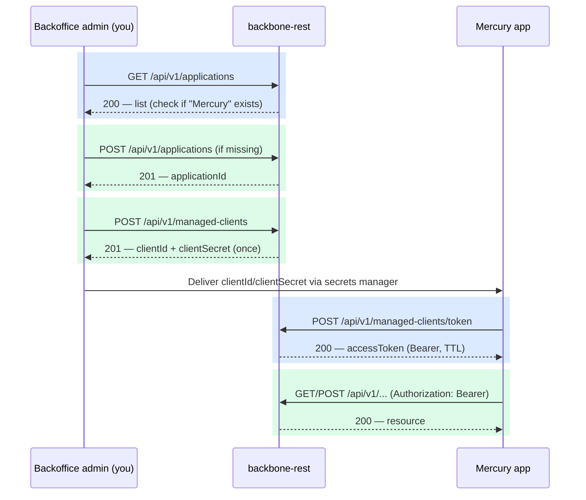

# Mercury — M2M Access Setup (MCAM)

> Operational runbook to register the **Mercury** application as a machine-to-machine
> (M2M) client of backbone-rest, using the Management Client Authentication Manager
> (MCAM) module (`/api/v1/managed-clients`).

Source of truth verified against `ManagedClientApi.java`, the DTOs in
`v1/managedclient/api/to/`, and `src/main/resources/static/api.yaml`.

> [!NOTE]
> A pre-existing keystore alias `mercury-api-client` exists in `keystore.jks`
> (see `.ai/tools/keytool.tool.md`). Confirm with the team whether that is an
> unrelated mTLS certificate or a previous credential for this same
> integration before issuing a new secret, to avoid running two live
> credentials for the same client.

## Flow overview



## Prerequisites

- You are already authenticated as a backoffice admin (OAuth2 Bearer JWT) —
  registration and management endpoints are not self-service.
- `jq` installed locally for the shell snippets below (optional but convenient).

Set these once in your shell:

```bash
export HOST="https://<host>:8084"
export ADMIN_JWT="<your-oauth2-jwt>"
```

## Step 0 — Confirm the "Mercury" application exists

```bash
curl -k -s -X GET "$HOST/api/v1/applications" \
  -H "Authorization: Bearer $ADMIN_JWT" | jq '.[] | select(.name=="Mercury")'
```

If the query returns nothing, create it:

```bash
curl -k -s -X POST "$HOST/api/v1/applications" \
  -H "Authorization: Bearer $ADMIN_JWT" \
  -H "Content-Type: application/json" \
  -d '{
    "application": {
      "name": "Mercury",
      "description": "Mercury application — M2M integration",
      "active": true
    }
  }' | tee mercury-application.json | jq .
```

```bash
export APPLICATION_ID=$(jq -r '.id' mercury-application.json)
```

## Step 1 — Register the managed client

Replace the `scopes` array with the actual permissions Mercury needs
(`resource:action` convention, e.g. `mercury:read`, `mercury:write` — no fixed
enum exists in the code, these are free-form strings you define).

```bash
curl -k -s -X POST "$HOST/api/v1/managed-clients" \
  -H "Authorization: Bearer $ADMIN_JWT" \
  -H "Content-Type: application/json" \
  -d '{
    "name": "mercury-integration",
    "description": "M2M client for the Mercury application",
    "applicationId": "'"$APPLICATION_ID"'",
    "scopes": ["mercury:read", "mercury:write"],
    "active": true
  }' | tee mercury-client.json | jq .
```

Response (`201 Created`):

```json
{
  "clientId": "b3f0....-uuid",
  "clientSecret": "plaintext-secret-shown-once",
  "name": "mercury-integration",
  "applicationId": "a1b2....-uuid",
  "scopes": ["mercury:read", "mercury:write"],
  "active": true,
  "createdAt": "2026-09-23T00:00:00Z"
}
```

> [!CAUTION]
> `clientSecret` is returned **exactly once** and can never be retrieved
> again. Store it immediately in the team's secrets manager (Vault) — do not
> leave it in `mercury-client.json` on disk longer than needed to copy it out.

```bash
export CLIENT_ID=$(jq -r '.clientId' mercury-client.json)
export CLIENT_SECRET=$(jq -r '.clientSecret' mercury-client.json)
# Move the secret into Vault, then:
shred -u mercury-client.json 2>/dev/null || rm -f mercury-client.json
```

## Step 2 — Mercury requests an access token

This endpoint is **public** (no admin bearer needed) — it's the call Mercury
itself makes at runtime. The requested `scopes` must be a subset of the
scopes registered in Step 1, or the call returns `400 invalid_scope`.

```bash
curl -k -s -X POST "$HOST/api/v1/managed-clients/token" \
  -H "Content-Type: application/json" \
  -d '{
    "clientId": "'"$CLIENT_ID"'",
    "clientSecret": "'"$CLIENT_SECRET"'",
    "scopes": ["mercury:read"]
  }' | jq .
```

Response (`200 OK`):

```json
{
  "accessToken": "eyJhbGciOi...",
  "tokenType": "Bearer",
  "expiresIn": 3600,
  "scopes": ["mercury:read"],
  "issuedAt": "2026-09-23T00:00:00Z"
}
```

## Step 3 — Mercury calls a protected endpoint

```bash
ACCESS_TOKEN=$(curl -k -s -X POST "$HOST/api/v1/managed-clients/token" \
  -H "Content-Type: application/json" \
  -d '{"clientId":"'"$CLIENT_ID"'","clientSecret":"'"$CLIENT_SECRET"'","scopes":["mercury:read"]}' \
  | jq -r '.accessToken')

curl -k -s "$HOST/api/v1/..." \
  -H "Authorization: Bearer $ACCESS_TOKEN"
```

> [!IMPORTANT]
> Today `SecurityConfig` only checks `anyRequest().authenticated()` for M2M
> tokens — there is no `@PreAuthorize`/`hasAuthority` gate per scope yet in
> the codebase. A valid, active token currently grants access to any
> `/api/v1/**` endpoint, not only the ones matching its declared `scopes`.
> Scopes are recorded and returned by introspection, but do not yet restrict
> what Mercury's token can call. Flag this if Mercury's access is meant to be
> narrower than full API access.

## Maintenance operations

| Operation | Endpoint | Auth | Notes |
|---|---|---|---|
| List clients | `GET /api/v1/managed-clients?applicationId=&active=&page=&size=` | Admin JWT | Filter by `applicationId=$APPLICATION_ID` |
| Get one | `GET /api/v1/managed-clients/{clientId}` | Admin JWT | Never returns the secret |
| Update | `PUT /api/v1/managed-clients/{clientId}` | Admin JWT | Change `name`, `description`, `scopes`, `active` |
| Delete | `DELETE /api/v1/managed-clients/{clientId}` | Admin JWT | Permanent, removes all issued tokens |
| Rotate secret | `POST /api/v1/managed-clients/{clientId}/rotate-secret` | Admin JWT | Returns new secret once; old one valid for `gracePeriodSeconds` |
| Revoke all tokens | `DELETE /api/v1/managed-clients/{clientId}/tokens` | Admin JWT | Use before rotating if the secret may be compromised |
| Introspect | `POST /api/v1/managed-clients/introspect` | Public | Always `200`; check `active` field |

### Rotate the secret

```bash
curl -k -s -X POST "$HOST/api/v1/managed-clients/$CLIENT_ID/rotate-secret" \
  -H "Authorization: Bearer $ADMIN_JWT" | jq .
```

1. Retrieve the new secret from the response (shown once).
2. Update the secrets manager entry Mercury reads from.
3. Deploy the new secret to Mercury.
4. Verify Mercury authenticates successfully with the new secret.
5. Old secret is honored only for `gracePeriodSeconds` — no rollback after that.

### Revoke access (incident response)

```bash
curl -k -s -X DELETE "$HOST/api/v1/managed-clients/$CLIENT_ID/tokens" \
  -H "Authorization: Bearer $ADMIN_JWT"

curl -k -s -X PUT "$HOST/api/v1/managed-clients/$CLIENT_ID" \
  -H "Authorization: Bearer $ADMIN_JWT" \
  -H "Content-Type: application/json" \
  -d '{"active": false}'
```

## Field reference

### `ManagedClientCreateRequest`

| Field | Required | Constraints |
|---|---|---|
| `name` | yes | max 128 chars, unique per `applicationId` |
| `description` | no | max 512 chars |
| `applicationId` | yes | UUID of an existing `Application` |
| `scopes` | yes | array, min 1 item, free-form strings |
| `active` | no | default `true` |

### `ManagedClientTokenRequest`

| Field | Required | Constraints |
|---|---|---|
| `clientId` | yes | UUID from registration |
| `clientSecret` | yes | plaintext secret from registration/rotation |
| `scopes` | yes | array, min 1 item, must be ⊆ registered scopes |

## Documentation status

`docs/api/managed-clients.md` previously described an older response/request
shape (`id` instead of `clientId`, singular `scope` string instead of
`scopes` array, `access_token`/`token_type`/`expires_in` snake_case fields,
a paginated list envelope that doesn't exist, and a "no grace period"
rotation claim that contradicted the actual grace-period behavior). It has
been reconciled against `ManagedClientApi.java`, the `api/to/*.java` DTOs,
and `api.yaml` as of `docs/fase5-security-process`, and now matches
`docs/v1/08-managed-clients-mcam.md`, which was already accurate.

One remaining discrepancy: both of those docs' error tables list a
`validation_error` code for `400` on registration. There is **no**
`@ExceptionHandler`/`@ControllerAdvice` anywhere in this codebase — a
`@Valid` failure on `ManagedClientCreateRequest`/`ManagedClientTokenRequest`
falls through to Spring Boot's default error body (`timestamp`/`status`/
`error`/`path`), not a `ManagedClientErrorResponse` with `error:
"validation_error"`. Don't parse for that field on a 400 from registration —
check the HTTP status only, unless/until a global exception handler is added.
