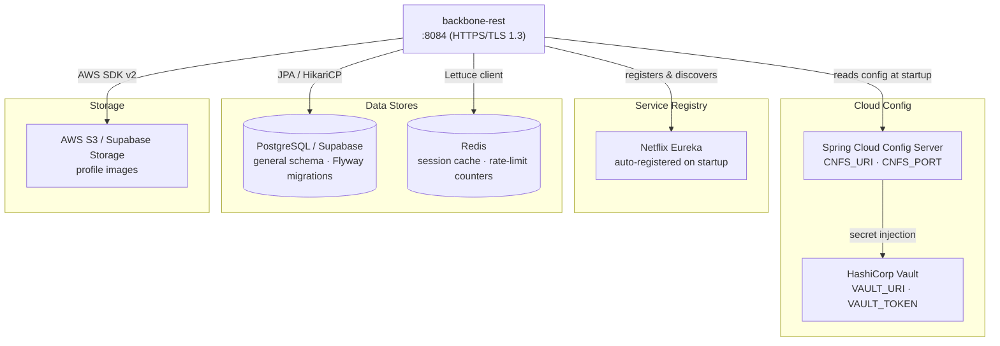
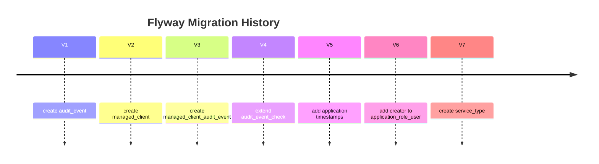
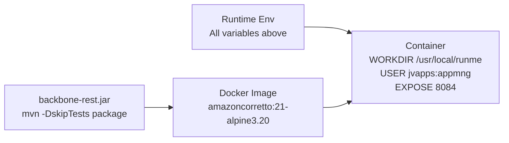

# ⚙️ Dependencies & Requirements

> **Guide:** v1 · [← Back to Index](./README.md)

---

## System Requirements

| Requirement | Minimum | Notes |
|-------------|---------|-------|
| **JDK** | 21 (LTS) | Amazon Corretto 21 recommended — matches the Docker base image |
| **Maven** | 3.9+ | No Maven Wrapper (`mvnw`) — install Maven directly |
| **Docker** | 24+ | Required for containerised deployment |
| **PostgreSQL** | 14+ | Supplied via Supabase pooler in cloud environments |
| **Redis** | 7+ | Used for session caching and brute-force throttling |

---

## Infrastructure Dependencies



| Service | Protocol | Required | Purpose |
|---------|----------|----------|---------|
| Spring Cloud Config Server | HTTPS | **Yes** | Loads all environment-specific config at startup |
| HashiCorp Vault | HTTPS | **Yes** (when `VAULT_ENABLED=true`) | Injects secrets (DB creds, JWT keys, MCAM keystore password) |
| Netflix Eureka | HTTPS | **Yes** | Service discovery and registration |
| PostgreSQL (Supabase pooler) | PostgreSQL/SSL | **Yes** | Persistence for all domains |
| Redis | `redis://` or `rediss://` | **Yes** | Session caching, brute-force counters |
| AWS S3 / Supabase Storage | HTTPS | For profile images | `profileimage` domain upload / signed URL |

---

## Private Maven Artifacts (Repsy)

The project depends on three internal libraries hosted on the private Repsy repository (`https://repo.repsy.io/mvn/lmata/prx`). Build credentials must be set before running `mvn`.

| Artifact | Version | Purpose |
|----------|---------|---------|
| `com.umdc:commons` | `0.0.1` | Shared POJOs (`ServiceType`, `Role`, `Feature`, `Application`, …), `MessageType` interface |
| `com.umdc:commons-services` | `0.0.1` | `CrudService` interface, `MapperAppConfig`, shared OpenAPI config |
| `com.umdc:persistence` | `0.0.1` | JPA entities (`RoleEntity`, `FeatureEntity`, …) and Spring Data repositories |
| `com.umdc:security-oauth` | `0.0.1` | OAuth2 / Keycloak JWT converter and security utilities |

**Credentials** — set as environment variables or in `~/.m2/settings.xml`:

```bash
export REPSY_ACCOUNT_USER=<your-repsy-username>
export REPSY_ACCOUNT_PASSWORD=<your-repsy-password>
```

---

## Runtime Dependencies

### Core Framework

| Dependency | Version | Purpose |
|------------|---------|---------|
| `spring-boot-starter-parent` | `4.0.6` | BOM — manages all Spring versions |
| `spring-boot-starter-web` | managed | Embedded Tomcat, MVC, REST controllers |
| `spring-boot-starter-data-jpa` | managed | Hibernate ORM, HikariCP connection pool |
| `spring-boot-starter-security` | managed | Filter chain, BCrypt, SecurityConfig |
| `spring-boot-starter-validation` | managed | Bean Validation (`@Valid`, Jakarta Validation) |
| `spring-boot-starter-actuator` | managed | Health, metrics, info endpoints |
| `spring-boot-starter-data-redis` | managed | Redis / Lettuce client |
| `spring-cloud-starter-config` | `2025.1.1` BOM | Config Server client |
| `spring-cloud-starter-bootstrap` | `2025.1.1` BOM | Enables `bootstrap.yml` processing |
| `spring-cloud-starter-vault-config` | `2025.1.1` BOM | HashiCorp Vault secret injection |
| `spring-cloud-starter-netflix-eureka-client` | `2025.1.1` BOM | Service registration and discovery |

### Data & Persistence

| Dependency | Version | Purpose |
|------------|---------|---------|
| `org.postgresql:postgresql` | `42.7.7` | JDBC driver for PostgreSQL / Supabase |
| `com.h2database:h2` | `2.2.224` | In-memory DB for tests |
| `org.flywaydb:flyway-core` | managed by Spring Boot | Database migrations (`src/main/resources/db/migration/`) |

### Mapping & Serialisation

| Dependency | Version | Purpose |
|------------|---------|---------|
| `org.mapstruct:mapstruct` | `1.6.3` | Compile-time DTO ↔ entity mapping |
| `org.mapstruct:mapstruct-processor` | `1.6.3` | Annotation processor — wired into `maven-compiler-plugin` |
| `com.fasterxml.jackson.datatype:jackson-datatype-jsr310` | managed | Java 8 date/time serialisation |
| `org.yaml:snakeyaml` | `2.5` | YAML parsing (overrides Boot default to avoid CVEs) |

### Security & Tokens

| Dependency | Version | Purpose |
|------------|---------|---------|
| `io.jsonwebtoken:jjwt-api` | `0.12.6` | Session JWT API (JJWT) |
| `io.jsonwebtoken:jjwt-impl` | `0.12.6` | JJWT implementation |
| `io.jsonwebtoken:jjwt-jackson` | `0.12.6` | JJWT Jackson serialiser |
| `org.springframework.security:spring-security-crypto` | managed | BCrypt password hashing |

### Cloud & Storage

| Dependency | Version | Purpose |
|------------|---------|---------|
| `software.amazon.awssdk:s3` | `2.21.0` | AWS S3 / Supabase Storage SDK |
| `com.netflix.eureka:eureka-client-jersey3` | managed | Jersey 3 transport for Eureka |
| `org.glassfish.jersey.core:jersey-client` | managed | Jersey 3 client runtime |
| `org.apache.httpcomponents.client5:httpclient5` | managed | HTTPS inter-service `RestTemplate` with custom TLS |

### Utilities

| Dependency | Version | Purpose |
|------------|---------|---------|
| `org.apache.commons:commons-lang3` | `3.18.0` | `StringUtils`, `NotImplementedException` |
| `commons-fileupload:commons-fileupload` | `1.6.0` | Multipart file upload |
| `org.json:json` | `20250517` | Lightweight JSON parsing |
| `com.fasterxml.woodstox:woodstox-core` | `7.0.0` | High-performance XML streaming (transitive for Cloud Config) |
| `org.apache.poi:poi-ooxml` | `5.4.0` | Excel report generation |
| `org.springdoc:springdoc-openapi-starter-webmvc-ui` | `2.6.0` | Swagger UI and OpenAPI 3.1 spec serving at `/swagger-ui.html` |

### Test Dependencies

| Dependency | Version | Scope |
|------------|---------|-------|
| `org.junit.jupiter:junit-jupiter` | `5.14.1` | `test` — JUnit 5 engine |
| `org.junit.jupiter:junit-jupiter-api` | `5.14.1` | `test` — JUnit 5 assertions and annotations |
| `org.mockito:mockito-core` | `5.21.0` | `test` — Mockito mocking |
| `org.mockito:mockito-junit-jupiter` | `5.21.0` | `test` — Mockito JUnit 5 extension |
| `org.mock-server:mockserver-junit-jupiter` | `5.15.0` | `test` — HTTP mock server for integration tests |
| `org.springframework.cloud:spring-cloud-starter-contract-verifier` | managed | `test` — Spring Cloud Contract |
| `org.springframework.cloud:spring-cloud-starter-contract-stub-runner` | managed | `test` — stub-runner for contract tests |
| `org.springframework.boot:spring-boot-starter-test` | managed | `test` — MockMvc, Spring test slices |

---

## Build Tools & Plugins

| Plugin | Version | Purpose |
|--------|---------|---------|
| `maven-compiler-plugin` | `3.14.1` | Java 21 compilation; wires MapStruct annotation processor |
| `spring-boot-maven-plugin` | `4.0.6` | Creates executable fat JAR (`backbone-rest.jar`) |
| `maven-surefire-plugin` | `3.5.2` | Runs JUnit 5 test suite |
| `maven-pmd-plugin` | `3.28.0` | Static analysis — zero violations policy enforced at `test` phase |
| `jacoco-maven-plugin` | `0.8.14` | Line + branch coverage measurement; report at `site/jacoco/jacoco.xml` |
| `maven-javadoc-plugin` | `3.6.3` | Public Javadoc generation |
| `springdoc-openapi-maven-plugin` | `1.4` | Generates OpenAPI spec at `integration-test` phase |

### Build Commands

```bash
# Fast syntax check
mvn -DskipTests compile

# Full suite: PMD + JaCoCo + JUnit
mvn test

# Single test class
mvn -Dtest=ServiceTypeServiceImplTest test

# Produce executable JAR
mvn -DskipTests package
```

> **Never use `mvnw`** — Maven Wrapper does not exist in this repository.

---

## Environment Variables

All variables are injected at runtime. Secrets must come from Vault or a secrets manager — **never hard-code values in source control**.

### Application Server

| Variable | Required | Default | Description |
|----------|----------|---------|-------------|
| `APP_PORT` | No | `8084` | HTTPS listening port |

### TLS / Keystore

| Variable | Required | Default | Description |
|----------|----------|---------|-------------|
| `SSL_KEYSTORE_LOCATION` | **Yes** | — | Path to server keystore (`backbone.jks`) — use `classpath:` prefix |
| `SSL_KEYSTORE_PASSWORD` | **Yes** | `changeit` | Password for the server keystore |
| `SSL_KEYSTORE_TYPE` | No | `JKS` | Keystore type (`JKS` or `PKCS12`) |
| `SSL_TRUSTSTORE_LOCATION` | **Yes** | — | Path to CA truststore (`umdc-truststore.jks`) |
| `SSL_TRUSTSTORE_PASSWORD` | **Yes** | `changeit` | Password for the truststore |
| `SSL_TRUSTSTORE_TYPE` | No | `JKS` | Truststore type |

### Spring Cloud Config

| Variable | Required | Default | Description |
|----------|----------|---------|-------------|
| `SPRING_BOOT_PROFILE_ACTIVE` | **Yes** | — | Active Spring profile (e.g., `remote-supabase`) |
| `SPRING_BOOT_CLOUD_BOOTSTRAP_ENABLED` | **Yes** | — | Set `true` to enable Config Server bootstrap |
| `SPRING_CLOUD_CONFIG_LABEL` | **Yes** | — | Config repo branch label (e.g., `Develop`) |
| `CNFS_URI` | **Yes** | — | Config Server base URL (e.g., `https://config-server.umdc-qa.tst`) |
| `CNFS_PORT` | **Yes** | — | Config Server port (typically `443`) |

### HashiCorp Vault

| Variable | Required | Default | Description |
|----------|----------|---------|-------------|
| `VAULT_ENABLED` | No | `false` | Set `true` to activate Vault secret injection |
| `VAULT_URI` | When enabled | — | Vault server URL (e.g., `https://vault.umdc-qa.tst`) |
| `VAULT_TOKEN` | When enabled | — | Vault access token — inject from a secrets manager |
| `VAULT_KV_BACKEND` | No | `secret` | KV backend name (e.g., `dev`, `prod`) |

### Database (injected via Config Server / Vault)

| Variable | Required | Default | Description |
|----------|----------|---------|-------------|
| `spring.datasource.url` | **Yes** | — | JDBC URL — Supabase pooler (`jdbc:postgresql://aws-1-us-east-2.pooler.supabase.com:6543/postgres?sslmode=require`) |
| `spring.datasource.username` | **Yes** | — | DB username |
| `spring.datasource.password` | **Yes** | — | DB password — inject from Vault |
| `spring.datasource.hikari.maximum-pool-size` | No | `10` | HikariCP max connections |
| `spring.datasource.hikari.minimum-idle` | No | `2` | HikariCP minimum idle connections |
| `spring.datasource.hikari.connection-timeout` | No | `30000` | Connection timeout in ms |

### Redis (injected via Config Server)

| Variable | Required | Default | Description |
|----------|----------|---------|-------------|
| `spring.data.redis.url` | **Yes*** | — | Full Redis URL — `redis://` or `rediss://` (TLS). *Or use the discrete properties below. |
| `spring.data.redis.host` | **Yes*** | — | Redis hostname (used when `url` is absent) |
| `spring.data.redis.port` | No | `6379` | Redis port |
| `spring.data.redis.username` | When ACL | — | Redis ACL username |
| `spring.data.redis.password` | When ACL | — | Redis password — inject from Vault |

### Session JWT

| Variable | Required | Default | Description |
|----------|----------|---------|-------------|
| `APP_TOKEN_SECRET` | **Yes** | — | HMAC-SHA key used to sign/verify session JWTs |
| `APP_TOKEN_EXPIRATION` | **Yes** | — | Session token TTL in milliseconds |
| `JWT_ISSUER` | No | `backbone-rest` | JWT `iss` claim value |
| `JWT_AUDIENCE` | No | `backbone-rest-client` | JWT `aud` claim value |

### Managed Client Authentication Manager (MCAM)

| Variable | Required | Default | Description |
|----------|----------|---------|-------------|
| `MCAM_KEY_ALIAS` | No | `backbone-rest` | Key alias in the keystore used for M2M JWT signing (RS256) |
| `MCAM_TOKEN_TTL_SECONDS` | No | `3600` | M2M access token TTL in seconds |
| `MCAM_ROTATION_GRACE_SECONDS` | No | `300` | Grace period in seconds after secret rotation |
| `MCAM_RATE_LIMIT_RPM` | No | `60` | Max token requests per minute per `clientId` |
| `MCAM_MAINTENANCE_INTERVAL_MS` | No | `600000` | Interval for the `prevSecretHash` cleanup task (ms) |

### Observability

| Variable | Required | Default | Description |
|----------|----------|---------|-------------|
| `LOGGING_TRACE_ENABLED` | No | `false` | Set `true` to enable `DEBUG`-level entry/exit tracing |

---

## Database Migrations

Flyway runs automatically on startup. Migrations live in `src/main/resources/db/migration/`.



> External domain tables (`user`, `role`, `feature`, `application`, …) are managed by the `com.umdc:persistence` library — **do not create Flyway migrations for them**.

---

## Docker Deployment



---

## Quality Gates

| Gate | Tool | Threshold | Phase |
|------|------|-----------|-------|
| Static analysis | PMD `3.28.0` + `ruleset.xml` | **Zero violations** | `test` |
| Copy-paste detection | PMD CPD | **Zero violations** | `test` |
| Line coverage | JaCoCo `0.8.14` | `≥ 0` (enforced; raise per-package as coverage grows) | `test` |
| Branch coverage | JaCoCo `0.8.14` | `≥ 0` (enforced; raise per-package as coverage grows) | `test` |
| Code quality | SonarCloud | Dashboard at `sonarcloud.io` project `umdc-directory-backend` | CI |

---

## Internal Module Dependency Diagram

```mermaid
graph TD
    BR["backbone-rest\ncom.umdc.backbone:backbone-rest:0.0.1"]

    subgraph UMDC Private Libs
        C["com.umdc:commons:0.0.1\nPOJOs · MessageType · HttpStatusUtil"]
        CS["com.umdc:commons-services:0.0.1\nCrudService · MapperAppConfig"]
        P["com.umdc:persistence:0.0.1\nJPA Entities · Spring Data Repositories"]
        SO["com.umdc:security-oauth:0.0.1\nJwtConverter · OAuth2 utilities"]
    end

    subgraph Spring Cloud
        SCC["spring-cloud-starter-config"]
        SCV["spring-cloud-starter-vault-config"]
        SCE["spring-cloud-starter-netflix-eureka-client"]
        SCB["spring-cloud-starter-bootstrap"]
    end

    subgraph Spring Boot
        SBW["spring-boot-starter-web"]
        SBJ["spring-boot-starter-data-jpa"]
        SBS["spring-boot-starter-security"]
        SBR["spring-boot-starter-data-redis"]
    end

    BR --> C
    BR --> CS
    BR --> P
    BR --> SO
    BR --> SCC
    BR --> SCV
    BR --> SCE
    BR --> SCB
    BR --> SBW
    BR --> SBJ
    BR --> SBS
    BR --> SBR
```



---

> ➡️ Next: [Getting Started](./01-getting-started.md)
