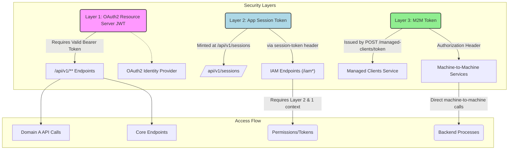

# 🚀 Getting Started

> **Guide:** v1 · [← Back to Index](./README.md)

---

## Base URL

| Environment | Base URL |
|-------------|----------|
| Development | `http://localhost:8080` |
| Staging     | `https://<your-staging-host>` |
| Production  | `https://<your-production-host>` |

All endpoints are versioned under the prefix:

```
/api/v1/
```

---

## Content Type

All request and response bodies use JSON:

```http
Content-Type: application/json
Accept: application/json
```

---

## Authentication Model

Backbone REST uses **three complementary security layers**:



### Public Endpoints (no token required)

| Endpoint | Reason |
|----------|--------|
| `POST /api/v1/sessions/token` | Login — token not yet available |
| `GET  /api/v1/sessions/validate` | Token validation utility |
| `POST /api/v1/managed-clients/token` | M2M credential exchange — no prior token |
| `POST /api/v1/managed-clients/introspect` | Token validation utility (M2M) |

> All other endpoints require a valid `session-token` header.

---

## Request Headers

| Header | Required | Description |
|--------|----------|-------------|
| `Content-Type` | ✅ | Must be `application/json` for POST/PUT |
| `Accept` | Recommended | `application/json` |
| `session-token` | ✅ (protected routes) | JWT session token from `/sessions` |

---

## HTTP Status Codes

| Code | Meaning | When Used |
|------|---------|-----------|
| `200 OK` | Success | GET, PUT operations |
| `201 Created` | Resource created | POST create operations |
| `202 Accepted` | Update accepted | Partial update operations |
| `204 No Content` | Success, no body | DELETE operations |
| `400 Bad Request` | Invalid input | Malformed payload / missing fields |
| `401 Unauthorized` | Auth failure | Invalid or missing session token |
| `404 Not Found` | Resource missing | Entity not found |
| `406 Not Acceptable` | Business rejection | Validation failed at service layer |
| `417 Expectation Failed` | Precondition failed | Required field missing at service |
| `500 Internal Server Error` | Server failure | Unexpected error |

---

## Error Response Format

Errors are returned with the appropriate HTTP status. Some endpoints return plain status codes (no body) while others return a message string.

---

## Pagination

The current API does **not** implement pagination. List endpoints return all matching records. Filtering is done by `applicationId` path parameter.

---

## UUID Identifiers

All entity identifiers use **UUID v4** format:

```
3fa85f64-5717-4562-b3fc-2c963f66afa6
```

---

## Date/Time Format

Timestamps follow `yyyy-MM-dd HH:mm:ss` (local time, no timezone):

```json
"createdDate": "2026-01-15 09:30:00"
```

Dates (birthdate) follow `yyyy-MM-dd`:

```json
"birthdate": "1990-06-15"
```

---

> ➡️ Next: [Authentication & Sessions](./02-authentication-sessions.md)


