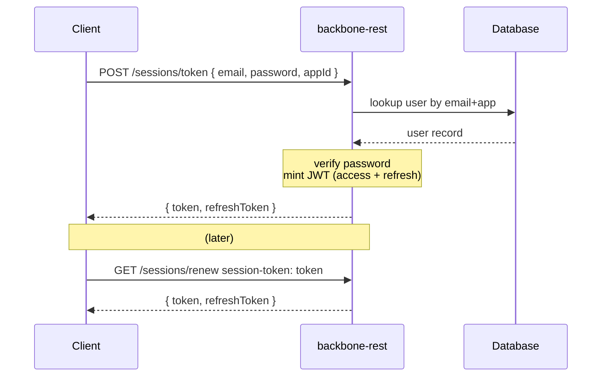

# 🔐 Authentication & Sessions

> **Guide:** v1 · [← Back to Index](./README.md)

---

## Overview

The session domain (`/api/v1/sessions`) is the authentication entry point of Backbone REST. It mints and manages **application-specific JWTs** that are separate from the OAuth2 provider tokens.



---

## Token Types

| Token | Header / Field | Lifetime | Purpose |
|-------|---------------|----------|---------|
| **Access Token** | `session-token` header | Short (configured via `APP_TOKEN_EXPIRATION`) | Authenticate API calls |
| **Refresh Token** | `refreshToken` in response body | Longer-lived | Obtain a new access token without re-login |

---

## Endpoints

### 1. Login with Alias + Password

```http
POST /api/v1/sessions
```

> 🔓 **Public endpoint** — no token required.

Login using a user's unique **alias**, password, and target application ID.

#### Request Body

```json
{
  "alias": "johndoe",
  "password": "s3cur3P@ss!",
  "applicationId": "3fa85f64-5717-4562-b3fc-2c963f66afa6"
}
```

| Field | Type | Required | Description |
|-------|------|----------|-------------|
| `alias` | `string` | ✅ | The user's unique alias |
| `password` | `string` | ✅ | The user's password |
| `applicationId` | `UUID` | ✅ | Target application context for the session |

#### Response `200 OK`

```json
{
  "token": "eyJhbGciOiJIUzI1NiIsInR5cCI6IkpXVCJ9...",
  "refreshToken": "eyJhbGciOiJIUzI1NiIsInR5cCI6IkpXVCJ9..."
}
```

| Field | Type | Description |
|-------|------|-------------|
| `token` | `string` | Short-lived JWT access token |
| `refreshToken` | `string` | Longer-lived refresh token |

#### Error Responses

| Code | Description |
|------|-------------|
| `401 Unauthorized` | Invalid alias, password, or application membership |
| `404 Not Found` | User not found for the given alias and application |
| `406 Not Acceptable` | Missing or invalid request fields |
| `429 Too Many Requests` | Account temporarily locked due to too many failed attempts |

---

### 2. Login with Email + Password ⭐ Recommended

```http
POST /api/v1/sessions/token
```

> 🔓 **Public endpoint** — no token required.

Login using the user's **email address**, password, and the target application ID.

#### Request Body

```json
{
  "email": "john.doe@example.com",
  "password": "s3cur3P@ss!",
  "applicationId": "3fa85f64-5717-4562-b3fc-2c963f66afa6"
}
```

| Field | Type | Required | Description |
|-------|------|----------|-------------|
| `email` | `string (email)` | ✅ | The user's registered email |
| `password` | `string` | ✅ | The user's password |
| `applicationId` | `UUID` | ✅ | The application context for the session |

#### Response `200 OK`

```json
{
  "token": "eyJhbGciOiJIUzI1NiIsInR5cCI6IkpXVCJ9...",
  "refreshToken": "eyJhbGciOiJIUzI1NiIsInR5cCI6IkpXVCJ9..."
}
```

#### Error Responses

| Code | Description |
|------|-------------|
| `401 Unauthorized` | Invalid credentials |
| `404 Not Found` | Invalid request payload |

---

### 3. Validate Session Token

```http
GET /api/v1/sessions/validate
```

> 🔓 **Public endpoint** — no token required.

Check whether a session token is still valid.

#### Request Headers

| Header | Required | Description |
|--------|----------|-------------|
| `session-token` | ✅ | The JWT to validate |

#### Response `200 OK`

```json
true
```

Returns `true` if the token is valid, `false` or `401` otherwise.

---

### 4. Renew Session Token

```http
GET /api/v1/sessions/renew
```

Renews the current session token before expiry, returning a new access token and refresh token.

#### Request Headers

| Header | Required | Description |
|--------|----------|-------------|
| `session-token` | ✅ | The current valid JWT |

#### Response `200 OK`

```json
{
  "token": "eyJhbGciOiJIUzI1NiIsInR5cCI6IkpXVCJ9...",
  "refreshToken": "eyJhbGciOiJIUzI1NiIsInR5cCI6IkpXVCJ9..."
}
```

#### Error Responses

| Code | Description |
|------|-------------|
| `400 Bad Request` | Token header is missing |
| `401 Unauthorized` | Token is invalid or expired |
| `404 Not Found` | User not found |
| `500 Internal Server Error` | Token generation failed |

---

### 5. Refresh Session Token

```http
POST /api/v1/sessions/refresh
Content-Type: application/json
```

> 🔓 **Public endpoint** — no active session required.

Exchange a valid (or recently expired) **refresh token** for a new access token and refresh token pair. Use this flow when the access token has expired but the refresh token is still within its grace period.

#### Request Body

```json
{
  "refreshToken": "eyJhbGciOiJIUzI1NiIsInR5cCI6IkpXVCJ9..."
}
```

| Field | Type | Required | Description |
|-------|------|----------|-------------|
| `refreshToken` | `string` | ✅ | The refresh token issued at login |

#### Response `200 OK`

```json
{
  "token": "eyJhbGciOiJIUzI1NiIsInR5cCI6IkpXVCJ9...",
  "refreshToken": "eyJhbGciOiJIUzI1NiIsInR5cCI6IkpXVCJ9..."
}
```

#### Error Responses

| Code | Description |
|------|-------------|
| `400 Bad Request` | Missing or empty refresh token |
| `401 Unauthorized` | Invalid token, wrong token type, or beyond grace period |
| `500 Internal Server Error` | Token generation failed |

---

## JWT Token Structure

The session token is a **JJWT 0.12.3** signed JWT with the following claims:

| Claim | Description |
|-------|-------------|
| `sub` | User identifier (alias or user ID) |
| `iss` | Issuer (`backbone-rest`) |
| `aud` | Audience (`backbone-rest-client`) |
| `exp` | Expiration time (epoch ms) |
| `iat` | Issued at (epoch ms) |
| `types` | Token type (`ACCESS` or `REFRESH`) |
| `roles` | Array of role strings assigned to the user |

---

## Recommended Auth Flow

```
1.  Call POST /api/v1/sessions/token  →  store { token, refreshToken }
2.  Include session-token: <token> on every API call
3.  When you receive 401, call POST /api/v1/sessions/refresh with { refreshToken }
4.  Replace stored token + refreshToken with new values
5.  Retry the original request
6.  If refresh also returns 401 → send user back to login
```

---

## Security Notes

> ⚠️ Never store the session token in `localStorage` on web clients — prefer `httpOnly` cookies or secure memory storage.

> ⚠️ The `session-token` header key is case-sensitive: use exactly `session-token`.

---

> ➡️ Next: [User Management](./03-user-management.md)

