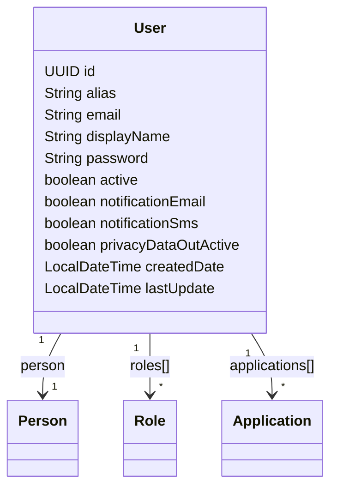
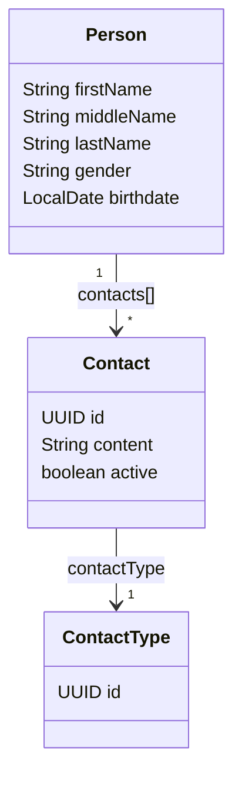

# 👤 User Management

> **Guide:** v1 · [← Back to Index](./README.md)

---

## Overview

The user domain (`/api/v1/users`) provides full lifecycle management for users. Each user belongs to at least one **Application** and carries one or more **Roles** within that application.

### User Data Model



### Person Data Model



---

## Endpoints

### 1. Create User

```http
POST /api/v1/users
Content-Type: application/json
session-token: <token>
```

Creates a new user and links them to the specified application and role.

#### Request Body

```json
{
  "alias": "johndoe",
  "displayName": "John Doe",
  "password": "s3cur3P@ss!",
  "email": "john.doe@example.com",
  "notificationEmail": true,
  "notificationSms": false,
  "privacyDataOutActive": false,
  "active": true,
  "person": {
    "firstName": "John",
    "middleName": "Michael",
    "lastName": "Doe",
    "gender": "M",
    "birthdate": "1990-06-15",
    "contacts": [
      {
        "content": "+1-555-0100",
        "active": true,
        "contactType": {
          "id": "3fa85f64-5717-4562-b3fc-2c963f66afa6"
        }
      }
    ]
  },
  "roleId": "a1b2c3d4-e5f6-7890-abcd-ef1234567890",
  "applicationId": "f47ac10b-58cc-4372-a567-0e02b2c3d479"
}
```

| Field | Type | Required | Description |
|-------|------|----------|-------------|
| `alias` | `string` | ✅ | Unique alias within the application |
| `displayName` | `string` | ✅ | Name shown in the UI |
| `password` | `string` | ✅ | User password (will be stored hashed) |
| `email` | `string (email)` | ✅ | Unique email address |
| `notificationEmail` | `boolean` | — | Opt-in for email notifications (default `false`) |
| `notificationSms` | `boolean` | — | Opt-in for SMS notifications (default `false`) |
| `privacyDataOutActive` | `boolean` | — | Allow sharing of personal data (default `false`) |
| `active` | `boolean` | — | Account status (default `false`) |
| `person` | `object` | ✅ | Personal information (see Person schema) |
| `person.firstName` | `string` | ✅ | First name |
| `person.middleName` | `string` | — | Middle name |
| `person.lastName` | `string` | ✅ | Last name |
| `person.gender` | `string` | — | Gender identifier |
| `person.birthdate` | `date (yyyy-MM-dd)` | — | Date of birth |
| `person.contacts` | `array` | — | Contact entries (phone, etc.) |
| `roleId` | `UUID` | ✅ | Initial role assigned to the user |
| `applicationId` | `UUID` | ✅ | Application the user belongs to |

#### Response `201 Created`

```json
{
  "id": "3fa85f64-5717-4562-b3fc-2c963f66afa6",
  "alias": "johndoe",
  "email": "john.doe@example.com",
  "displayName": "John Doe",
  "createdDate": "2026-06-03 10:00:00",
  "lastUpdate": "2026-06-03 10:00:00",
  "notificationEmail": true,
  "notificationSms": false,
  "privacyDataOutActive": false,
  "active": true,
  "personId": "b2c3d4e5-f6a7-8901-bcde-f12345678901",
  "roleId": "a1b2c3d4-e5f6-7890-abcd-ef1234567890",
  "applicationId": "f47ac10b-58cc-4372-a567-0e02b2c3d479"
}
```

| Field | Type | Description |
|-------|------|-------------|
| `id` | `UUID` | Auto-generated user identifier |
| `alias` | `string` | User's alias |
| `email` | `string` | User's email |
| `displayName` | `string` | Display name |
| `createdDate` | `datetime` | Creation timestamp |
| `lastUpdate` | `datetime` | Last modification timestamp |
| `notificationEmail` | `boolean` | Email notification preference |
| `notificationSms` | `boolean` | SMS notification preference |
| `privacyDataOutActive` | `boolean` | Data sharing preference |
| `active` | `boolean` | Account active status |
| `personId` | `UUID` | Linked person record ID |
| `roleId` | `UUID` | Assigned role ID |
| `applicationId` | `UUID` | Application ID |

#### Error Responses

| Code | Description |
|------|-------------|
| `406 Not Acceptable` | Request body is null |
| `417 Expectation Failed` | Alias or password missing |

---

### 2. Get User by ID

```http
GET /api/v1/users/user/{userId}
session-token: <token>
```

Retrieves full user details including person information, roles, and linked applications.

#### Path Parameters

| Parameter | Type | Description |
|-----------|------|-------------|
| `userId` | `UUID` | The user's unique identifier |

#### Response `200 OK`

```json
{
  "id": "3fa85f64-5717-4562-b3fc-2c963f66afa6",
  "alias": "johndoe",
  "email": "john.doe@example.com",
  "displayName": "John Doe",
  "createdDate": "2026-01-15 09:30:00",
  "lastUpdate": "2026-06-01 14:22:00",
  "active": true,
  "notificationEmail": true,
  "notificationSms": false,
  "privacyDataOutActive": false,
  "person": {
    "firstName": "John",
    "middleName": "Michael",
    "lastName": "Doe",
    "gender": "M",
    "birthdate": "1990-06-15",
    "contacts": [
      {
        "id": "c1d2e3f4-...",
        "content": "+1-555-0100",
        "active": true,
        "contactType": { "id": "..." }
      }
    ]
  },
  "roles": [
    { "id": "a1b2c3d4-...", "name": "ADMIN", "active": true }
  ],
  "applications": [
    { "id": "f47ac10b-...", "name": "My App" }
  ]
}
```

---

### 3. List All Users in an Application

```http
GET /api/v1/users/application/{applicationId}
session-token: <token>
```

Returns all users registered under the specified application.

#### Path Parameters

| Parameter | Type | Description |
|-----------|------|-------------|
| `applicationId` | `UUID` | The application identifier |

#### Response `200 OK`

```json
[
  {
    "id": "3fa85f64-...",
    "alias": "johndoe",
    "email": "john.doe@example.com",
    "displayName": "John Doe",
    "active": true,
    "roles": [...],
    "applications": [...]
  }
]
```

> ℹ️ Returns an empty array `[]` if no users are found.

---

### 4. Get User by Alias

```http
GET /api/v1/users/userByAlias/{alias}/application/{applicationId}
session-token: <token>
```

Looks up a full user record by their alias within a specific application.

#### Path Parameters

| Parameter | Type | Description |
|-----------|------|-------------|
| `alias` | `string` | The user's alias (non-blank) |
| `applicationId` | `UUID` | The application context |

#### Response `200 OK`

Returns the full `UserTO` object (same schema as Get User by ID).

---

### 5. Get User Alias Record

```http
GET /api/v1/users/alias/{alias}/application/{applicationId}
session-token: <token>
```

Returns a lightweight alias record useful for session resolution.

#### Path Parameters

| Parameter | Type | Description |
|-----------|------|-------------|
| `alias` | `string` | The user's alias |
| `applicationId` | `UUID` | The application context |

#### Response `200 OK`

```json
{
  "userId": "3fa85f64-5717-4562-b3fc-2c963f66afa6",
  "alias": "johndoe",
  "firstname": "John",
  "lastname": "Doe",
  "roles": [
    "a1b2c3d4-e5f6-7890-abcd-ef1234567890"
  ]
}
```

| Field | Type | Description |
|-------|------|-------------|
| `userId` | `UUID` | User identifier |
| `alias` | `string` | User's alias |
| `firstname` | `string` | First name |
| `lastname` | `string` | Last name |
| `roles` | `UUID[]` | Set of role IDs |

---

### 6. Check Alias Availability

```http
GET /api/v1/users/check/alias/{alias}/application/{applicationId}
session-token: <token>
```

Checks whether a given alias is available (not yet taken) in the application.

#### Path Parameters

| Parameter | Type | Description |
|-----------|------|-------------|
| `alias` | `string` | The alias to check |
| `applicationId` | `UUID` | The application context |

#### Responses

| Code | Meaning |
|------|---------|
| `200 OK` | Alias is available |
| `404 Not Found` | Alias already taken |

> Use this endpoint to provide real-time availability feedback during registration.

---

### 7. Check Email Availability

```http
GET /api/v1/users/check/email/{email}/application/{applicationId}
session-token: <token>
```

Checks whether a given email is available in the application.

#### Path Parameters

| Parameter | Type | Description |
|-----------|------|-------------|
| `email` | `string (email)` | The email address to check |
| `applicationId` | `UUID` | The application context |

#### Responses

| Code | Meaning |
|------|---------|
| `200 OK` | Email is available |
| `404 Not Found` | Email already in use |

---

### 8. Full User Update

```http
PUT /api/v1/users/{userId}/full-detail
Content-Type: application/json
session-token: <token>
```

Performs a **full replacement** of user data. All fields from `UserTO` are applied. Missing fields are set to `null`.

#### Path Parameters

| Parameter | Type | Description |
|-----------|------|-------------|
| `userId` | `UUID` | The user to update |

#### Request Body

Full `UserTO` object. See [Get User by ID](#2-get-user-by-id) response schema for structure.

#### Response `200 OK`

Returns the updated `UserTO` object.

#### Error Responses

| Code | Description |
|------|-------------|
| `400 Bad Request` | userId is null, user has no person, or invalid data |

---

### 9. Partial User Update ⭐ Recommended

```http
PUT /api/v1/users/{userId}
Content-Type: application/json
session-token: <token>
```

Performs a **partial update** — only the fields included in the request body are updated. Omitted fields are left unchanged.

#### Path Parameters

| Parameter | Type | Description |
|-----------|------|-------------|
| `userId` | `UUID` | The user to update |

#### Request Body

```json
{
  "application": "f47ac10b-58cc-4372-a567-0e02b2c3d479",
  "displayName": "John M. Doe",
  "firstName": "John",
  "middleName": "Michael",
  "lastName": "Doe",
  "gender": "M",
  "birthdate": "1990-06-15",
  "active": true,
  "notificationEmail": true,
  "notificationSms": false,
  "privacyDataOutActive": false,
  "contacts": [
    {
      "id": "c1d2e3f4-...",
      "content": "+1-555-0199",
      "active": true,
      "contactType": {
        "id": "ct-uuid-here"
      }
    }
  ],
  "roleIds": [
    "a1b2c3d4-e5f6-7890-abcd-ef1234567890"
  ]
}
```

| Field | Type | Required | Description |
|-------|------|----------|-------------|
| `application` | `UUID` | ✅ | Application context (required) |
| `password` | `string` | — | New password |
| `displayName` | `string` | — | New display name |
| `active` | `boolean` | — | Account status |
| `notificationEmail` | `boolean` | — | Email notification preference |
| `notificationSms` | `boolean` | — | SMS notification preference |
| `privacyDataOutActive` | `boolean` | — | Data sharing preference |
| `firstName` | `string` | — | Person first name |
| `middleName` | `string` | — | Person middle name |
| `lastName` | `string` | — | Person last name |
| `gender` | `string` | — | Gender identifier |
| `birthdate` | `date (yyyy-MM-dd)` | — | Date of birth |
| `contacts` | `array` | — | Contact entries to update/add |
| `contacts[].id` | `UUID` | — | Existing contact ID (for updates) |
| `contacts[].content` | `string` | — | Contact value (phone number, etc.) |
| `contacts[].active` | `boolean` | — | Contact active status |
| `contacts[].contactType.id` | `UUID` | — | Contact type identifier |
| `roleIds` | `UUID[]` | — | Replace user's role set |

#### Responses

| Code | Meaning |
|------|---------|
| `202 Accepted` | Update applied successfully |
| `406 Not Acceptable` | Update rejected |

---

### 10. Link Role to User

```http
PUT /api/v1/users/link/user/{userId}/role/{roleId}
session-token: <token>
```

Assigns an additional role to a user.

#### Path Parameters

| Parameter | Type | Description |
|-----------|------|-------------|
| `userId` | `UUID` | The user identifier |
| `roleId` | `UUID` | The role to assign |

#### Response `200 OK`

Returns the updated `UserTO` with the new role in the `roles` set.

---

### 11. Unlink Role from User

```http
PUT /api/v1/users/unlink/user/{userId}/role/{roleId}
session-token: <token>
```

Removes a role assignment from a user.

#### Path Parameters

| Parameter | Type | Description |
|-----------|------|-------------|
| `userId` | `UUID` | The user identifier |
| `roleId` | `UUID` | The role to remove |

#### Response `200 OK`

Returns the updated `UserTO` with the role removed.

---

### 12. Delete User

```http
DELETE /api/v1/users/application/{applicationId}/user/{userId}
session-token: <token>
```

Permanently deletes a user from the specified application.

#### Path Parameters

| Parameter | Type | Description |
|-----------|------|-------------|
| `applicationId` | `UUID` | The application context |
| `userId` | `UUID` | The user to delete |

#### Responses

| Code | Meaning |
|------|---------|
| `204 No Content` | User deleted successfully |
| `404 Not Found` | User not found |
| `400 Bad Request` | Invalid parameters |

> ⚠️ **This operation is irreversible.** The user and all their application-role associations will be permanently removed.

---

## Common Scenarios

### New User Registration Flow

```
1. GET  /check/alias/{alias}/application/{appId}    →  confirm alias available (200)
2. GET  /check/email/{email}/application/{appId}    →  confirm email available (200)
3. POST /api/v1/users                               →  create user (201)
4. POST /api/v1/sessions/token                      →  login and get session token
```

### Update Phone Number

```
1. GET  /api/v1/users/user/{userId}                 →  get current user with contact IDs
2. PUT  /api/v1/users/{userId}                      →  send partial update with contacts[]
   Body: { "application": "...", "contacts": [{ "id": "<existing>", "content": "+new-number", "active": true, "contactType": { "id": "..." } }] }
```

### Assign a New Role

```
PUT /api/v1/users/link/user/{userId}/role/{roleId}
```

---

> ➡️ Next: [Application Client Management](./04-application-client.md)

