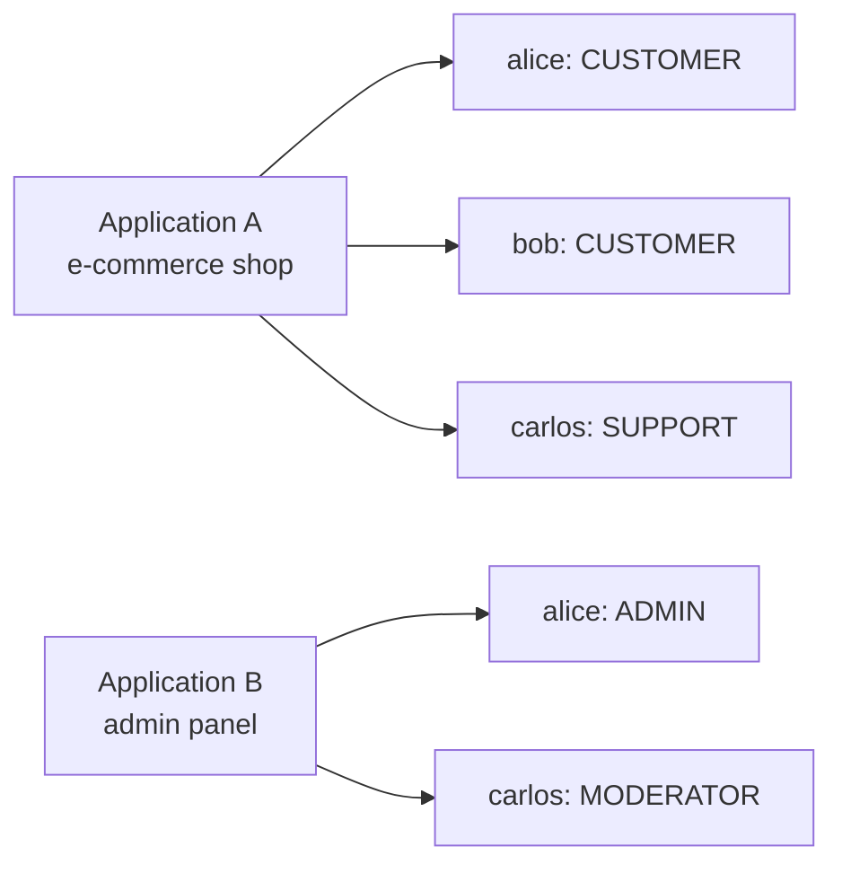
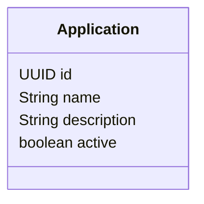
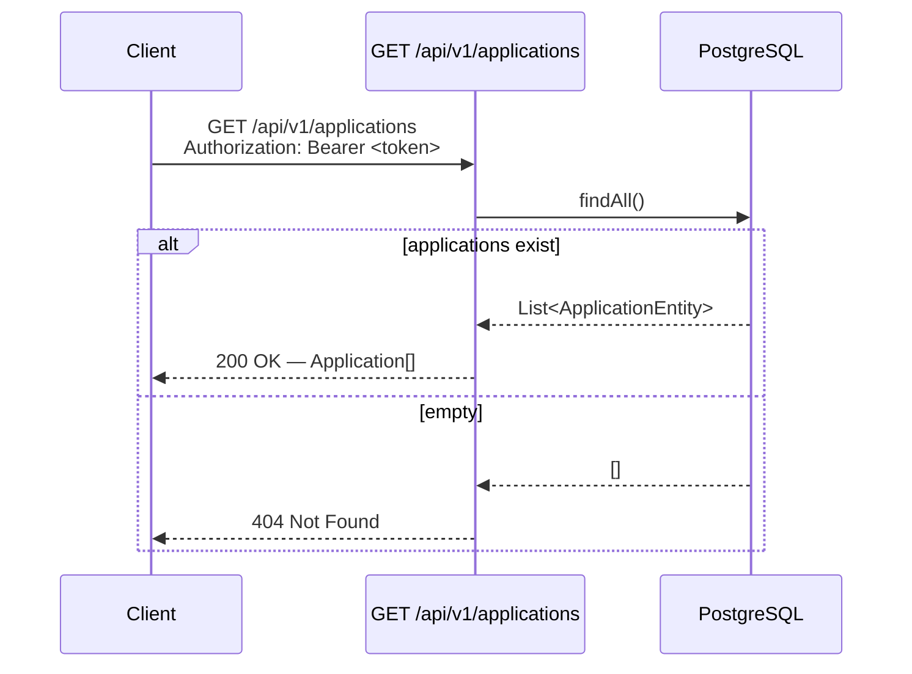
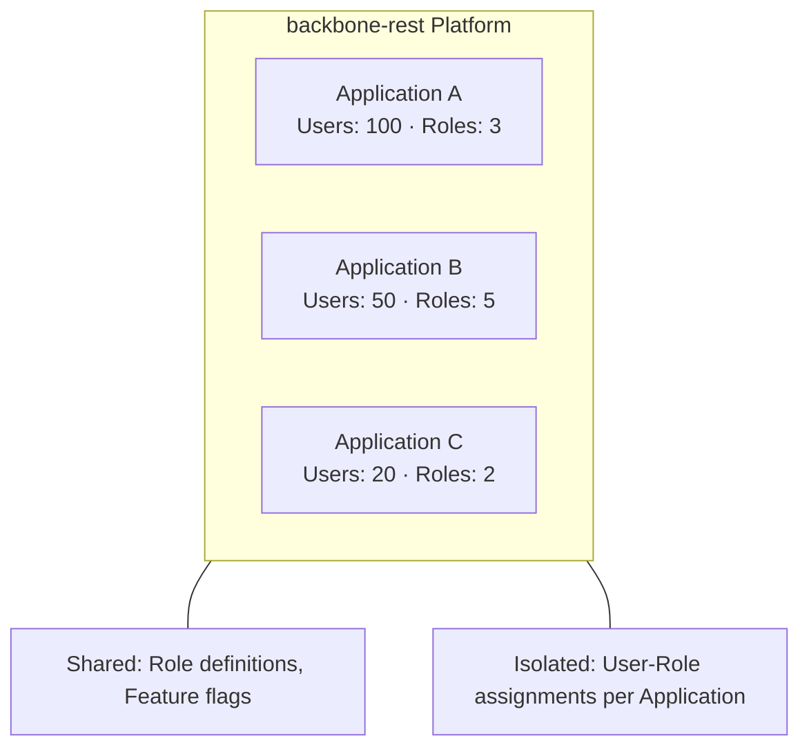

# 🏢 Application Client Management

> **Guide:** v1 · [← Back to Index](./README.md)

---

## Overview

An **Application** (also referred to as a _client_) is the top-level multi-tenancy boundary in Backbone REST. Every user, role assignment, and session exists **within the context of an Application**.

Think of an Application as:

- A **product** or **service** you are building on top of the backbone platform
- A **tenant** that owns its own set of users, roles, and features
- A **client registration** that allows your frontend or service to authenticate users

### Why Applications Matter



The same user can exist in **multiple applications** with **different roles** in each — the `ApplicationRoleUser` junction enforces this isolation.

---

## Application Data Model



---

## Endpoints

### 1. Register a New Application Client

```http
POST /api/v1/applications
Content-Type: application/json
session-token: <token>
```

Creates a new application client registration. Once registered, users and roles can be linked to this application.

#### Request Body

```json
{
  "application": {
    "name": "My Awesome App",
    "description": "Customer-facing e-commerce application",
    "active": true
  }
}
```

| Field | Type | Required | Description |
|-------|------|----------|-------------|
| `application` | `object` | ✅ | The application object to create |
| `application.name` | `string` | ✅ | Unique application name |
| `application.description` | `string` | — | Human-readable description |
| `application.active` | `boolean` | — | Whether the application is active |

#### Response `201 Created`

```json
{
  "id": "f47ac10b-58cc-4372-a567-0e02b2c3d479",
  "name": "My Awesome App",
  "description": "Customer-facing e-commerce application",
  "active": true
}
```

| Field | Type | Description |
|-------|------|-------------|
| `id` | `UUID` | Auto-generated application identifier |
| `name` | `string` | Application name |
| `description` | `string` | Application description |
| `active` | `boolean` | Active status |

#### Error Responses

| Code | Description |
|------|-------------|
| `400 Bad Request` | Request body missing or `application` object is null |
| `500 Internal Server Error` | Persistence error |

---

### 2. List All Applications

```http
GET /api/v1/applications
Authorization: Bearer <session-token>
```

Returns every registered application on the platform. Useful for discovery, admin dashboards, or populating an application selector in a management UI.

#### Response `200 OK`

```json
[
  {
    "id": "f47ac10b-58cc-4372-a567-0e02b2c3d479",
    "name": "My Awesome App",
    "description": "Customer-facing e-commerce application",
    "active": true
  },
  {
    "id": "a1b2c3d4-0000-1111-2222-333344445555",
    "name": "Backoffice Portal",
    "description": "Internal management portal",
    "active": true
  }
]
```

| Field | Type | Description |
|-------|------|-------------|
| `id` | `UUID` | Application identifier |
| `name` | `string` | Application name |
| `description` | `string` | Application description |
| `active` | `boolean` | Active status |

#### Error Responses

| Code | Description |
|------|-------------|
| `404 Not Found` | No applications have been registered yet |

#### Flow



---

## The Application ID in Other Endpoints

Once you have registered an application and obtained its `id`, you use it as a **scope parameter** in virtually every other API call:

| Endpoint | Application Context |
|----------|---------------------|
| `POST /api/v1/users` | `applicationId` field in body |
| `GET /api/v1/users/application/{applicationId}` | Path parameter |
| `GET /api/v1/users/check/alias/{alias}/application/{applicationId}` | Path parameter |
| `GET /api/v1/users/check/email/{email}/application/{applicationId}` | Path parameter |
| `GET /api/v1/users/userByAlias/{alias}/application/{applicationId}` | Path parameter |
| `GET /api/v1/users/alias/{alias}/application/{applicationId}` | Path parameter |
| `DELETE /api/v1/users/application/{applicationId}/user/{userId}` | Path parameter |
| `PUT /api/v1/users/{userId}` | `application` field in body |
| `POST /api/v1/sessions/token` | `applicationId` field in body |
| `POST /api/v1/iam/permissions/check` | `applicationId` field in body |

---

## Multi-Tenant Design



### Isolation Rules

- ✅ A user can be registered in **multiple** applications
- ✅ A user can have **different roles** in different applications
- ✅ Listing users is always **scoped by `applicationId`**
- ❌ You cannot list all users across all applications in a single call

---

## Complete Setup Walkthrough

Follow these steps to onboard a new application client from scratch:

### Step 1 — Register the Application

```http
POST /api/v1/applications
```

```json
{
  "application": {
    "name": "Backoffice Portal",
    "description": "Internal management portal",
    "active": true
  }
}
```

**Save the returned `id`** — this is your `applicationId` for all subsequent calls.

---

### Step 2 — Create Roles for the Application

```http
POST /api/v1/roles/
```

```json
{
  "role": {
    "name": "ADMIN",
    "description": "Full access administrator",
    "active": true
  }
}
```

See [Roles & Features](./06-roles-features.md) for full role management documentation.

---

### Step 3 — Create the First User

```http
POST /api/v1/users
```

```json
{
  "alias": "admin_user",
  "displayName": "Admin User",
  "password": "s3cur3P@ss!",
  "email": "admin@myapp.com",
  "active": true,
  "notificationEmail": true,
  "notificationSms": false,
  "privacyDataOutActive": false,
  "person": {
    "firstName": "Admin",
    "lastName": "User"
  },
  "roleId": "<role-id-from-step-2>",
  "applicationId": "<app-id-from-step-1>"
}
```

---

### Step 4 — Authenticate

```http
POST /api/v1/sessions/token
```

```json
{
  "email": "admin@myapp.com",
  "password": "s3cur3P@ss!",
  "applicationId": "<app-id-from-step-1>"
}
```

You will receive a `token` and `refreshToken` to use in subsequent API calls.

---

## Application vs. Client: Terminology

In Backbone REST documentation, these terms are used interchangeably:

| Term | Meaning |
|------|---------|
| **Application** | The registered entity in the database (`Application` POJO) |
| **Client** | The same entity from the perspective of an API consumer |
| **Tenant** | The same entity from a multi-tenancy perspective |
| **applicationId** | The UUID used to scope API calls to a specific application |

---

> ➡️ Next: [User–Application–Role](./05-user-application-role.md)

