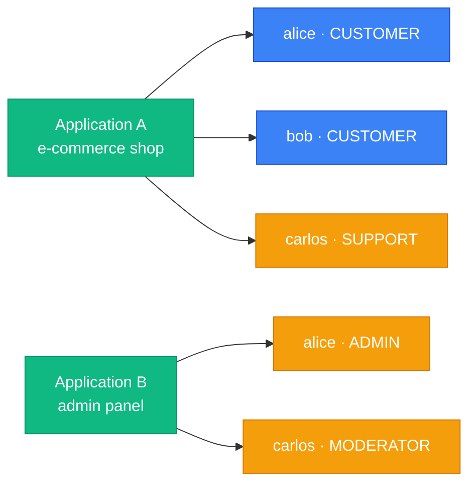
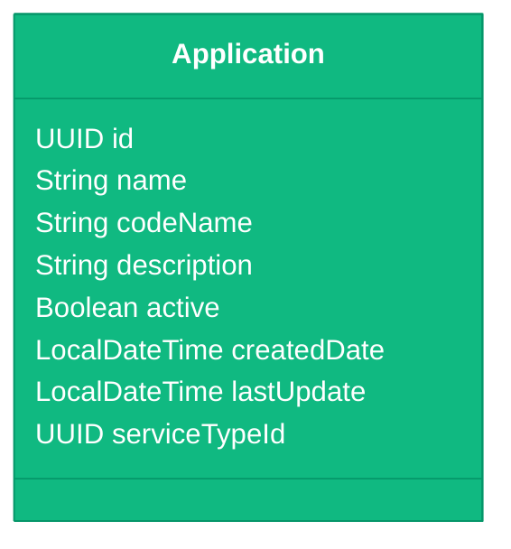
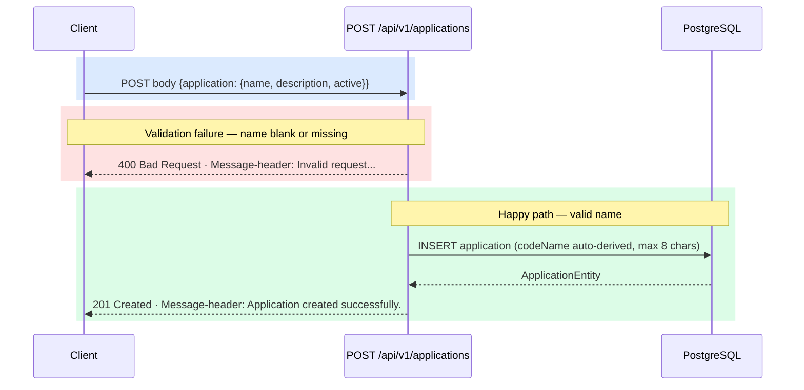
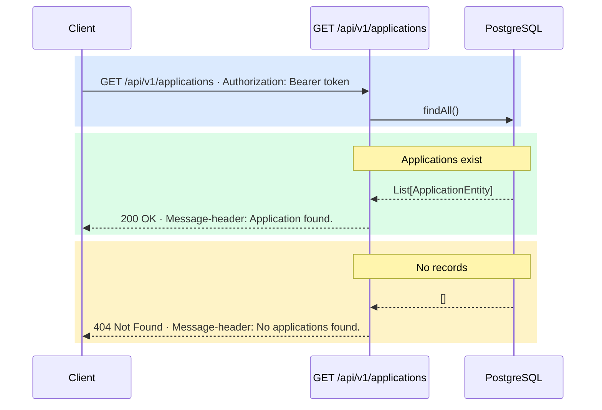
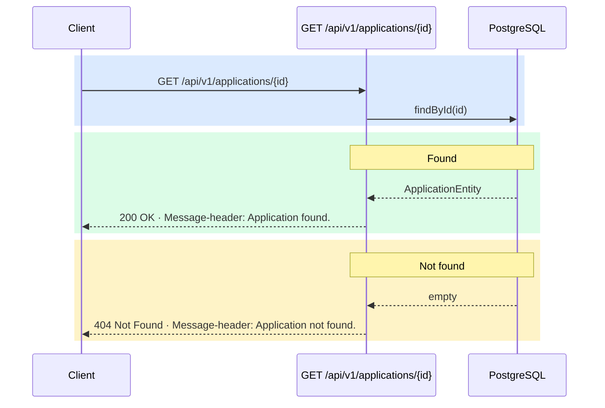
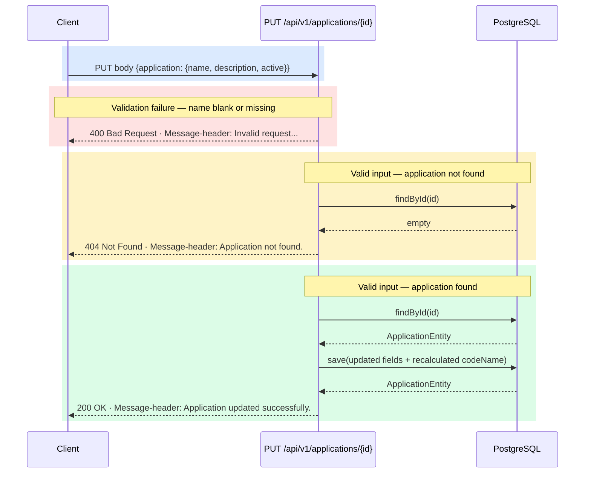
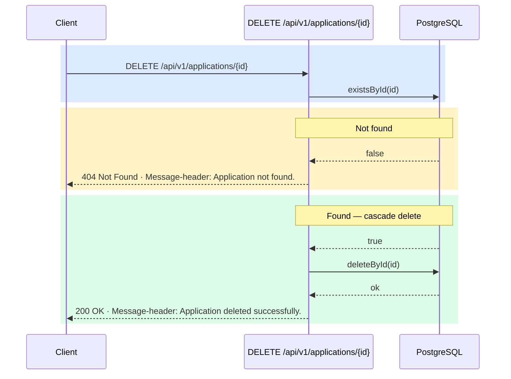
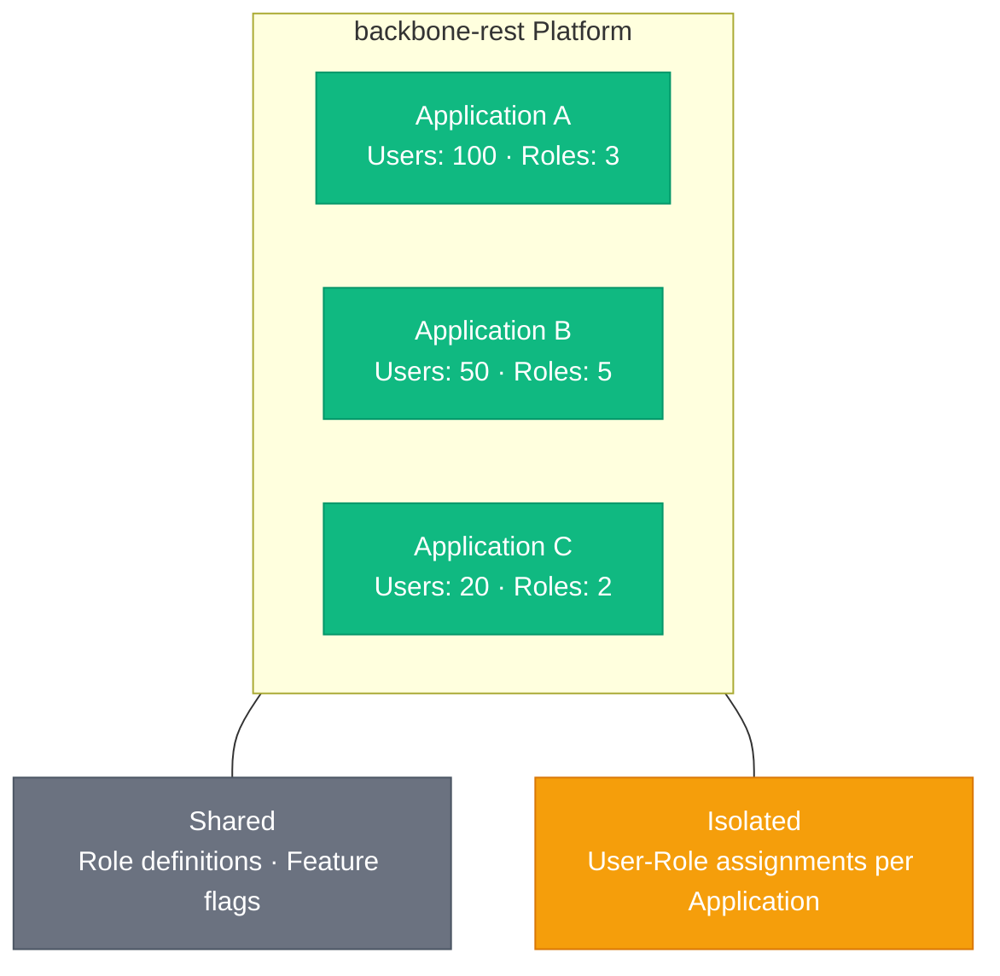

# Application Client Management

> **Guide:** v1 · [← Back to Index](./README.md)

---

## Overview

An **Application** (also referred to as a _client_) is the top-level multi-tenancy boundary in Backbone REST. Every user, role assignment, and session exists **within the context of an Application**.

Think of an Application as:

- A **product** or **service** you are building on top of the backbone platform
- A **tenant** that owns its own set of users, roles, and features
- A **client registration** that allows your frontend or service to authenticate users

### Why Applications Matter



The same user can exist in **multiple applications** with **different roles** in each — the `ApplicationRoleUser` junction enforces this isolation.

---

## Application Data Model



> [!NOTE]
> `codeName` is auto-derived from `name` on create and update: lowercased, non-alphanumeric characters replaced with `_`, **truncated to 8 characters** (e.g. `"Backoffice Portal"` → `"backoffi"`). It cannot be set directly by callers.

---

## Endpoints

### 1. Register a New Application Client

```http
POST /api/v1/applications
Authorization: Bearer <oauth2-jwt>
Content-Type: application/json
```

Creates a new application client registration. Once registered, users and roles can be linked to this application.

#### Request Body

```json
{
  "application": {
    "name": "My Awesome App",
    "description": "Customer-facing e-commerce application",
    "active": true
  }
}
```

| Field | Type | Required | Description |
|-------|------|----------|-------------|
| `application` | `object` | Yes | The application object to create |
| `application.name` | `string` | Yes | Unique display name (non-blank) |
| `application.description` | `string` | No | Human-readable description |
| `application.active` | `boolean` | No | Whether the application is active |

#### Response `201 Created`

```json
{
  "id": "f47ac10b-58cc-4372-a567-0e02b2c3d479",
  "name": "My Awesome App",
  "codeName": "my_aweso",
  "description": "Customer-facing e-commerce application",
  "active": true,
  "createdDate": "2026-07-13T02:00:00Z"
}
```

| Field | Type | Description |
|-------|------|-------------|
| `id` | `UUID` | Auto-generated application identifier |
| `name` | `string` | Application display name |
| `codeName` | `string` | Auto-derived short code (max 8 chars) |
| `description` | `string` | Application description |
| `active` | `boolean` | Active status |
| `createdDate` | `datetime` | UTC creation timestamp |

#### Response Headers

| Header | Value |
|--------|-------|
| `Message-header` | `Application created successfully.` |

#### Error Responses

| Code | `Message-header` | Description |
|------|-----------------|-------------|
| `400 Bad Request` | `Invalid request. The 'application' body is required and must include a non-blank 'name'.` | Missing or blank `name` |
| `500 Internal Server Error` | — | Persistence error |

#### Flow



---

### 2. List All Applications

```http
GET /api/v1/applications
Authorization: Bearer <oauth2-jwt>
```

Returns every registered application on the platform.

#### Response `200 OK`

```json
[
  {
    "id": "f47ac10b-58cc-4372-a567-0e02b2c3d479",
    "name": "My Awesome App",
    "codeName": "my_aweso",
    "description": "Customer-facing e-commerce application",
    "active": true
  },
  {
    "id": "a1b2c3d4-0000-1111-2222-333344445555",
    "name": "Backoffice Portal",
    "codeName": "backoffi",
    "description": "Internal management portal",
    "active": true
  }
]
```

#### Response Headers

| Header | Value |
|--------|-------|
| `Message-header` | `Application found.` |

#### Error Responses

| Code | `Message-header` | Description |
|------|-----------------|-------------|
| `404 Not Found` | `No applications found.` | No applications registered yet |

#### Flow



---

### 3. List Applications by IDs

```http
GET /api/v1/applications?ids={id1,id2,...}
Authorization: Bearer <oauth2-jwt>
```

Returns only the applications matching the supplied UUIDs. Useful when you already know a set of application IDs and need their full records.

#### Query Parameters

| Parameter | Type | Required | Description |
|-----------|------|----------|-------------|
| `ids` | `UUID[]` | Yes | Comma-separated list of application UUIDs |

#### Response `200 OK`

```json
[
  {
    "id": "f47ac10b-58cc-4372-a567-0e02b2c3d479",
    "name": "My Awesome App",
    "codeName": "my_aweso",
    "active": true
  }
]
```

#### Response Headers

| Header | Value |
|--------|-------|
| `Message-header` | `Application found.` |

#### Error Responses

| Code | `Message-header` | Description |
|------|-----------------|-------------|
| `404 Not Found` | `No applications found.` | None of the supplied IDs matched |

#### Example

```bash
curl -k -s \
  "https://<host>:8084/api/v1/applications?ids=f47ac10b-58cc-4372-a567-0e02b2c3d479,a1b2c3d4-0000-1111-2222-333344445555" \
  -H "Authorization: Bearer <oauth2-jwt>"
```

---

### 4. Find Application by ID

```http
GET /api/v1/applications/{id}
Authorization: Bearer <oauth2-jwt>
```

Returns a single application by its UUID.

#### Path Parameters

| Parameter | Type | Required | Description |
|-----------|------|----------|-------------|
| `id` | `UUID` | Yes | Application identifier |

#### Response `200 OK`

```json
{
  "id": "f47ac10b-58cc-4372-a567-0e02b2c3d479",
  "name": "My Awesome App",
  "codeName": "my_aweso",
  "description": "Customer-facing e-commerce application",
  "active": true
}
```

#### Response Headers

| Header | Value |
|--------|-------|
| `Message-header` | `Application found.` |

#### Error Responses

| Code | `Message-header` | Description |
|------|-----------------|-------------|
| `404 Not Found` | `Application not found.` | No application matches the given ID |
| `401 Unauthorized` | — | Missing or invalid Bearer token |

#### Flow



---

### 5. Update Application

```http
PUT /api/v1/applications/{id}
Authorization: Bearer <oauth2-jwt>
Content-Type: application/json
```

Updates the metadata of an existing application. The `codeName` is automatically recalculated from the new `name`.

#### Path Parameters

| Parameter | Type | Required | Description |
|-----------|------|----------|-------------|
| `id` | `UUID` | Yes | Application identifier |

#### Request Body

```json
{
  "application": {
    "name": "Backoffice Portal v2",
    "description": "Internal management portal — v2",
    "active": true
  }
}
```

| Field | Type | Required | Description |
|-------|------|----------|-------------|
| `application` | `object` | Yes | Wrapper object |
| `application.name` | `string` | Yes | Updated display name (non-blank) |
| `application.description` | `string` | No | Updated description |
| `application.active` | `boolean` | No | Updated active status |

#### Response `200 OK`

```json
{
  "id": "f47ac10b-58cc-4372-a567-0e02b2c3d479",
  "name": "Backoffice Portal v2",
  "codeName": "backoffi",
  "description": "Internal management portal — v2",
  "active": true
}
```

#### Response Headers

| Header | Value |
|--------|-------|
| `Message-header` | `Application updated successfully.` |

#### Error Responses

| Code | `Message-header` | Description |
|------|-----------------|-------------|
| `400 Bad Request` | `Invalid request. The 'application' body is required and must include a non-blank 'name'.` | Missing or blank `name` |
| `404 Not Found` | `Application not found.` | No application matches the given ID |
| `401 Unauthorized` | — | Missing or invalid Bearer token |

#### Flow



---

### 6. Delete Application

```http
DELETE /api/v1/applications/{id}
Authorization: Bearer <oauth2-jwt>
```

Permanently removes an application from the system.

> [!CAUTION]
> Deletion is irreversible. All `ApplicationRoleUser` associations for this application will also be removed by the database cascade rules.

#### Path Parameters

| Parameter | Type | Required | Description |
|-----------|------|----------|-------------|
| `id` | `UUID` | Yes | Application identifier |

#### Responses

| Status | `Message-header` | When |
|--------|-----------------|------|
| `200 OK` | `Application deleted successfully.` | Application removed |
| `404 Not Found` | `Application not found.` | No application matches the given ID |
| `401 Unauthorized` | — | Missing or invalid Bearer token |

#### Flow



#### Example

```bash
curl -k -s -X DELETE \
  https://<host>:8084/api/v1/applications/f47ac10b-58cc-4372-a567-0e02b2c3d479 \
  -H "Authorization: Bearer <oauth2-jwt>"
```

---

## The Application ID in Other Endpoints

Once you have registered an application and obtained its `id`, you use it as a **scope parameter** in virtually every other API call:

| Endpoint | Application Context |
|----------|---------------------|
| `POST /api/v1/users` | `applicationId` field in body |
| `GET /api/v1/users/application/{applicationId}` | Path parameter |
| `GET /api/v1/users/check/alias/{alias}/application/{applicationId}` | Path parameter |
| `GET /api/v1/users/check/email/{email}/application/{applicationId}` | Path parameter |
| `GET /api/v1/users/userByAlias/{alias}/application/{applicationId}` | Path parameter |
| `GET /api/v1/users/alias/{alias}/application/{applicationId}` | Path parameter |
| `DELETE /api/v1/users/application/{applicationId}/user/{userId}` | Path parameter |
| `PUT /api/v1/users/{userId}` | `application` field in body |
| `POST /api/v1/sessions/token` | `applicationId` field in body |
| `POST /api/v1/iam/permissions/check` | `applicationId` field in body |

---

## Multi-Tenant Design



### Isolation Rules

- A user can be registered in **multiple** applications
- A user can have **different roles** in different applications
- Listing users is always **scoped by `applicationId`**
- You cannot list all users across all applications in a single call

---

## Complete Setup Walkthrough

Follow these steps to onboard a new application client from scratch:

### Step 1 — Register the Application

```http
POST /api/v1/applications
```

```json
{
  "application": {
    "name": "Backoffice Portal",
    "description": "Internal management portal",
    "active": true
  }
}
```

**Save the returned `id`** — this is your `applicationId` for all subsequent calls.

---

### Step 2 — Create Roles for the Application

```http
POST /api/v1/roles/
```

```json
{
  "role": {
    "name": "ADMIN",
    "description": "Full access administrator",
    "active": true
  }
}
```

See [Roles & Features](./06-roles-features.md) for full role management documentation.

---

### Step 3 — Create the First User

```http
POST /api/v1/users
```

```json
{
  "alias": "admin_user",
  "displayName": "Admin User",
  "password": "s3cur3P@ss!",
  "email": "admin@myapp.com",
  "active": true,
  "notificationEmail": true,
  "notificationSms": false,
  "privacyDataOutActive": false,
  "person": {
    "firstName": "Admin",
    "lastName": "User"
  },
  "roleId": "<role-id-from-step-2>",
  "applicationId": "<app-id-from-step-1>"
}
```

---

### Step 4 — Authenticate

```http
POST /api/v1/sessions/token
```

```json
{
  "email": "admin@myapp.com",
  "password": "s3cur3P@ss!",
  "applicationId": "<app-id-from-step-1>"
}
```

You will receive a `token` and `refreshToken` to use in subsequent API calls.

---

## Application vs. Client: Terminology

In Backbone REST documentation, these terms are used interchangeably:

| Term | Meaning |
|------|---------|
| **Application** | The registered entity in the database (`Application` POJO) |
| **Client** | The same entity from the perspective of an API consumer |
| **Tenant** | The same entity from a multi-tenancy perspective |
| **applicationId** | The UUID used to scope API calls to a specific application |

---

> Next: [User–Application–Role](./05-user-application-role.md)
