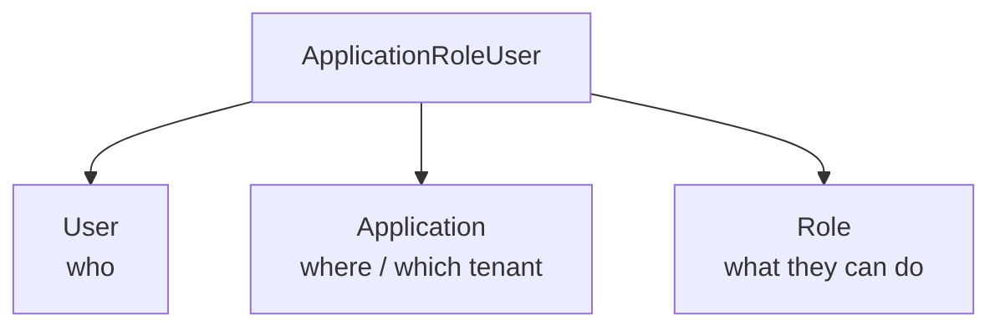
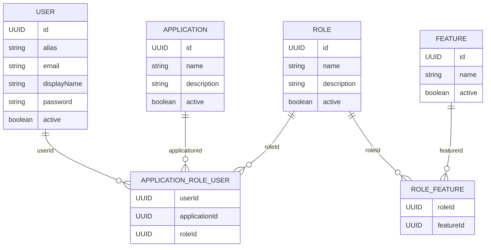

# 🔗 User–Application–Role (Multi-Tenant RBAC)

> **Guide:** v1 · [← Back to Index](./README.md)

---

## Overview

The `ApplicationRoleUser` junction is the heart of Backbone REST's **multi-tenant Role-Based Access Control (RBAC)** model. It creates a three-way link:



This design allows the **same user** to participate in **multiple applications** with **different roles** in each, maintaining strict tenant isolation.

---

## Data Model



---

## Role Assignment at User Creation

When you create a user via `POST /api/v1/users`, you **must** supply both a `roleId` and an `applicationId`. This creates the initial `ApplicationRoleUser` record automatically:

```json
{
  "alias": "johndoe",
  "roleId": "a1b2c3d4-e5f6-7890-abcd-ef1234567890",
  "applicationId": "f47ac10b-58cc-4372-a567-0e02b2c3d479",
  ...
}
```

The service:
1. Creates the `User` entity
2. Resolves the `Application` and `Role` entities
3. Creates the `ApplicationRoleUser` junction record
4. Returns `UserCreateResponse` with all three IDs confirmed

---

## Managing Role Assignments After Creation

### Add a Role to a User

```http
PUT /api/v1/users/link/user/{userId}/role/{roleId}
session-token: <token>
```

Adds a role to the user's role set. If the role is already assigned, it is a no-op.

#### Path Parameters

| Parameter | Type | Description |
|-----------|------|-------------|
| `userId` | `UUID` | The target user |
| `roleId` | `UUID` | The role to add |

#### Response `200 OK`

Returns the updated full `UserTO` with the updated `roles` collection.

---

### Remove a Role from a User

```http
PUT /api/v1/users/unlink/user/{userId}/role/{roleId}
session-token: <token>
```

Removes a role from the user's role set within the application context.

#### Path Parameters

| Parameter | Type | Description |
|-----------|------|-------------|
| `userId` | `UUID` | The target user |
| `roleId` | `UUID` | The role to remove |

#### Response `200 OK`

Returns the updated full `UserTO` with the role removed from the `roles` collection.

---

### Update All Roles at Once (Partial Update)

Use the partial update endpoint to **replace the entire role set** in one call:

```http
PUT /api/v1/users/{userId}
Content-Type: application/json
session-token: <token>
```

```json
{
  "application": "f47ac10b-58cc-4372-a567-0e02b2c3d479",
  "roleIds": [
    "a1b2c3d4-e5f6-7890-abcd-ef1234567890",
    "b2c3d4e5-f6a7-8901-bcde-f12345678901"
  ]
}
```

> ⚠️ Providing `roleIds` in the partial update **replaces** the entire role set — it does not append to it.

---

## Checking User Roles at Runtime

### Via Token Introspection

After a user authenticates, their roles are embedded in the JWT claims. Use the introspect endpoint to verify:

```http
POST /api/v1/iam/tokens/introspect
Content-Type: application/json
session-token: <token>
```

```json
{
  "token": "<the-session-jwt>"
}
```

Response includes the `roles` claim:

```json
{
  "active": true,
  "subject": "johndoe",
  "roles": ["ADMIN", "SUPPORT"],
  ...
}
```

### Via Permission Check

To verify a specific permission programmatically:

```http
POST /api/v1/iam/permissions/check
Content-Type: application/json
session-token: <token>
```

```json
{
  "permission": "ROLE_ADMIN",
  "applicationId": "f47ac10b-58cc-4372-a567-0e02b2c3d479",
  "sessionToken": "<the-session-jwt>"
}
```

See [IAM — Permissions & Tokens](./07-iam.md) for full details.

---

## Scenarios

### Scenario 1: User Promotion

A support agent is promoted to admin:

```http
PUT /api/v1/users/link/user/{userId}/role/{adminRoleId}
PUT /api/v1/users/unlink/user/{userId}/role/{supportRoleId}
```

### Scenario 2: User Joins a Second Application

The same user account is enrolled in a second application with a different role:

```http
POST /api/v1/users
```

> You can create a new user entry for the same person in the second application, linking via the same `personId` in the `person` field.

### Scenario 3: Revoke All Roles

```http
PUT /api/v1/users/{userId}
```

```json
{
  "application": "<appId>",
  "roleIds": []
}
```

### Scenario 4: Access Control Gate in Your Application

```
1. User logs in  →  POST /sessions/token  →  receive JWT
2. On every sensitive action:
   →  POST /iam/permissions/check
      { "permission": "ROLE_ADMIN", "applicationId": "...", "sessionToken": "..." }
3. If granted = true  →  allow action
   If granted = false →  return 403 to end user
```

---

> ➡️ Next: [Roles & Features](./06-roles-features.md)

