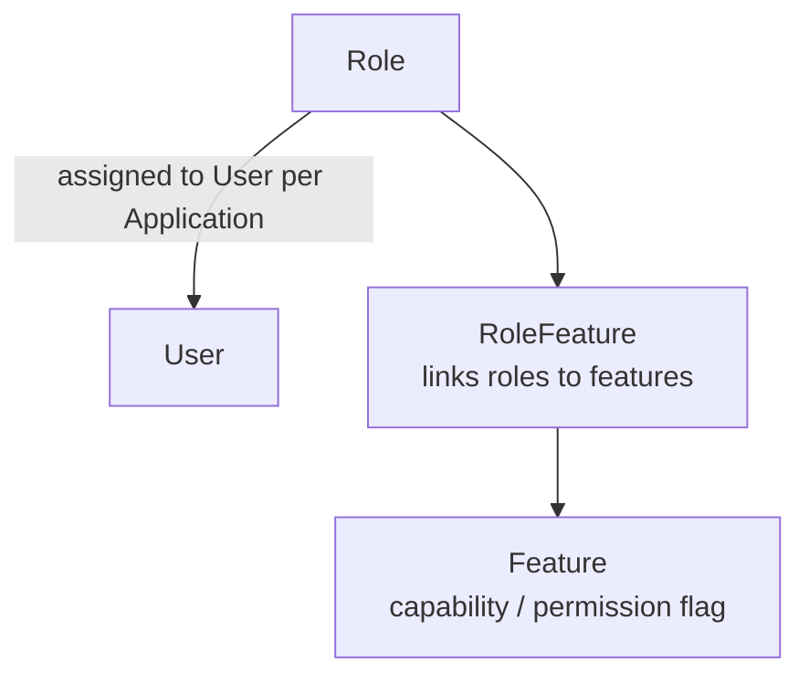
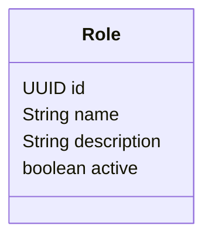
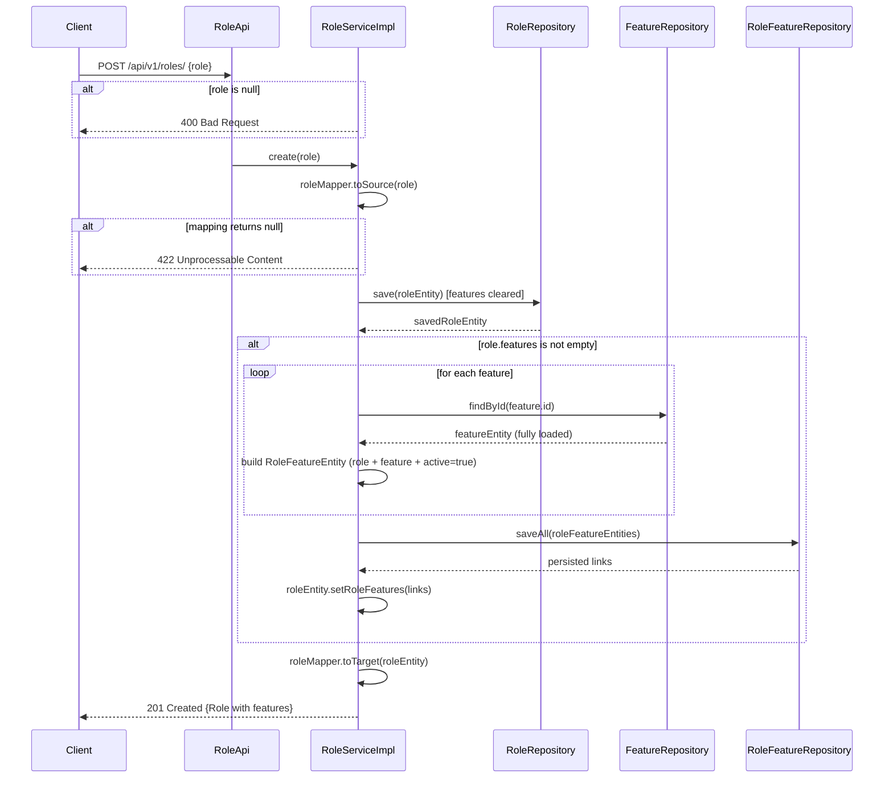
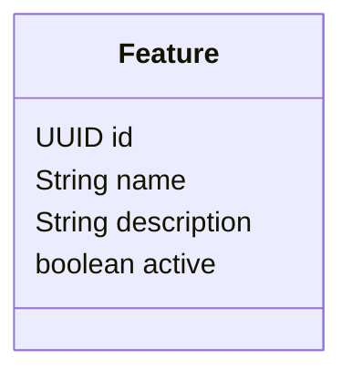

# 🎭 Roles & Features

> **Guide:** v1 · [← Back to Index](./README.md)

---

## Overview

Backbone REST uses a flat **Role-Based Access Control (RBAC)** model:



- **Roles** define _what kind_ of user someone is (e.g., `ADMIN`, `CUSTOMER`, `SUPPORT`)
- **Features** define _what capabilities_ exist in the system
- **RoleFeature** links specific features to specific roles

---

## Role Management

### Role Data Model



### Endpoints

#### Get Role by ID

```http
GET /api/v1/roles/find/{roleId}
session-token: <token>
```

| Parameter | Type | Description |
|-----------|------|-------------|
| `roleId` | `UUID` | Role identifier |

**Response `200 OK`:**

```json
{
  "id": "a1b2c3d4-e5f6-7890-abcd-ef1234567890",
  "name": "ADMIN",
  "description": "Full access administrator",
  "active": true
}
```

---

#### List All Roles

```http
GET /api/v1/roles
session-token: <token>
```

Returns all roles regardless of status.

**Response `200 OK`:** Array of `Role` objects.

---

#### List Roles by Status

```http
GET /api/v1/roles/{includeInactive}
session-token: <token>
```

| Parameter | Type | Description |
|-----------|------|-------------|
| `includeInactive` | `boolean` | `true` = include inactive roles; `false` = active only |

**Response `200 OK`:** Array of `Role` objects filtered by status.

---

#### List Roles by Status and IDs

```http
GET /api/v1/roles/{includeInactive}/{roleIds}
session-token: <token>
```

| Parameter | Type | Description |
|-----------|------|-------------|
| `includeInactive` | `boolean` | Include inactive roles |
| `roleIds` | `UUID[]` | Comma-separated list of role UUIDs to filter |

**Example:**
```http
GET /api/v1/roles/false/a1b2c3d4-...,b2c3d4e5-...
```

---

#### List Roles by User

```http
GET /api/v1/roles/user/{userId}
session-token: <token>
```

Returns all roles currently assigned to the specified user.

| Parameter | Type | Description |
|-----------|------|-------------|
| `userId` | `UUID` | User identifier |

**Response `200 OK`:** Array of `Role` objects.

---

#### Create Role

```http
POST /api/v1/roles/
Content-Type: application/json
session-token: <token>
```

**Request Body:**

```json
{
  "role": {
    "name": "SUPPORT",
    "description": "Customer support agent",
    "active": true,
    "features": [
      { "id": "feat-uuid-1" },
      { "id": "feat-uuid-2" }
    ]
  }
}
```

| Field | Type | Required | Description |
|-------|------|----------|-------------|
| `role.name` | `string` | ✅ | Unique role name (convention: UPPERCASE) |
| `role.description` | `string` | — | Human-readable description |
| `role.active` | `boolean` | — | Whether the role is active |
| `role.features` | `Feature[]` | — | Existing features to link at creation time; only `id` is required per entry |

**Create Role Flow:**



> **Note:** Features must already exist in the system before being referenced here.
> Only the feature `id` is required; name and description are resolved from the database.

**Response `201 Created`:** The created `Role` object with generated `id` and linked features.

**Error Responses:**

| Code | Description |
|------|-------------|
| `400 Bad Request` | Role object is null |
| `422 Unprocessable Content` | Role payload could not be mapped |

---

#### Update Role

```http
PUT /api/v1/roles/{roleId}
Content-Type: application/json
session-token: <token>
```

| Parameter | Type | Description |
|-----------|------|-------------|
| `roleId` | `UUID` | Role to update |

**Request Body:**

```json
{
  "role": {
    "name": "SUPPORT",
    "description": "Updated description",
    "active": false
  }
}
```

**Response `200 OK`:** The updated `Role` object.

**Error Responses:**

| Code | Description |
|------|-------------|
| `404 Not Found` | Role not found |

---

## Feature Management

Features are **capability flags** that can be linked to roles to express fine-grained permissions.

### Feature Data Model



### Endpoints

#### Get Feature by ID

```http
GET /api/v1/features/find/{featureId}
session-token: <token>
```

| Parameter | Type | Description |
|-----------|------|-------------|
| `featureId` | `UUID` | Feature identifier |

**Response `200 OK`:**

```json
{
  "id": "feat-uuid-here",
  "name": "EXPORT_REPORTS",
  "description": "Allows exporting system reports",
  "active": true
}
```

---

#### List Features by Status

```http
GET /api/v1/features/{includeInactive}
session-token: <token>
```

| Parameter | Type | Description |
|-----------|------|-------------|
| `includeInactive` | `boolean` | `true` = include inactive features |

**Response `200 OK`:** Array of `Feature` objects.

---

#### List Features by Status and IDs

```http
GET /api/v1/features/{includeInactive}/{featuresIds}
session-token: <token>
```

| Parameter | Type | Description |
|-----------|------|-------------|
| `includeInactive` | `boolean` | Include inactive features |
| `featuresIds` | `string[]` | Comma-separated feature ID strings |

---

#### Create Feature

```http
POST /api/v1/features/
Content-Type: application/json
session-token: <token>
```

**Request Body:**

```json
{
  "feature": {
    "name": "EXPORT_REPORTS",
    "description": "Allows exporting system reports",
    "active": true
  }
}
```

| Field | Type | Required | Description |
|-------|------|----------|-------------|
| `feature.name` | `string` | ✅ | Unique feature name (convention: SCREAMING_SNAKE_CASE) |
| `feature.description` | `string` | — | What this feature enables |
| `feature.active` | `boolean` | — | Feature active status |

**Response `201 Created`:** The created `Feature` object.

**Error Responses:**

| Code | Description |
|------|-------------|
| `406 Not Acceptable` | Feature could not be created |

---

#### Update Feature

```http
PUT /api/v1/features/{featureId}
Content-Type: application/json
session-token: <token>
```

| Parameter | Type | Description |
|-----------|------|-------------|
| `featureId` | `UUID` | Feature to update |

**Request Body:**

```json
{
  "feature": {
    "name": "EXPORT_REPORTS",
    "description": "Updated description — also allows PDF export",
    "active": true
  }
}
```

**Response `202 Accepted`:** The updated `Feature` object.

**Error Responses:**

| Code | Description |
|------|-------------|
| `406 Not Acceptable` | Feature not registered |

---

## RBAC Design Guidelines

### Naming Conventions

| Entity | Convention | Example |
|--------|-----------|---------|
| Role | `SCREAMING_SNAKE_CASE` | `ADMIN`, `CUSTOMER_SUPPORT`, `READ_ONLY` |
| Feature | `SCREAMING_SNAKE_CASE` | `EXPORT_REPORTS`, `MANAGE_USERS`, `VIEW_DASHBOARD` |

### Recommended Role Structure

```
SUPER_ADMIN     →  All features
ADMIN           →  Most features (except destructive)
MANAGER         →  Read + limited write features
SUPPORT         →  Read-only + ticket management
CUSTOMER        →  Self-service features only
```

### Feature Granularity

Design features around **actions on resources**, not UI screens:

```
✅  MANAGE_USERS        (create, update, delete users)
✅  VIEW_REPORTS        (read access to reports)
✅  EXPORT_DATA         (download/export data)
✅  CONFIGURE_APP       (modify application settings)

❌  SHOW_SIDEBAR        (UI concern, not a permission)
❌  ACCESS_PAGE_X       (too tightly coupled to UI layout)
```

---

## Complete RBAC Setup Example

```
1. Create Features
   POST /api/v1/features/  { "feature": { "name": "MANAGE_USERS", "description": "...", "active": true } }
   POST /api/v1/features/  { "feature": { "name": "VIEW_REPORTS",  "description": "...", "active": true } }
   → note the returned "id" values for use in step 2

2. Create Roles (with features linked inline)
   POST /api/v1/roles/
   {
     "role": {
       "name": "ADMIN",
       "description": "Full access administrator",
       "active": true,
       "features": [
         { "id": "<manage_users_id>" },
         { "id": "<view_reports_id>" }
       ]
     }
   }

   POST /api/v1/roles/
   {
     "role": {
       "name": "SUPPORT",
       "description": "Read-only support agent",
       "active": true,
       "features": [
         { "id": "<view_reports_id>" }
       ]
     }
   }

3. Assign Roles to Users (via user creation or link endpoint)
   POST /api/v1/users  { ..., "roleId": "<admin_role_id>", "applicationId": "..." }
```

---

> ➡️ Next: [IAM — Permissions & Tokens](./07-iam.md)

