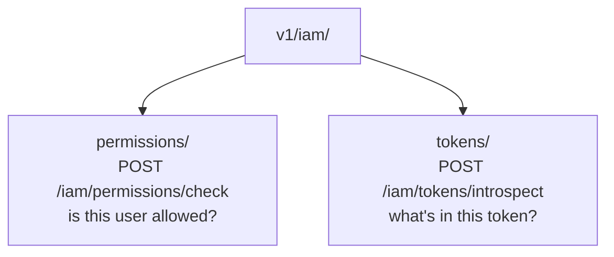
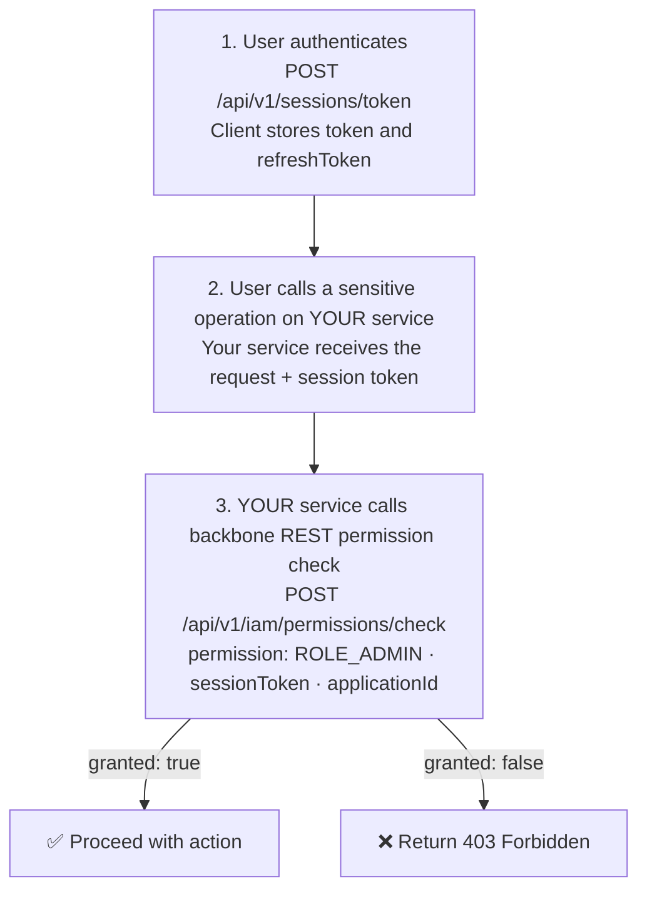

# 🛡️ IAM — Identity & Access Management

> **Guide:** v1 · [← Back to Index](./README.md)

---

## Overview

The IAM module (`/api/v1/iam/`) provides runtime identity verification and access control utilities. These endpoints are designed for **service-to-service** and **backend authorization middleware** use cases.



> 🔐 All IAM endpoints require a valid `session-token` header — they are **not** in the public exclude list.

---

## Token Introspection

### What Is Token Introspection?

Token introspection allows you to decode and validate a session JWT without knowing the signing secret. The endpoint parses the token and returns its claims in a structured format.

Use cases:
- Backend middleware that validates tokens before processing requests
- Debugging — inspect token contents during development
- Service-to-service calls where you need to verify the caller's identity

---

### Introspect a Session Token

```http
POST /api/v1/iam/tokens/introspect
Content-Type: application/json
session-token: <your-own-valid-token>
```

#### Request Body

```json
{
  "token": "eyJhbGciOiJIUzI1NiIsInR5cCI6IkpXVCJ9..."
}
```

| Field | Type | Required | Description |
|-------|------|----------|-------------|
| `token` | `string` | ✅ | The JWT session token to introspect (must be non-blank) |

#### Response `200 OK` — Valid Token

```json
{
  "active": true,
  "subject": "johndoe",
  "issuer": "backbone-rest",
  "audience": "backbone-rest-client",
  "expiresAt": 1780000000000,
  "issuedAt":  1779996400000,
  "tokenType": "ACCESS",
  "roles": ["ADMIN", "SUPPORT"]
}
```

#### Response `200 OK` — Invalid/Expired Token

```json
{
  "active": false,
  "subject": null,
  "issuer": null,
  "audience": null,
  "expiresAt": 0,
  "issuedAt": 0,
  "tokenType": null,
  "roles": []
}
```

#### Response Fields

| Field | Type | Description |
|-------|------|-------------|
| `active` | `boolean` | `true` if token is valid and not expired |
| `subject` | `string` | JWT `sub` claim — user identifier |
| `issuer` | `string` | JWT `iss` claim — token issuer |
| `audience` | `string` | JWT `aud` claim — intended audience |
| `expiresAt` | `long` | Expiry as **epoch milliseconds** (`exp × 1000`) |
| `issuedAt` | `long` | Issuance as **epoch milliseconds** (`iat × 1000`) |
| `tokenType` | `string` | Token type claim (`ACCESS` or `REFRESH`) |
| `roles` | `string[]` | Parsed role strings from the `roles` JWT claim |

#### Error Responses

| Code | Description |
|------|-------------|
| `400 Bad Request` | Token field is blank or missing |

---

### Reading `expiresAt`

```javascript
// JavaScript example
const expiresAt = introspectResponse.expiresAt; // epoch ms
const expiryDate = new Date(expiresAt);
const isExpired = Date.now() > expiresAt;
```

```java
// Java example
Instant expiry = Instant.ofEpochMilli(response.expiresAt());
boolean isExpired = Instant.now().isAfter(expiry);
```

---

## Permission Check

### What Is a Permission Check?

The permission check endpoint verifies whether a given session token carries a specific permission (role). It's the canonical way to implement **authorization middleware** in your services that consume the backbone REST API.

Use cases:
- Guard a sensitive action: "Does this user have `ROLE_ADMIN`?"
- Multi-tenant authorization: "Does this user have `ROLE_MANAGER` in this specific application?"
- API gateway policy enforcement

---

### Check a Permission

```http
POST /api/v1/iam/permissions/check
Content-Type: application/json
session-token: <your-own-valid-token>
```

#### Request Body

```json
{
  "permission": "ROLE_ADMIN",
  "applicationId": "f47ac10b-58cc-4372-a567-0e02b2c3d479",
  "sessionToken": "eyJhbGciOiJIUzI1NiIsInR5cCI6IkpXVCJ9..."
}
```

| Field | Type | Required | Description |
|-------|------|----------|-------------|
| `permission` | `string` | ✅ | The permission / role string to check (non-blank) |
| `applicationId` | `UUID` | — | Application context for the check (may be `null` for global check) |
| `sessionToken` | `string` | ✅ | The session JWT of the user being checked (non-blank) |

#### Response `200 OK` — Permission Granted

```json
{
  "granted": true,
  "permission": "ROLE_ADMIN",
  "reason": "Token carries the requested permission"
}
```

#### Response `200 OK` — Permission Denied

```json
{
  "granted": false,
  "permission": "ROLE_ADMIN",
  "reason": "Token does not carry the requested permission"
}
```

#### Response Fields

| Field | Type | Description |
|-------|------|-------------|
| `granted` | `boolean` | `true` if the token carries the requested permission |
| `permission` | `string` | The permission string that was evaluated |
| `reason` | `string` | Human-readable explanation of the result |

#### Error Responses

| Code | Description |
|------|-------------|
| `400 Bad Request` | Missing or malformed request payload |
| `401 Unauthorized` | Invalid or expired session token (the `session-token` header) |

---

## Role String Convention

When checking permissions, use the role names exactly as they were defined in your role registry:

```json
{ "permission": "ADMIN" }        // ← matches role named "ADMIN"
{ "permission": "ROLE_ADMIN" }   // ← matches role with prefix "ROLE_"
```

> The prefix convention depends on how roles were created in your system. Use the same string used in `Role.name` when creating roles via `POST /api/v1/roles/`.

---

## Authorization Flow in Your Service

Here is the recommended pattern for protecting sensitive operations in a service that calls backbone REST:



---

## IAM Quick Reference

| Goal | Endpoint | Key Field |
|------|----------|-----------|
| Decode a token | `POST /iam/tokens/introspect` | `token` |
| Check if user is admin | `POST /iam/permissions/check` | `permission: "ADMIN"` |
| Get user's roles from token | `POST /iam/tokens/introspect` | `roles[]` in response |
| Verify token is still valid | `POST /iam/tokens/introspect` | `active: true` in response |
| Check token expiry time | `POST /iam/tokens/introspect` | `expiresAt` in response |

---

## Security Considerations

> 🔐 The `sessionToken` field in the permission check request body is the token you are **checking on behalf of another user** — it is **not** the same as the `session-token` header, which authenticates the calling service.

> ⚠️ Always check `active: true` from introspect before trusting any other claim in the response.

> 💡 Cache introspect results for a short TTL (e.g., 30 seconds) to avoid hammering the endpoint on high-traffic paths. Invalidate on 401 from any downstream call.

---

> ➡️ Back to: [Index](./README.md)

