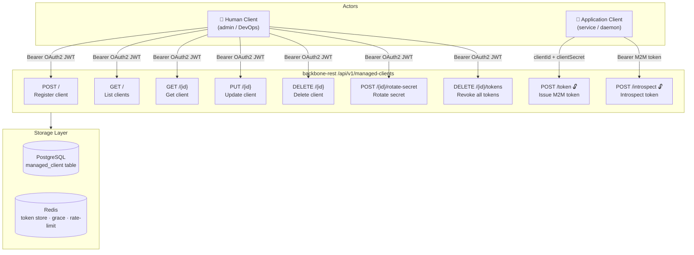
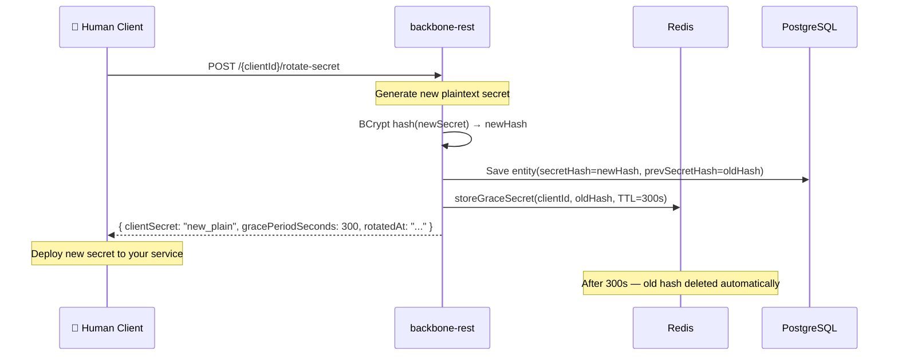
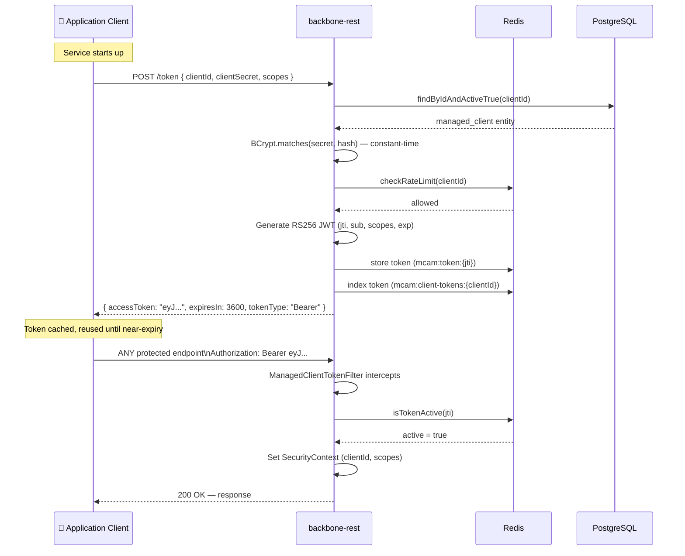
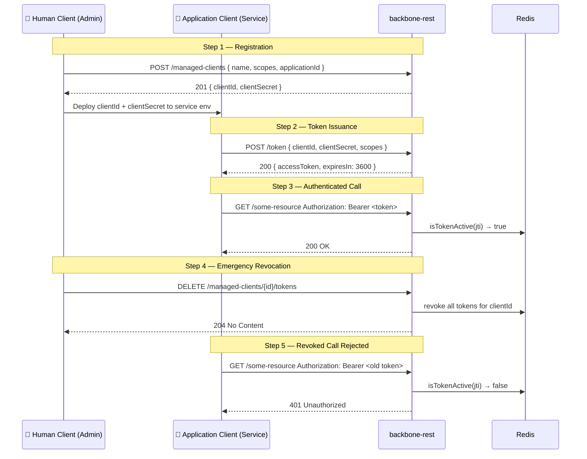
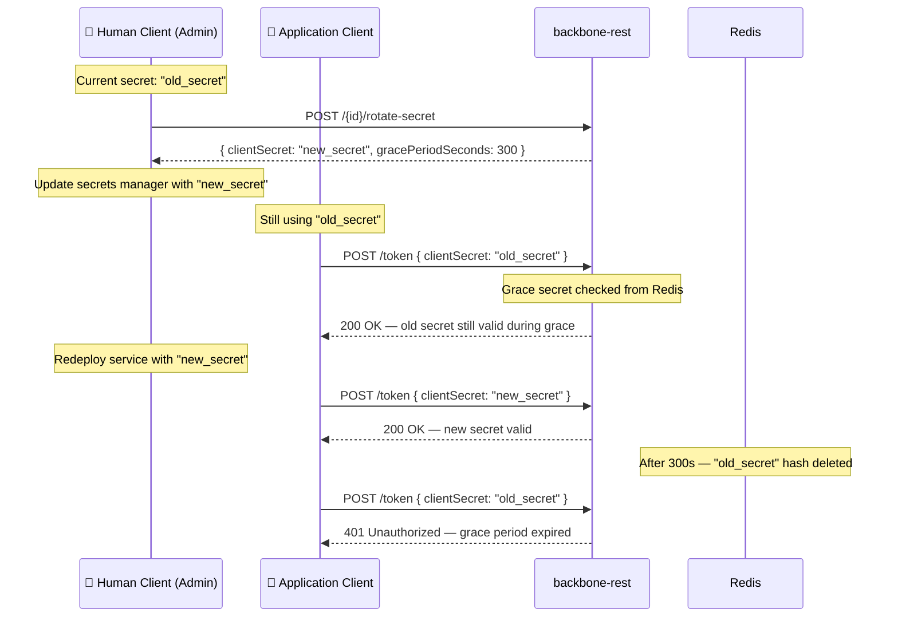

# 🤖 Managed Client Authentication Manager (MCAM)

> **Guide:** v1 · [← Back to Index](./README.md)

---

## Overview

The **Managed Client Authentication Manager (MCAM)** provides a complete M2M (machine-to-machine) OAuth2 client credential lifecycle for backbone-rest. It allows you to register service accounts, issue signed RS256 access tokens scoped to specific permissions, rotate secrets safely with a grace period, and revoke tokens instantly.



---

## Two Actor Types

| Actor | Who | How They Authenticate | What They Can Do |
|-------|-----|-----------------------|-----------------|
| **Human Client** | Admin, DevOps, backend admin service | `Authorization: Bearer <OAUTH2_JWT>` (Supabase / Keycloak) | Register, list, update, delete clients; rotate secrets; revoke tokens |
| **Application Client** | Automated service, daemon, microservice | `clientId` + `clientSecret` in the request body | Issue M2M access tokens; use those tokens on downstream protected endpoints |

> 🔓 `/token` and `/introspect` are **public** — no Bearer JWT required to call them.

---

## M2M Token Structure

M2M tokens are **RS256-signed JWTs** with the following claims:

```json
{
  "iss": "backbone-rest",
  "sub": "<clientId>",
  "jti": "<uuid>",
  "type": "M2M",
  "scopes": ["read:data", "write:data"],
  "iat": 1748995200,
  "exp": 1748998800
}
```

| Claim | Description |
|-------|-------------|
| `iss` | Issuer — always `backbone-rest` |
| `sub` | The `clientId` of the managed client |
| `jti` | Unique token ID (used for revocation) |
| `type` | Always `M2M` — identifies the token as machine-to-machine |
| `scopes` | Array of scopes the token was issued for |
| `iat` / `exp` | Issued-at / expiry (Unix epoch seconds) |

---

## Quick Reference

| Method | Path | Auth | Summary |
|--------|------|------|---------|
| `POST` | `/api/v1/managed-clients` | Bearer JWT | Register a new managed client |
| `GET` | `/api/v1/managed-clients` | Bearer JWT | List managed clients |
| `GET` | `/api/v1/managed-clients/{clientId}` | Bearer JWT | Get client detail |
| `PUT` | `/api/v1/managed-clients/{clientId}` | Bearer JWT | Update client metadata |
| `DELETE` | `/api/v1/managed-clients/{clientId}` | Bearer JWT | Delete client + revoke all tokens |
| `POST` | `/api/v1/managed-clients/token` | 🔓 Public | Issue M2M access token |
| `POST` | `/api/v1/managed-clients/{clientId}/rotate-secret` | Bearer JWT | Rotate client secret |
| `DELETE` | `/api/v1/managed-clients/{clientId}/tokens` | Bearer JWT | Revoke all active tokens |
| `POST` | `/api/v1/managed-clients/introspect` | 🔓 Public | Introspect M2M token |

---

## Human Client — Admin Operations

Human clients are administrators or backend services that hold a valid **OAuth2 Bearer JWT** (issued by Supabase or Keycloak). All management operations require this token.

> Obtain a Bearer JWT by authenticating with your OAuth2 provider. For Supabase:
> ```bash
> # Exchange credentials for a Supabase access token (example)
> curl -X POST "https://jygwixrpoxcrltmeshyl.supabase.co/auth/v1/token?grant_type=password" \
>   -H "apikey: <SUPABASE_ANON_KEY>" \
>   -H "Content-Type: application/json" \
>   -d '{"email": "admin@example.com", "password": "yourpassword"}'
> ```
> Use the returned `access_token` as `BEARER_JWT` in all examples below.

---

### 1. Register a Managed Client

```http
POST /api/v1/managed-clients
Authorization: Bearer <BEARER_JWT>
Content-Type: application/json
```

Creates a new M2M service account. The `clientSecret` is returned **exactly once** — store it immediately.

#### Request Body

```json
{
  "name": "inventory-sync-service",
  "description": "Nightly inventory sync from ERP to backbone",
  "applicationId": "3fa85f64-5717-4562-b3fc-2c963f66afa6",
  "scopes": ["read:inventory", "write:inventory"],
  "active": true
}
```

| Field | Type | Required | Description |
|-------|------|----------|-------------|
| `name` | `string` (max 128) | ✅ | Unique within the application |
| `description` | `string` (max 512) | — | Human-readable purpose |
| `applicationId` | `UUID` | ✅ | The parent application this client belongs to |
| `scopes` | `string[]` (min 1) | ✅ | Permission scopes the client may request tokens for |
| `active` | `boolean` | — | Defaults to `true` |

#### Response `201 Created`

```json
{
  "clientId": "a1b2c3d4-e5f6-7890-abcd-ef1234567890",
  "clientSecret": "rnd_k9xP2mQzLvTu8nWsJbAyFhDcEgRoXiV3",
  "name": "inventory-sync-service",
  "applicationId": "3fa85f64-5717-4562-b3fc-2c963f66afa6",
  "scopes": ["read:inventory", "write:inventory"],
  "active": true,
  "createdAt": "2026-06-04T10:00:00"
}
```

> ⚠️ **`clientSecret` is shown only once.** It is BCrypt-hashed before storage. If you lose it, rotate the secret with the rotation endpoint.

#### cURL Example

```bash
curl -X POST http://localhost:8080/api/v1/managed-clients \
  -H "Authorization: Bearer $BEARER_JWT" \
  -H "Content-Type: application/json" \
  -d '{
    "name": "inventory-sync-service",
    "description": "Nightly inventory sync from ERP",
    "applicationId": "3fa85f64-5717-4562-b3fc-2c963f66afa6",
    "scopes": ["read:inventory", "write:inventory"],
    "active": true
  }'
```

#### Error Responses

| Code | Error | Description |
|------|-------|-------------|
| `400` | `validation_error` | Missing required fields |
| `409` | `client_conflict` | A client with that name already exists in the application |

---

### 2. List Managed Clients

```http
GET /api/v1/managed-clients
Authorization: Bearer <BEARER_JWT>
```

Returns all managed clients, optionally filtered by application or status.

#### Query Parameters

| Parameter | Type | Required | Description |
|-----------|------|----------|-------------|
| `applicationId` | `UUID` | — | Filter by application |
| `active` | `boolean` | — | Filter by active status |
| `page` | `integer` | — | Page number (default `0`) |
| `size` | `integer` | — | Page size (default `20`) |

#### cURL Example

```bash
# All clients in a specific application
curl -G http://localhost:8080/api/v1/managed-clients \
  -H "Authorization: Bearer $BEARER_JWT" \
  --data-urlencode "applicationId=3fa85f64-5717-4562-b3fc-2c963f66afa6" \
  --data-urlencode "active=true"

# Paginated — page 2, 10 per page
curl -G http://localhost:8080/api/v1/managed-clients \
  -H "Authorization: Bearer $BEARER_JWT" \
  --data-urlencode "page=1" \
  --data-urlencode "size=10"
```

#### Response `200 OK`

```json
[
  {
    "clientId": "a1b2c3d4-e5f6-7890-abcd-ef1234567890",
    "name": "inventory-sync-service",
    "description": "Nightly inventory sync from ERP",
    "applicationId": "3fa85f64-5717-4562-b3fc-2c963f66afa6",
    "scopes": ["read:inventory", "write:inventory"],
    "active": true,
    "createdAt": "2026-06-04T10:00:00",
    "lastUpdatedAt": "2026-06-04T10:00:00",
    "secretLastRotatedAt": null
  }
]
```

> `secretHash`, `prevSecretHash`, and `clientSecret` are **never returned** by list or get endpoints.

---

### 3. Get Client Detail

```http
GET /api/v1/managed-clients/{clientId}
Authorization: Bearer <BEARER_JWT>
```

#### cURL Example

```bash
export CLIENT_ID="a1b2c3d4-e5f6-7890-abcd-ef1234567890"

curl http://localhost:8080/api/v1/managed-clients/$CLIENT_ID \
  -H "Authorization: Bearer $BEARER_JWT"
```

#### Response `200 OK`

```json
{
  "clientId": "a1b2c3d4-e5f6-7890-abcd-ef1234567890",
  "name": "inventory-sync-service",
  "description": "Nightly inventory sync from ERP",
  "applicationId": "3fa85f64-5717-4562-b3fc-2c963f66afa6",
  "scopes": ["read:inventory", "write:inventory"],
  "active": true,
  "createdAt": "2026-06-04T10:00:00",
  "lastUpdatedAt": "2026-06-04T10:00:00",
  "secretLastRotatedAt": "2026-06-04T12:00:00"
}
```

#### Error Responses

| Code | Error | Description |
|------|-------|-------------|
| `404` | `not_found` | No active client with that ID |

---

### 4. Update a Client

```http
PUT /api/v1/managed-clients/{clientId}
Authorization: Bearer <BEARER_JWT>
Content-Type: application/json
```

Partial update — only fields present in the body are changed.

#### Request Body

```json
{
  "description": "Updated description for the sync service",
  "scopes": ["read:inventory", "write:inventory", "read:catalog"],
  "active": true
}
```

| Field | Type | Required | Description |
|-------|------|----------|-------------|
| `name` | `string` (max 128) | — | Rename the client |
| `description` | `string` (max 512) | — | Update the description |
| `scopes` | `string[]` | — | Replace the full scope set |
| `active` | `boolean` | — | Activate or deactivate |

#### cURL Example

```bash
curl -X PUT http://localhost:8080/api/v1/managed-clients/$CLIENT_ID \
  -H "Authorization: Bearer $BEARER_JWT" \
  -H "Content-Type: application/json" \
  -d '{
    "description": "Updated description for the sync service",
    "scopes": ["read:inventory", "write:inventory", "read:catalog"]
  }'
```

#### Response `200 OK`

Returns the updated `ManagedClientTO` (same shape as GET response).

---

### 5. Delete a Client

```http
DELETE /api/v1/managed-clients/{clientId}
Authorization: Bearer <BEARER_JWT>
```

Immediately revokes **all active tokens** for the client before removing it from the database.

#### cURL Example

```bash
curl -X DELETE http://localhost:8080/api/v1/managed-clients/$CLIENT_ID \
  -H "Authorization: Bearer $BEARER_JWT"
```

#### Response `204 No Content`

No body. All tokens for this client are immediately invalidated.

---

### 6. Rotate Client Secret

```http
POST /api/v1/managed-clients/{clientId}/rotate-secret
Authorization: Bearer <BEARER_JWT>
```

Generates a new `clientSecret` and stores its hash. The **old secret remains valid** for the grace period configured by `MCAM_ROTATION_GRACE_SECONDS` (default 300 seconds), allowing your deployment pipeline time to distribute the new secret before the old one expires.



#### cURL Example

```bash
curl -X POST http://localhost:8080/api/v1/managed-clients/$CLIENT_ID/rotate-secret \
  -H "Authorization: Bearer $BEARER_JWT"
```

#### Response `200 OK`

```json
{
  "clientId": "a1b2c3d4-e5f6-7890-abcd-ef1234567890",
  "clientSecret": "rnd_newSecretPlaintextValue9xP2mQzLv",
  "gracePeriodSeconds": 300,
  "rotatedAt": "2026-06-04T14:00:00"
}
```

| Field | Description |
|-------|-------------|
| `clientSecret` | The new plaintext secret — **store it immediately, shown once** |
| `gracePeriodSeconds` | How long the old secret continues to work (seconds) |
| `rotatedAt` | Timestamp of the rotation |

#### Error Responses

| Code | Error | Description |
|------|-------|-------------|
| `404` | `not_found` | Client not found or inactive |

> 📋 **Recommended rotation procedure:**
> 1. Call `POST /{clientId}/rotate-secret` → save the new `clientSecret`
> 2. Update your service's secret configuration (env var / secrets manager)
> 3. Redeploy or hot-reload the service using the new secret
> 4. The old secret is automatically invalidated after `gracePeriodSeconds`

---

### 7. Revoke All Active Tokens

```http
DELETE /api/v1/managed-clients/{clientId}/tokens
Authorization: Bearer <BEARER_JWT>
```

Immediately invalidates every active M2M token for the specified client by writing revocation tombstones to Redis. Tokens already in-flight will be rejected on next validation.

#### cURL Example

```bash
curl -X DELETE http://localhost:8080/api/v1/managed-clients/$CLIENT_ID/tokens \
  -H "Authorization: Bearer $BEARER_JWT"
```

#### Response `204 No Content`

All tokens are invalidated. The client itself remains registered — it can continue to issue new tokens.

---

## Application Client — M2M Flow

Application clients are automated services. They do **not** hold a human user JWT. Instead, they authenticate using `clientId` and `clientSecret` to obtain a short-lived M2M access token, then include that token as a Bearer on subsequent calls.



---

### 1. Issue an M2M Access Token

```http
POST /api/v1/managed-clients/token
Content-Type: application/json
```

> 🔓 **Public endpoint** — no `Authorization` header required.

#### Request Body

```json
{
  "clientId": "a1b2c3d4-e5f6-7890-abcd-ef1234567890",
  "clientSecret": "rnd_k9xP2mQzLvTu8nWsJbAyFhDcEgRoXiV3",
  "scopes": ["read:inventory", "write:inventory"]
}
```

| Field | Type | Required | Description |
|-------|------|----------|-------------|
| `clientId` | `UUID` | ✅ | The managed client's ID |
| `clientSecret` | `string` | ✅ | The plaintext secret |
| `scopes` | `string[]` (min 1) | ✅ | Requested scopes — must be a subset of the client's registered scopes |

#### cURL Example

```bash
export CLIENT_ID="a1b2c3d4-e5f6-7890-abcd-ef1234567890"
export CLIENT_SECRET="rnd_k9xP2mQzLvTu8nWsJbAyFhDcEgRoXiV3"

curl -X POST http://localhost:8080/api/v1/managed-clients/token \
  -H "Content-Type: application/json" \
  -d "{
    \"clientId\": \"$CLIENT_ID\",
    \"clientSecret\": \"$CLIENT_SECRET\",
    \"scopes\": [\"read:inventory\", \"write:inventory\"]
  }"
```

#### Response `200 OK`

```json
{
  "accessToken": "eyJhbGciOiJSUzI1NiJ9.eyJpc3MiOiJiYWNrYm9uZS1yZXN0Iiwic3ViIjoiYTFiMmMzZDQtZTVmNi03ODkwLWFiY2QtZWYxMjM0NTY3ODkwIiwianRpIjoiN2Q4ZTlmMGEtMWIyYy0zZDRlLTVmNmEtN2I4YzkwYTFiMmMzIiwidHlwZSI6Ik0yTSIsInNjb3BlcyI6WyJyZWFkOmludmVudG9yeSIsIndyaXRlOmludmVudG9yeSJdLCJpYXQiOjE3NDg5OTUyMDAsImV4cCI6MTc0ODk5ODgwMH0.signature",
  "tokenType": "Bearer",
  "expiresIn": 3600,
  "scopes": ["read:inventory", "write:inventory"],
  "issuedAt": "2026-06-04T10:00:00"
}
```

| Field | Description |
|-------|-------------|
| `accessToken` | Signed RS256 M2M JWT — use as `Authorization: Bearer <accessToken>` |
| `tokenType` | Always `Bearer` |
| `expiresIn` | Token TTL in seconds (configured by `MCAM_TOKEN_TTL_SECONDS`, default 3600) |
| `scopes` | The scopes granted |
| `issuedAt` | Token creation timestamp |

#### Error Responses

| Code | Error | Description |
|------|-------|-------------|
| `400` | `invalid_scope` | Requested scope(s) exceed the client's registered scopes |
| `401` | `invalid_client` | Wrong clientId, wrong secret, or client is inactive |
| `429` | `rate_limit_exceeded` | Too many token requests — default limit 60 rpm per `clientId` |

---

### 2. Using the M2M Token

Include the `accessToken` as a `Bearer` on all downstream calls:

```bash
export M2M_TOKEN="eyJhbGciOiJSUzI1NiJ9.eyJ..."

# Example: call any protected endpoint
curl http://localhost:8080/api/v1/some-protected-endpoint \
  -H "Authorization: Bearer $M2M_TOKEN"
```

The `ManagedClientTokenFilter` intercepts every incoming `Bearer` token, detects the `"type": "M2M"` claim, and validates it against Redis. If valid, it sets the Spring `SecurityContext` with the `clientId` as the principal and the `scopes` as authorities.

> 💡 **Best practice:** cache the `accessToken` in your service and reuse it until ~60 seconds before `expiresIn`. Then call `/token` again to obtain a fresh token.

```python
# Python pseudocode — token cache pattern
import time, requests

_token_cache = {"token": None, "expires_at": 0}

def get_m2m_token():
    if time.time() < _token_cache["expires_at"] - 60:
        return _token_cache["token"]
    resp = requests.post("http://localhost:8080/api/v1/managed-clients/token", json={
        "clientId": CLIENT_ID,
        "clientSecret": CLIENT_SECRET,
        "scopes": ["read:inventory"]
    })
    data = resp.json()
    _token_cache["token"] = data["accessToken"]
    _token_cache["expires_at"] = time.time() + data["expiresIn"]
    return _token_cache["token"]
```

---

### 3. Introspect a Token

```http
POST /api/v1/managed-clients/introspect
Content-Type: application/json
```

> 🔓 **Public endpoint** — no `Authorization` header required.

Validates a token and returns its claims. Always returns `HTTP 200` — check the `active` field in the body.

#### Request Body

```json
{
  "token": "eyJhbGciOiJSUzI1NiJ9.eyJ..."
}
```

#### cURL Example

```bash
curl -X POST http://localhost:8080/api/v1/managed-clients/introspect \
  -H "Content-Type: application/json" \
  -d "{\"token\": \"$M2M_TOKEN\"}"
```

#### Response `200 OK` — Active Token

```json
{
  "active": true,
  "clientId": "a1b2c3d4-e5f6-7890-abcd-ef1234567890",
  "clientName": "inventory-sync-service",
  "scopes": ["read:inventory", "write:inventory"],
  "issuer": "backbone-rest",
  "exp": 1748998800,
  "iat": 1748995200,
  "jti": "7d8e9f0a-1b2c-3d4e-5f6a-7b8c90a1b2c3"
}
```

#### Response `200 OK` — Inactive/Expired/Revoked Token

```json
{
  "active": false
}
```

> The introspect endpoint **never returns 4xx** for a bad token — always `200 OK` with `active: false`. Only return `401` to the caller if your business logic requires authentication.

---

## End-to-End Flows

### Full M2M Lifecycle



---

### Secret Rotation with Grace Period



---

## Error Reference

All error responses follow a consistent JSON format:

```json
{
  "error": "invalid_client",
  "errorDescription": "Client not found or inactive",
  "clientId": "a1b2c3d4-e5f6-7890-abcd-ef1234567890"
}
```

| `error` Value | HTTP | Meaning |
|--------------|------|---------|
| `invalid_client` | 401 | Wrong credentials, client inactive, or not found |
| `invalid_scope` | 400 | Requested scopes exceed the client's allowed scopes |
| `rate_limit_exceeded` | 429 | Too many token requests per minute |
| `not_found` | 404 | Client ID does not exist or is inactive |
| `client_conflict` | 409 | A client with that name already exists in the application |
| `validation_error` | 400 | Missing or malformed request fields |
| `invalid_token` | 401 | M2M token presented to a protected endpoint is revoked/expired |

---

## Security Notes

> ⚠️ **`clientSecret` is shown exactly once** — at registration and after each rotation. Store it immediately in a secrets manager (Vault, AWS SSM, Kubernetes Secret). It cannot be recovered.

> ⚠️ **Never log or print `clientSecret`.** The filter and service layers never log secret material.

> ⚠️ **Scope principle of least privilege.** Grant only the scopes a client actively needs. You can update scopes at any time via `PUT /{clientId}`.

> ⚠️ **Rotate secrets regularly.** A `gracePeriodSeconds` of 300 gives you 5 minutes to redeploy. Increase `MCAM_ROTATION_GRACE_SECONDS` if your pipeline requires more time.

> ⚠️ **Rate limiting is per `clientId`.** Default 60 requests/minute. Burst activity (e.g., container restarts requesting tokens simultaneously) can trigger 429. Cache the token and reuse it.

---

> ➡️ Back to: [IAM — Permissions & Tokens](./07-iam.md)  
> ➡️ See also: [Environment Variables](../env/mcam-env-vars.md)
