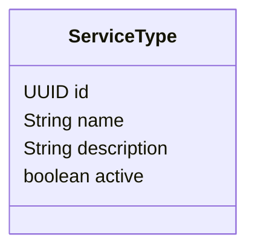
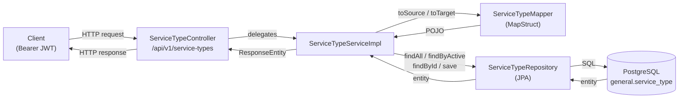
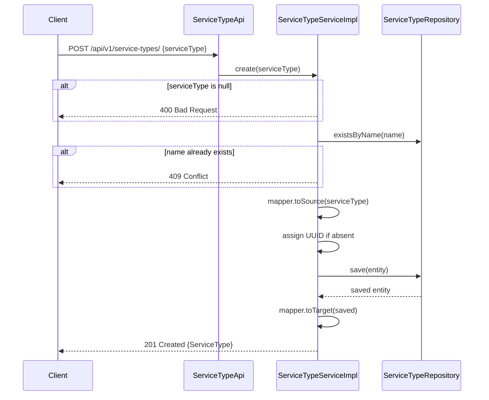
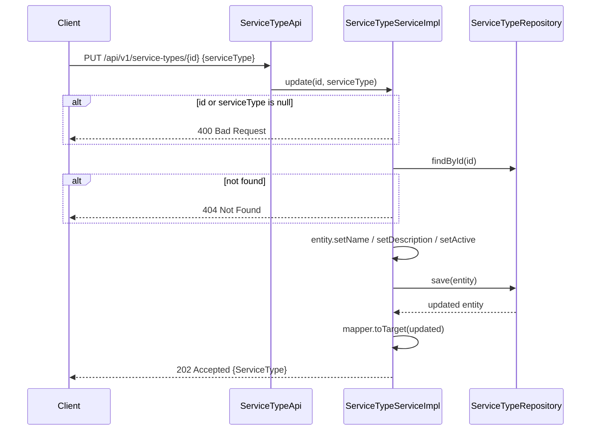
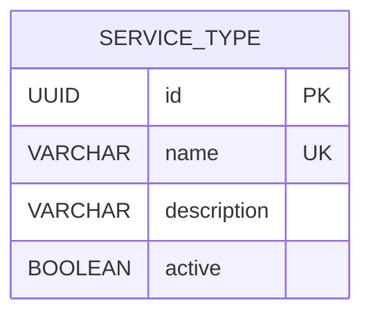

# 🏷️ Service Type Management

> **Guide:** v1 · [← Back to Index](./README.md)

---

## Overview

Service types are **catalog entries** that classify services managed within the backoffice. They are simple, named records with an active/inactive lifecycle flag.



---

## Data Flow



---

## Endpoints

### List All Service Types

```http
GET /api/v1/service-types
Authorization: Bearer <jwt>
```

Returns every registered service type regardless of status.

**Response `200 OK`:**

```json
[
  {
    "id": "a1b2c3d4-e5f6-7890-abcd-ef1234567890",
    "name": "STANDARD",
    "description": "Standard service offering",
    "active": true
  }
]
```

**Error Responses:**

| Code | Description |
|------|-------------|
| `404 Not Found` | No service types registered |

---

### List Service Types by Status

```http
GET /api/v1/service-types/{active}
Authorization: Bearer <jwt>
```

| Parameter | Type | Description |
|-----------|------|-------------|
| `active` | `boolean` | `true` = active only · `false` = inactive only |

**Response `200 OK`:** Array of `ServiceType` objects matching the requested status.

**Error Responses:**

| Code | Description |
|------|-------------|
| `404 Not Found` | No service types found for the given status |

---

### Find Service Type by ID

```http
GET /api/v1/service-types/find/{serviceTypeId}
Authorization: Bearer <jwt>
```

| Parameter | Type | Description |
|-----------|------|-------------|
| `serviceTypeId` | `UUID` | Service type identifier |

**Response `200 OK`:**

```json
{
  "id": "a1b2c3d4-e5f6-7890-abcd-ef1234567890",
  "name": "PREMIUM",
  "description": "Premium service tier",
  "active": true
}
```

**Error Responses:**

| Code | Description |
|------|-------------|
| `400 Bad Request` | ID is missing or invalid |
| `404 Not Found` | No service type found for the given ID |

---

### Create Service Type

```http
POST /api/v1/service-types/
Content-Type: application/json
Authorization: Bearer <jwt>
```

**Request Body:**

```json
{
  "serviceType": {
    "name": "PREMIUM",
    "description": "Premium service tier",
    "active": true
  }
}
```

| Field | Type | Required | Description |
|-------|------|----------|-------------|
| `serviceType.name` | `string` | ✅ | Unique service type name |
| `serviceType.description` | `string` | — | Human-readable description |
| `serviceType.active` | `boolean` | — | Whether the service type is active (defaults to `true`) |

**Create Flow:**



**Response `201 Created`:** The persisted `ServiceType` with its generated `id`.

**Error Responses:**

| Code | Description |
|------|-------------|
| `400 Bad Request` | Request body or `serviceType` is null |
| `409 Conflict` | A service type with the same name already exists |

---

### Update Service Type

```http
PUT /api/v1/service-types/{serviceTypeId}
Content-Type: application/json
Authorization: Bearer <jwt>
```

| Parameter | Type | Description |
|-----------|------|-------------|
| `serviceTypeId` | `UUID` | Service type to update |

**Request Body:**

```json
{
  "serviceType": {
    "name": "PREMIUM",
    "description": "Updated description for premium tier",
    "active": false
  }
}
```

**Update Flow:**



**Response `202 Accepted`:** The updated `ServiceType`.

**Error Responses:**

| Code | Description |
|------|-------------|
| `400 Bad Request` | ID or request body is null |
| `404 Not Found` | No service type found for the given ID |

---

## Database Schema



Table: `general.service_type` — migrated by `V7__create_service_type.sql`.

---

## Message Header

All responses include an `X-Message` header (via `MessageUtil.MESSAGE_HEADER_STR`) with a human-readable status description, e.g.:

| Scenario | Header value |
|----------|-------------|
| Found | `Service type found.` |
| Created | `Service type created.` |
| Updated | `Service type updated.` |
| Not found | `Service type not found.` |
| Conflict | `Service type name already in use.` |
| Bad input | `Invalid request.` |

---

## Quick-Start Example

```
1. Create a service type
   POST /api/v1/service-types/
   { "serviceType": { "name": "STANDARD", "description": "Base offering", "active": true } }
   → 201 Created — note the returned "id"

2. Retrieve it by ID
   GET /api/v1/service-types/find/<id>
   → 200 OK

3. Update its description and deactivate
   PUT /api/v1/service-types/<id>
   { "serviceType": { "name": "STANDARD", "description": "Retired tier", "active": false } }
   → 202 Accepted

4. List only active types
   GET /api/v1/service-types/true
   → 200 OK (STANDARD will not appear — it is now inactive)
```

---

> ➡️ Next: [Getting Started](./01-getting-started.md)
