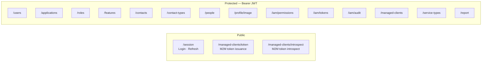
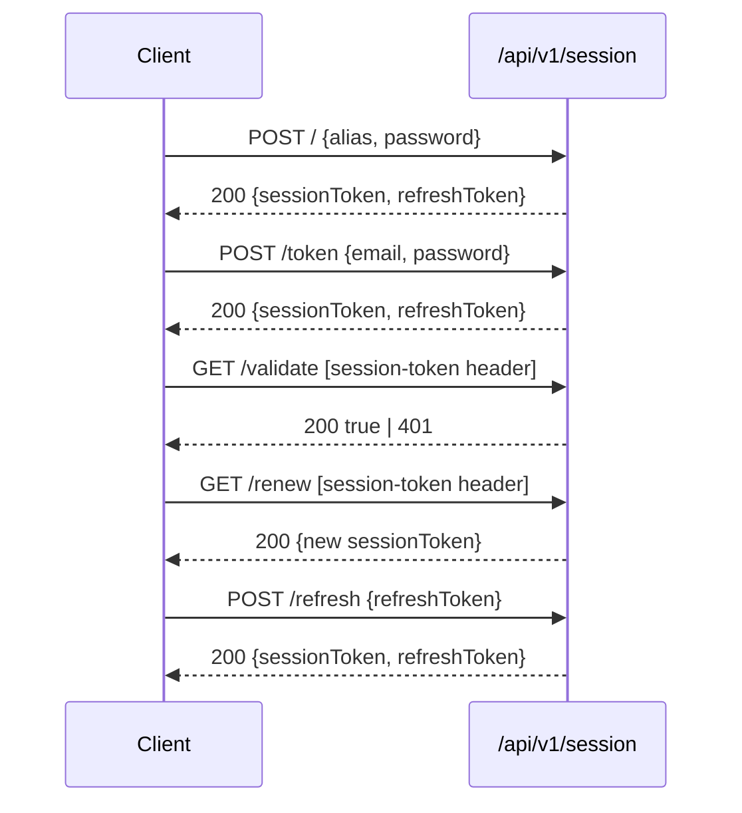
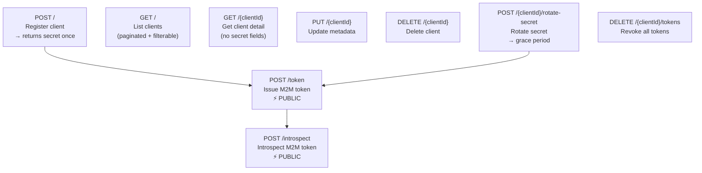
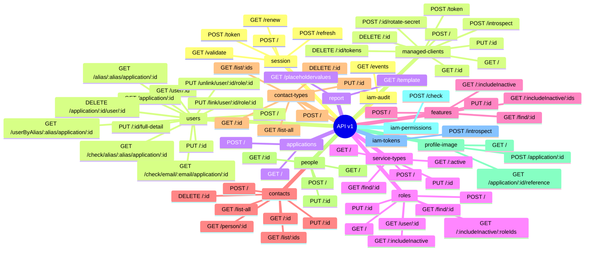

# 📋 API Reference — All Endpoints

> **Guide:** v1 · [← Back to Index](./README.md)
>
> Base URL: `https://<host>:8084/api/v1`  
> Protocol: **HTTPS only** (TLS 1.3)  
> Content-Type: `application/json` unless noted otherwise

---

## Authentication Headers

| Header | Used by | Description |
|--------|---------|-------------|
| `Authorization: Bearer <jwt>` | All protected endpoints | OAuth2 JWT issued by Supabase / Keycloak |
| `session-token: <token>` | Session-protected endpoints | Short-lived JWT issued by `/api/v1/session` |

---

## Domain Map



---

## Sessions — `/api/v1/session`

> **Public** — no bearer token required.



| Method | Path | Auth | Summary | Request | Responses |
|--------|------|------|---------|---------|-----------|
| `POST` | `/api/v1/session` | None | Login with alias + password | `SessionRequest` body | `200` token · `401` bad creds · `404` bad payload |
| `POST` | `/api/v1/session/token` | None | Login with email + password | `SessionEmailRequest` body | `200` token · `401` bad creds · `404` bad payload |
| `GET` | `/api/v1/session/validate` | `session-token` header | Validate session token | — | `200 true` · `401` |
| `GET` | `/api/v1/session/renew` | `session-token` header | Renew session token | — | `200` new token · `400` · `401` · `404` · `500` |
| `POST` | `/api/v1/session/refresh` | None | Exchange refresh token | `SessionRefreshRequest` body | `200` tokens · `400` · `401` · `500` |

**`SessionRequest` body:**
```json
{ "alias": "jdoe", "password": "s3cr3t", "applicationId": "<uuid>" }
```

**`SessionEmailRequest` body:**
```json
{ "email": "jdoe@example.com", "password": "s3cr3t", "applicationId": "<uuid>" }
```

**`SessionRefreshRequest` body:**
```json
{ "refreshToken": "<refresh-token-string>" }
```

**`SessionResponse`:**
```json
{ "sessionToken": "<jwt>", "refreshToken": "<refresh-jwt>" }
```

---

## Users — `/api/v1/users`

> **Protected** — requires `Authorization: Bearer <jwt>`.

| Method | Path | Summary | Request | Responses |
|--------|------|---------|---------|-----------|
| `POST` | `/api/v1/users` | Create user | `UserCreateRequest` body (`@Valid`) | `201` created |
| `GET` | `/api/v1/users/user/{userId}` | Get user by ID | `userId` UUID path param | `200` user |
| `GET` | `/api/v1/users/application/{applicationId}` | List users in application | `applicationId` UUID path param | `200` list |
| `GET` | `/api/v1/users/userByAlias/{alias}/application/{applicationId}` | Get user by alias | `alias`, `applicationId` path params | `200` user |
| `GET` | `/api/v1/users/alias/{alias}/application/{applicationId}` | Get user alias record | `alias`, `applicationId` path params | `200` alias record |
| `GET` | `/api/v1/users/check/alias/{alias}/application/{applicationId}` | Check alias availability | `alias`, `applicationId` path params | `200` available · `404` taken |
| `GET` | `/api/v1/users/check/email/{email}/application/{applicationId}` | Check email availability | `email` (validated), `applicationId` | `200` available · `404` taken |
| `PUT` | `/api/v1/users/{userId}/full-detail` | Full user update | `userId` + `UserTO` body (`@Valid`) | `200` updated · `400` bad input |
| `PUT` | `/api/v1/users/{userId}` | Partial user update | `userId` + `PutUserUpdateRequest` body | `202` accepted · `406` rejected |
| `PUT` | `/api/v1/users/link/user/{userId}/role/{roleId}` | Link role to user | `userId`, `roleId` path params | `200` updated |
| `PUT` | `/api/v1/users/unlink/user/{userId}/role/{roleId}` | Unlink role from user | `userId`, `roleId` path params | `200` updated |
| `DELETE` | `/api/v1/users/application/{applicationId}/user/{userId}` | Delete user | `applicationId`, `userId` path params | `204` deleted · `404` · `400` |

**`PutUserUpdateRequest` — partial update fields:**

| Field | Type | Description |
|-------|------|-------------|
| `firstName` | `string` | First name |
| `lastName` | `string` | Last name |
| `middleName` | `string` | Middle name |
| `displayName` | `string` | Display name |
| `gender` | `string` | Gender |
| `birthdate` | `date` | Birth date |
| `contacts` | `array` | Phone number contacts |

---

## Applications — `/api/v1/applications`

> **Protected** — requires `Authorization: Bearer <jwt>`.

| Method | Path | Summary | Request | Responses |
|--------|------|---------|---------|-----------|
| `GET` | `/api/v1/applications` | List all applications | — | `200` list · `404` none |
| `GET` | `/api/v1/applications?ids=` | List applications by IDs | `ids` query param (comma-separated UUIDs) | `200` list · `404` none |
| `POST` | `/api/v1/applications` | Create application | `ApplicationCreateRequest` body | `201` created · `400` bad request · `500` error |
| `GET` | `/api/v1/applications/{id}` | Find application by ID | `id` path param | `200` found · `404` not found · `401` |
| `PUT` | `/api/v1/applications/{id}` | Update application | `id` path param + `ApplicationUpdateRequest` body | `200` updated · `400` bad request · `404` not found · `401` |
| `DELETE` | `/api/v1/applications/{id}` | Delete application | `id` path param | `200` deleted · `404` not found · `401` |

**`ApplicationCreateRequest` body:**
```json
{ "application": { "name": "my-app", "description": "My application", "active": true } }
```

**`ApplicationUpdateRequest` body:**
```json
{ "application": { "name": "my-app-v2", "description": "Updated description", "active": true } }
```

**`Application` response fields:**

| Field | Type | Description |
|-------|------|-------------|
| `id` | `UUID` | Auto-generated identifier |
| `name` | `string` | Display name |
| `codeName` | `string` | Auto-derived short code — max 8 chars, alphanumeric + `_` |
| `description` | `string` | Human-readable description |
| `active` | `boolean` | Active status |
| `createdDate` | `datetime` | UTC timestamp set on creation (POST only) |

> [!NOTE]
> All responses include a `Message-header` header with a human-readable status description (e.g. `Application created successfully.`, `Application not found.`).

---

## Roles — `/api/v1/roles`

> **Protected** — requires `Authorization: Bearer <jwt>`.

| Method | Path | Summary | Request | Responses |
|--------|------|---------|---------|-----------|
| `GET` | `/api/v1/roles` | List all roles | — | `200` list · `404` |
| `GET` | `/api/v1/roles/{includeInactive}` | List roles by status | `includeInactive` boolean path param | `200` list · `404` |
| `GET` | `/api/v1/roles/{includeInactive}/{roleIds}` | List roles by status + IDs | `includeInactive`, `roleIds` (comma-separated UUIDs) | `200` list · `404` |
| `GET` | `/api/v1/roles/find/{roleId}` | Get role by ID | `roleId` UUID path param | `200` role · `404` |
| `GET` | `/api/v1/roles/user/{userId}` | List roles assigned to user | `userId` UUID path param | `200` list · `404` |
| `POST` | `/api/v1/roles/` | Create role | `RoleRequest` body | `201` created · `400` null · `422` bad mapping |
| `PUT` | `/api/v1/roles/{roleId}` | Update role | `roleId` + `RoleRequest` body | `200` updated · `404` |

**`RoleRequest` body:**
```json
{
  "role": {
    "name": "ADMIN",
    "description": "Full access administrator",
    "active": true,
    "features": [{ "id": "<feature-uuid>" }]
  }
}
```

---

## Features — `/api/v1/features`

> **Protected** — requires `Authorization: Bearer <jwt>`.

| Method | Path | Summary | Request | Responses |
|--------|------|---------|---------|-----------|
| `GET` | `/api/v1/features/find/{featureId}` | Get feature by ID | `featureId` UUID path param | `200` · `404` |
| `GET` | `/api/v1/features/{includeInactive}` | List features by status | `includeInactive` boolean path param | `200` list · `404` |
| `GET` | `/api/v1/features/{includeInactive}/{featuresIds}` | List features by status + IDs | `includeInactive`, `featuresIds` (comma-separated strings) | `200` list · `404` |
| `POST` | `/api/v1/features/` | Create feature | `FeatureRequest` body | `201` created · `406` error |
| `PUT` | `/api/v1/features/{featureId}` | Update feature | `featureId` + `FeatureRequest` body | `202` updated · `406` not registered |

**`FeatureRequest` body:**
```json
{ "feature": { "name": "EXPORT_REPORTS", "description": "Allows exporting reports", "active": true } }
```

---

## Contacts — `/api/v1/contacts`

> **Protected** — requires `Authorization: Bearer <jwt>`.

| Method | Path | Summary | Request | Responses |
|--------|------|---------|---------|-----------|
| `POST` | `/api/v1/contacts/` | Create contact | `Contact` body | `200` created |
| `PUT` | `/api/v1/contacts/{contactId}` | Update contact | `contactId` + `Contact` body | `200` updated |
| `GET` | `/api/v1/contacts/{contactId}` | Get contact by ID | `contactId` UUID path param | `200` contact |
| `GET` | `/api/v1/contacts/list/{contactIds}` | List contacts by IDs | `contactIds` comma-separated UUIDs | `200` list |
| `GET` | `/api/v1/contacts/person/{personId}` | List contacts by person | `personId` UUID path param | `200` list |
| `GET` | `/api/v1/contacts/list-all` | List all contacts | — | `501` Not Implemented |
| `DELETE` | `/api/v1/contacts/{contactId}` | Delete contact | `contactId` UUID path param | `200` deleted |

---

## Contact Types — `/api/v1/contact-types`

> **Protected** — requires `Authorization: Bearer <jwt>`.

| Method | Path | Summary | Request | Responses |
|--------|------|---------|---------|-----------|
| `POST` | `/api/v1/contact-types/` | Create contact type | `ContactTypeRequest` body | `201` created |
| `GET` | `/api/v1/contact-types/{contactTypeId}` | Get contact type by ID | `contactTypeId` UUID path param | `200` found |
| `PUT` | `/api/v1/contact-types/{contactTypeId}` | Update contact type | `contactTypeId` + `ContactType` body | `200` updated · `404` · `400` |
| `GET` | `/api/v1/contact-types/list/{contactTypeIds}` | List contact types by IDs | `contactTypeIds` comma-separated UUIDs | `200` list |
| `GET` | `/api/v1/contact-types/list-all` | List all contact types | — | `200` list |
| `DELETE` | `/api/v1/contact-types/{contactTypeId}` | Delete contact type | `contactTypeId` UUID path param | `200` deleted |

**`ContactTypeRequest` body:**
```json
{ "contactType": { "name": "EMAIL", "description": "Email address", "active": true } }
```

---

## People — `/api/v1/people`

> **Protected** — requires `Authorization: Bearer <jwt>`.

| Method | Path | Summary | Request | Responses |
|--------|------|---------|---------|-----------|
| `POST` | `/api/v1/people` | Create person | `PersonRequest` body | `200` created |
| `GET` | `/api/v1/people/{personId}` | Get person by ID | `personId` UUID path param | `200` person · `404` |
| `PUT` | `/api/v1/people/{personId}` | Update person | `personId` + `PersonRequest` body | `200` updated · `400` |
| `GET` | `/api/v1/people` | List all people | — | `200` list · `404` |

**`PersonRequest` body:**
```json
{ "person": { "firstName": "John", "lastName": "Doe", "birthdate": "1990-01-15" } }
```

---

## Profile Image — `/api/v1/profile/image`

> **Protected** — requires `session-token` header.

| Method | Path | Summary | Request | Responses |
|--------|------|---------|---------|-----------|
| `POST` | `/api/v1/profile/image/application/{applicationId}` | Upload profile image | `session-token` header + `applicationId` path param + `image` multipart/form-data | `201` uploaded · `400` bad input · `500` |
| `GET` | `/api/v1/profile/image/` | Get profile image (raw bytes) | `session-token` header | `200` bytes · `404` · `500` |
| `GET` | `/api/v1/profile/image/application/{applicationId}/reference` | Get profile image reference / signed URL | `session-token` header + `applicationId` path param | `200` reference · `401` · `404` · `500` |

> **Note:** Upload uses `Content-Type: multipart/form-data`. The `image` part contains the raw image bytes.

---

## IAM — Permissions — `/api/v1/iam/permissions`

> **Protected** — requires `Authorization: Bearer <jwt>`.

| Method | Path | Summary | Request | Responses |
|--------|------|---------|---------|-----------|
| `POST` | `/api/v1/iam/permissions/check` | Check user permission | `PermissionCheckRequest` body (`@Valid`) | `200` result · `400` bad payload · `401` invalid token |

**`PermissionCheckRequest` body:**
```json
{ "sessionToken": "<session-jwt>", "permission": "EXPORT_REPORTS" }
```

**`PermissionCheckResponse`:**
```json
{ "granted": true, "permission": "EXPORT_REPORTS" }
```

---

## IAM — Token Introspection — `/api/v1/iam/tokens`

> **Protected** — requires `Authorization: Bearer <jwt>`.

| Method | Path | Summary | Request | Responses |
|--------|------|---------|---------|-----------|
| `POST` | `/api/v1/iam/tokens/introspect` | Introspect session JWT | `TokenIntrospectRequest` body (`@Valid`) | `200` metadata · `400` blank token |

**`TokenIntrospectRequest` body:**
```json
{ "token": "<session-jwt>" }
```

**`TokenIntrospectResponse`:**
```json
{ "active": true, "subject": "user-uuid", "issuer": "backbone-rest", "expiresAt": "2026-07-12T12:00:00Z" }
```

---

## IAM — Audit Events — `/api/v1/iam/audit`

> **Protected** — requires `Authorization: Bearer <jwt>`.

| Method | Path | Summary | Request | Responses |
|--------|------|---------|---------|-----------|
| `GET` | `/api/v1/iam/audit/events` | Query security audit events (paginated) | Query params (all optional) | `200` list · `204` none · `400` bad param · `401` |

**Query parameters:**

| Parameter | Type | Required | Default | Description |
|-----------|------|----------|---------|-------------|
| `userId` | `UUID` | No | — | Filter by user who triggered the event |
| `applicationId` | `UUID` | No | — | Filter by application context |
| `eventType` | `string` | No | — | Filter by event type (case-insensitive, e.g. `LOGIN`, `LOGOUT`) |
| `from` | `ISO-8601 datetime` | No | — | Lower bound timestamp (`2026-01-01T00:00:00`) |
| `to` | `ISO-8601 datetime` | No | — | Upper bound timestamp |
| `page` | `int` | No | `0` | Zero-based page index |
| `size` | `int` | No | `20` | Page size |

**Example:**
```http
GET /api/v1/iam/audit/events?eventType=LOGIN&from=2026-07-01T00:00:00&page=0&size=50
Authorization: Bearer <jwt>
```

---

## Managed Clients (MCAM) — `/api/v1/managed-clients`



| Method | Path | Auth | Summary | Responses |
|--------|------|------|---------|-----------|
| `POST` | `/api/v1/managed-clients` | Bearer JWT | Register M2M client | `201` + secret · `400` · `409` duplicate |
| `GET` | `/api/v1/managed-clients` | Bearer JWT | List clients (`applicationId?`, `active?`, `page`, `size`) | `200` list · `204` empty |
| `GET` | `/api/v1/managed-clients/{clientId}` | Bearer JWT | Get client (no secret) | `200` client · `404` |
| `PUT` | `/api/v1/managed-clients/{clientId}` | Bearer JWT | Update client metadata | `200` updated · `404` |
| `DELETE` | `/api/v1/managed-clients/{clientId}` | Bearer JWT | Delete client | `204` deleted · `404` |
| `POST` | `/api/v1/managed-clients/token` | **None** (public) | Issue M2M access token | `200` token · `400` bad scope · `401` bad creds · `429` rate limit |
| `DELETE` | `/api/v1/managed-clients/{clientId}/tokens` | Bearer JWT | Revoke all tokens for client | `204` revoked · `404` |
| `POST` | `/api/v1/managed-clients/introspect` | **None** (public) | Introspect M2M token | `200` always (`active: false` for invalid) |
| `POST` | `/api/v1/managed-clients/{clientId}/rotate-secret` | Bearer JWT | Rotate client secret | `200` + new secret · `404` |

**Register (`POST /api/v1/managed-clients`) body:**
```json
{
  "name": "payment-service",
  "applicationId": "<uuid>",
  "scopes": ["read:payments", "write:payments"],
  "active": true
}
```

**Issue token (`POST /api/v1/managed-clients/token`) body:**
```json
{ "clientId": "<uuid>", "clientSecret": "<raw-secret>", "scope": "read:payments" }
```

---

## Report / Document — `/api/v1/report`

> **Protected** — requires `Authorization: Bearer <jwt>`.

| Method | Path | Summary | Request | Responses |
|--------|------|---------|---------|-----------|
| `GET` | `/api/v1/report/template` | Generate Word document from template | `values` (map of placeholder → value, query params) + `documentTemplate` multipart file | `200` `.docx` binary |
| `GET` | `/api/v1/report/placeholdervalues` | Extract placeholder names from template | `templateDocumentModel` (query param) + `documentTemplate` multipart file | `200` string list · `400` null model |

> Both report endpoints use `Content-Type: multipart/form-data` for the `documentTemplate` file part and return `application/octet-stream`.

---

## Service Types — `/api/v1/service-types`

> **Protected** — requires `Authorization: Bearer <jwt>`.

| Method | Path | Summary | Request | Responses |
|--------|------|---------|---------|-----------|
| `GET` | `/api/v1/service-types` | List all service types | — | `200` list · `404` none |
| `GET` | `/api/v1/service-types/{active}` | List service types by active status | `active` boolean path param | `200` list · `404` none |
| `GET` | `/api/v1/service-types/find/{serviceTypeId}` | Get service type by ID | `serviceTypeId` UUID path param | `200` found · `400` null id · `404` not found |
| `POST` | `/api/v1/service-types/` | Create service type | `ServiceTypeRequest` body | `201` created · `400` null · `409` name conflict |
| `PUT` | `/api/v1/service-types/{serviceTypeId}` | Update service type | `serviceTypeId` + `ServiceTypeRequest` body | `202` updated · `400` null input · `404` not found |

**`ServiceTypeRequest` body:**
```json
{ "serviceType": { "name": "PREMIUM", "description": "Premium service tier", "active": true } }
```

---

## Complete Endpoint Index



---

## HTTP Status Code Summary

| Code | Meaning | Common causes |
|------|---------|---------------|
| `200 OK` | Success | Read/query |
| `201 Created` | Resource created | POST success |
| `202 Accepted` | Update accepted | PUT success |
| `204 No Content` | Success, no body | DELETE success |
| `400 Bad Request` | Invalid input | Null body, constraint violation |
| `401 Unauthorized` | Invalid/missing token | Expired JWT, wrong credentials |
| `403 Forbidden` | Token valid, role missing | Insufficient permissions |
| `404 Not Found` | Resource absent | ID not in DB, empty list |
| `406 Not Acceptable` | Business rule rejection | Feature/role creation constraint |
| `409 Conflict` | Duplicate resource | Name uniqueness violation |
| `422 Unprocessable` | Mapping failure | Mapper returned null |
| `429 Too Many Requests` | Rate limit exceeded | MCAM token issuance RPM limit |
| `500 Internal Error` | Unexpected failure | Unhandled exception |
| `501 Not Implemented` | Stub endpoint | Planned but not yet active |

---

> ➡️ Related guides: [Service Type Management](./09-service-type.md) · [Managed Clients (MCAM)](./08-managed-clients-mcam.md) · [IAM](./07-iam.md)
