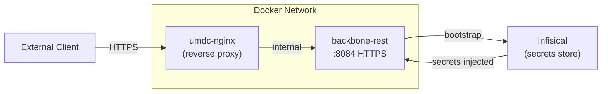
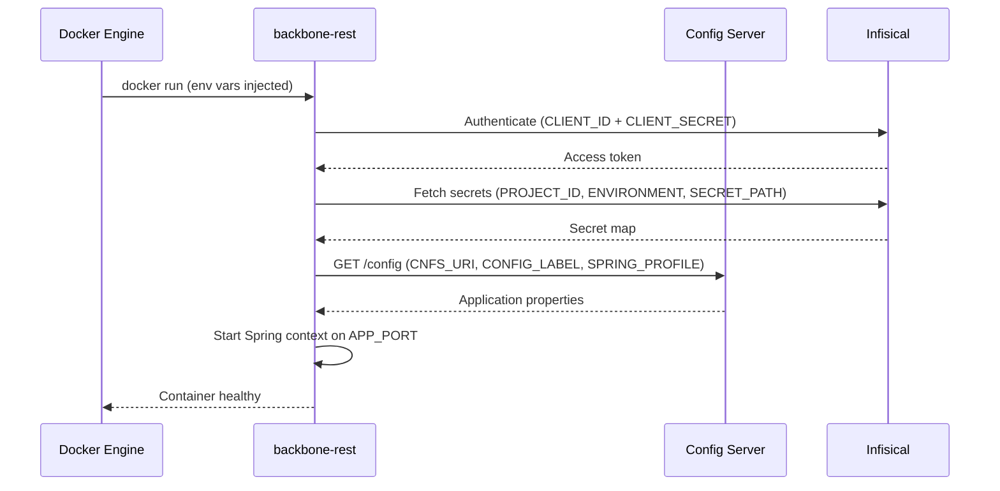
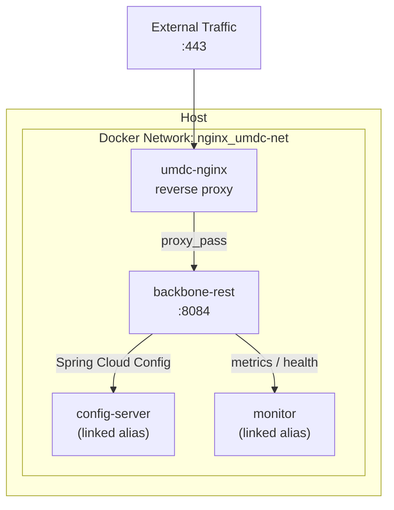

# Container Deployment

> **Guide:** v1 · [← Back to Index](./README.md)

---

## Overview

Backbone REST runs as a Docker container on HTTPS port `8084`, connected to an NGINX reverse-proxy network. Secrets are injected at runtime via [Infisical](https://app.infisical.com) through Spring Cloud Config.



---

## Prerequisites

| Requirement | Details |
|-------------|---------|
| Docker Engine | 24.x or later |
| Docker network | `${DOCKER_NETWORK}` must exist before running the container |
| NGINX container | `${NGINX_CONTAINER}` must be running and attached to the same network |
| TLS keystores | `${SSL_KEYSTORE_LOCATION}` and `${SSL_TRUSTSTORE_LOCATION}` must be mounted or baked into the image |
| Infisical credentials | `${INFISICAL_CLIENT_ID}` and `${INFISICAL_CLIENT_SECRET}` obtained from the Infisical machine identity |

Create the Docker network if it does not exist:

```bash
docker network create ${DOCKER_NETWORK}
```

---

## Environment Variables Reference

### Network & Infrastructure

| Variable | Example | Description |
|----------|---------|-------------|
| `DOCKER_NETWORK` | `nginx_umdc-net` | Docker bridge network shared with NGINX |
| `NGINX_CONTAINER` | `umdc-nginx` | Name of the running NGINX container |
| `APP_HOST_ALIAS` | `umdc-qa.tst` | DNS alias for the application host (via `--link`) |
| `CONFIG_SERVER_HOST_ALIAS` | `config-server.umdc-qa.tst` | DNS alias for the config server (via `--link`) |
| `MONITOR_HOST_ALIAS` | `monitor.umdc-qa.tst` | DNS alias for the monitoring endpoint (via `--link`) |
| `CONTAINER_NAME` | `backbone-rest` | Name assigned to the running container |
| `HOST_PORT` | `8084` | Host port mapped to the container |

### Application & Spring Boot

| Variable | Example | Description |
|----------|---------|-------------|
| `APP_PORT` | `8084` | Port the application listens on inside the container |
| `SPRING_PROFILE` | `remote-supabase` | Active Spring Boot profile (`remote-supabase`, `local`, etc.) |
| `SPRING_CLOUD_BOOTSTRAP_ENABLED` | `true` | Enables Spring Cloud Bootstrap context (required for Config Server) |
| `CONFIG_LABEL` | `Develop` | Git branch / label used by Spring Cloud Config to resolve properties |
| `CNFS_PORT` | `443` | Port of the Config Server |
| `CNFS_URI` | `https://config-server.umdc-qa.tst` | Base URI of the Spring Cloud Config Server |
| `LOGGING_TRACE_ENABLED` | `true` | Enables trace-level logging (`false` for production) |

### Infisical Secrets Management

> **Security:** Treat `INFISICAL_CLIENT_ID`, `INFISICAL_CLIENT_SECRET`, and `INFISICAL_PROJECT_ID` as sensitive credentials. Prefer injecting them via Docker secrets or a CI/CD vault rather than plain `-e` flags.

| Variable | Description |
|----------|-------------|
| `INFISICAL_ENABLED` | `true` to activate Infisical secret injection |
| `INFISICAL_URL` | Infisical API base URL (e.g. `https://app.infisical.com`) |
| `INFISICAL_CLIENT_ID` | Machine identity Client ID — **secret** |
| `INFISICAL_CLIENT_SECRET` | Machine identity Client Secret — **secret** |
| `INFISICAL_PROJECT_ID` | Infisical project UUID — **secret** |
| `INFISICAL_ENVIRONMENT` | Target environment slug (`dev`, `staging`, `prod`) |
| `INFISICAL_SECRET_PATH` | Secrets path within the project (e.g. `/`) |

### TLS / SSL

> **Security:** Keystore and truststore passwords must never be hard-coded. Inject via secrets manager or Docker secrets.

| Variable | Description |
|----------|-------------|
| `SSL_KEYSTORE_LOCATION` | Filename of the application keystore (e.g. `backbone.jks`) |
| `SSL_KEYSTORE_PASSWORD` | Password for the keystore — **secret** |
| `SSL_KEYSTORE_TYPE` | Keystore format: `JKS` or `PKCS12` |
| `SSL_TRUSTSTORE_LOCATION` | Filename of the truststore (e.g. `umdc-truststore.jks`) |
| `SSL_TRUSTSTORE_PASSWORD` | Password for the truststore — **secret** |

### Image

| Variable | Example | Description |
|----------|---------|-------------|
| `DOCKER_IMAGE` | `lamata/backbone-rest` | Docker image repository |
| `IMAGE_TAG` | `0.0.4` | Image tag / version to deploy |

---

## Deployment Command

```bash
docker run -d -ti \
  --network ${DOCKER_NETWORK} \
  --link ${NGINX_CONTAINER}:${APP_HOST_ALIAS} \
  --link ${NGINX_CONTAINER}:${CONFIG_SERVER_HOST_ALIAS} \
  --link ${NGINX_CONTAINER}:${MONITOR_HOST_ALIAS} \
  -p ${HOST_PORT}:${APP_PORT} \
  --name ${CONTAINER_NAME} \
  -e CNFS_PORT=${CNFS_PORT} \
  -e CNFS_URI=${CNFS_URI} \
  -e SPRING_BOOT_CLOUD_BOOTSTRAP_ENABLED=${SPRING_CLOUD_BOOTSTRAP_ENABLED} \
  -e SPRING_BOOT_PROFILE_ACTIVE=${SPRING_PROFILE} \
  -e SPRING_CLOUD_CONFIG_LABEL=${CONFIG_LABEL} \
  -e INFISICAL_ENABLED=${INFISICAL_ENABLED} \
  -e CONFIG_SERVER_SITE_URL=${INFISICAL_URL} \
  -e CONFIG_SERVER_CLIENT_ID=${INFISICAL_CLIENT_ID} \
  -e CONFIG_SERVER_CLIENT_SECRET=${INFISICAL_CLIENT_SECRET} \
  -e CONFIG_SERVER_PROJECT_ID=${INFISICAL_PROJECT_ID} \
  -e CONFIG_SERVER_ENVIRONMENT=${INFISICAL_ENVIRONMENT} \
  -e CONFIG_SERVER_SECRET_PATH=${INFISICAL_SECRET_PATH} \
  -e LOGGING_TRACE_ENABLED=${LOGGING_TRACE_ENABLED} \
  -e APP_PORT=${APP_PORT} \
  -e SSL_KEYSTORE_LOCATION=${SSL_KEYSTORE_LOCATION} \
  -e SSL_KEYSTORE_PASSWORD=${SSL_KEYSTORE_PASSWORD} \
  -e SSL_KEYSTORE_TYPE=${SSL_KEYSTORE_TYPE} \
  -e SSL_TRUSTSTORE_LOCATION=${SSL_TRUSTSTORE_LOCATION} \
  -e SSL_TRUSTSTORE_PASSWORD=${SSL_TRUSTSTORE_PASSWORD} \
  ${DOCKER_IMAGE}:${IMAGE_TAG}
```

---

## Bootstrap Sequence



---

## Step-by-Step Deployment

### 1 — Export variables

Create an `.env` file (never commit it to git):

```bash
# .env  — DO NOT COMMIT
DOCKER_NETWORK=nginx_umdc-net
NGINX_CONTAINER=umdc-nginx
APP_HOST_ALIAS=umdc-qa.tst
CONFIG_SERVER_HOST_ALIAS=config-server.umdc-qa.tst
MONITOR_HOST_ALIAS=monitor.umdc-qa.tst
HOST_PORT=8084
APP_PORT=8084
CONTAINER_NAME=backbone-rest
DOCKER_IMAGE=lamata/backbone-rest
IMAGE_TAG=0.0.4

SPRING_PROFILE=remote-supabase
SPRING_CLOUD_BOOTSTRAP_ENABLED=true
CONFIG_LABEL=Develop
CNFS_PORT=443
CNFS_URI=https://config-server.umdc-qa.tst
LOGGING_TRACE_ENABLED=false

INFISICAL_ENABLED=true
INFISICAL_URL=https://app.infisical.com
INFISICAL_CLIENT_ID=<your-client-id>
INFISICAL_CLIENT_SECRET=<your-client-secret>
INFISICAL_PROJECT_ID=<your-project-id>
INFISICAL_ENVIRONMENT=dev
INFISICAL_SECRET_PATH=/

SSL_KEYSTORE_LOCATION=backbone.jks
SSL_KEYSTORE_PASSWORD=<keystore-password>
SSL_KEYSTORE_TYPE=JKS
SSL_TRUSTSTORE_LOCATION=umdc-truststore.jks
SSL_TRUSTSTORE_PASSWORD=<truststore-password>
```

Load the variables:

```bash
set -a && source .env && set +a
```

### 2 — Pull the image

```bash
docker pull ${DOCKER_IMAGE}:${IMAGE_TAG}
```

### 3 — Run the container

Copy the deployment command from the section above and execute it with the variables loaded.

### 4 — Verify startup

```bash
# Tail logs until Spring context reports started
docker logs -f ${CONTAINER_NAME}

# Health check (adjust host alias as needed)
curl -k https://localhost:${HOST_PORT}/actuator/health
```

Expected output:

```json
{ "status": "UP" }
```

---

## Stopping and Removing

```bash
# Stop
docker stop ${CONTAINER_NAME}

# Remove container (data is stateless — safe to remove)
docker rm ${CONTAINER_NAME}
```

---

## Network Topology



---

## Security Notes

| Concern | Guidance |
|---------|---------|
| Secrets in `-e` flags | Visible in `docker inspect`. Use Docker secrets or a secrets injection sidecar for production. |
| Keystore files | Must be present inside the image or mounted via a volume. Never store them in the Git repository. |
| `LOGGING_TRACE_ENABLED=true` | Logs request details and tokens. Set to `false` in staging and production. |
| Image tag `latest` | Always pin to an explicit version tag (e.g. `0.0.4`) to ensure reproducible deployments. |

---

> ➡️ Related guides: [Dependencies & Requirements](./00-prerequisites.md) · [API Reference](./10-api-reference.md)
