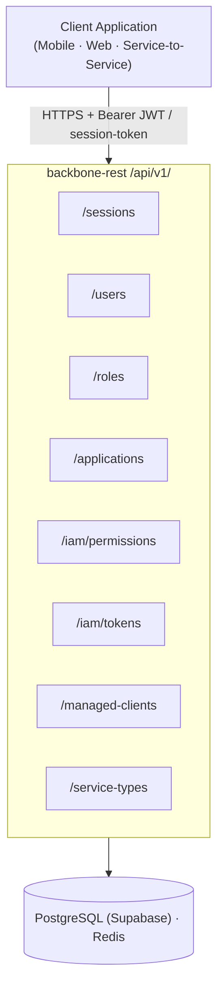
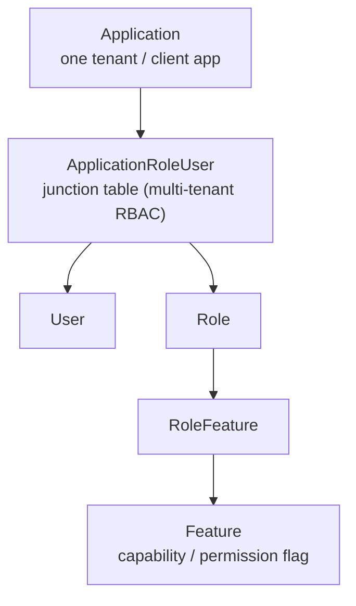

# 📚 Backbone REST — Developer User Guide `v1`

> **Version:** API v1 · App `0.0.2` · Last updated: June 2026

Welcome to the **Backbone REST** backoffice service documentation. This guide covers every domain exposed under `/api/v1/` — from authentication to user management, application clients, and IAM controls.

---

## 🗂️ Table of Contents

| # | Guide | Description |
|---|-------|-------------|
| 0 | [Dependencies & Requirements](./00-prerequisites.md) | System requirements, env vars, Maven dependencies, Docker |
| 1 | [Getting Started](./01-getting-started.md) | Base URL, authentication overview, request format |
| 2 | [Authentication & Sessions](./02-authentication-sessions.md) | Session tokens, refresh flow, JWT details |
| 3 | [User Management](./03-user-management.md) | Create, find, update, delete users |
| 4 | [Application Client Management](./04-application-client.md) | Register and manage application clients |
| 5 | [User–Application–Role](./05-user-application-role.md) | Multi-tenant linking, role assignment per app |
| 6 | [Roles & Features](./06-roles-features.md) | RBAC: role CRUD, feature flags, role-feature linking |
| 7 | [IAM — Permissions & Tokens](./07-iam.md) | Permission check, token introspection, audit |
| 8 | [Managed Clients (MCAM)](./08-managed-clients-mcam.md) | M2M OAuth2 client credentials — register, token issuance, rotation, revocation |
| 9 | [Service Type Management](./09-service-type.md) | Create, list, find, and update service type catalog entries |
| 10 | [API Reference](./10-api-reference.md) | All endpoints — full request/response contract for every domain |
| 11 | [Container Deployment](./11-container-deployment.md) | Docker run template, env vars reference, bootstrap sequence |

---

## 🏗️ Architecture at a Glance

### Domain Model

---

## ⚡ Quick Reference — All Endpoints

| Method | Path | Summary |
|--------|------|---------|
| `POST` | `/api/v1/sessions` | Login with alias + password |
| `POST` | `/api/v1/sessions/token` | Login with email + password |
| `GET`  | `/api/v1/sessions/validate` | Validate session token |
| `GET`  | `/api/v1/sessions/renew` | Renew session token |
| `POST` | `/api/v1/sessions/refresh` | Refresh using refresh token |
| `POST` | `/api/v1/users` | Create user |
| `GET`  | `/api/v1/users/user/{userId}` | Get user by ID |
| `GET`  | `/api/v1/users/application/{applicationId}` | List all users in application |
| `GET`  | `/api/v1/users/userByAlias/{alias}/application/{applicationId}` | Get user by alias |
| `GET`  | `/api/v1/users/alias/{alias}/application/{applicationId}` | Get user alias record |
| `GET`  | `/api/v1/users/check/alias/{alias}/application/{applicationId}` | Check alias availability |
| `GET`  | `/api/v1/users/check/email/{email}/application/{applicationId}` | Check email availability |
| `PUT`  | `/api/v1/users/{userId}/full-detail` | Full user update |
| `PUT`  | `/api/v1/users/{userId}` | Partial user update |
| `PUT`  | `/api/v1/users/link/user/{userId}/role/{roleId}` | Link role to user |
| `PUT`  | `/api/v1/users/unlink/user/{userId}/role/{roleId}` | Unlink role from user |
| `DELETE` | `/api/v1/users/application/{applicationId}/user/{userId}` | Delete user |
| `POST` | `/api/v1/applications` | Register application client |
| `GET`  | `/api/v1/applications` | List all applications |
| `GET`  | `/api/v1/roles/find/{roleId}` | Get role by ID |
| `GET`  | `/api/v1/roles` | List all roles |
| `GET`  | `/api/v1/roles/{includeInactive}` | List roles by status |
| `POST` | `/api/v1/roles/` | Create role |
| `PUT`  | `/api/v1/roles/{roleId}` | Update role |
| `GET`  | `/api/v1/roles/user/{userId}` | List roles by user |
| `GET`  | `/api/v1/features/find/{featureId}` | Get feature by ID |
| `GET`  | `/api/v1/features/{includeInactive}` | List features by status |
| `POST` | `/api/v1/features/` | Create feature |
| `PUT`  | `/api/v1/features/{featureId}` | Update feature |
| `POST` | `/api/v1/iam/permissions/check` | Check user permission |
| `POST` | `/api/v1/iam/tokens/introspect` | Introspect session token |
| `POST` | `/api/v1/managed-clients` | Register M2M managed client |
| `GET`  | `/api/v1/managed-clients` | List managed clients |
| `GET`  | `/api/v1/managed-clients/{clientId}` | Get managed client detail |
| `PUT`  | `/api/v1/managed-clients/{clientId}` | Update managed client |
| `DELETE` | `/api/v1/managed-clients/{clientId}` | Delete managed client |
| `POST` | `/api/v1/managed-clients/token` | Issue M2M access token (public) |
| `POST` | `/api/v1/managed-clients/{clientId}/rotate-secret` | Rotate client secret |
| `DELETE` | `/api/v1/managed-clients/{clientId}/tokens` | Revoke all active tokens |
| `POST` | `/api/v1/managed-clients/introspect` | Introspect M2M token (public) |
| `GET`  | `/api/v1/service-types` | List all service types |
| `GET`  | `/api/v1/service-types/{active}` | List service types by active status |
| `GET`  | `/api/v1/service-types/find/{serviceTypeId}` | Get service type by ID |
| `POST` | `/api/v1/service-types/` | Create service type |
| `PUT`  | `/api/v1/service-types/{serviceTypeId}` | Update service type |

---

> 💡 **Tip:** Human clients use a `Authorization: Bearer <OAUTH2_JWT>` header for protected endpoints. Application clients use `/managed-clients/token` to obtain an M2M Bearer token. See [Managed Clients (MCAM)](./08-managed-clients-mcam.md) for the full M2M flow.

