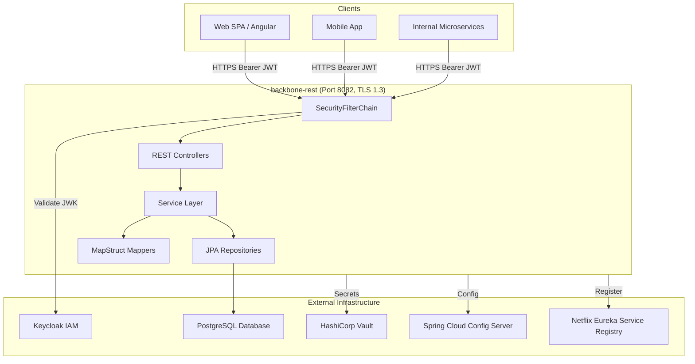
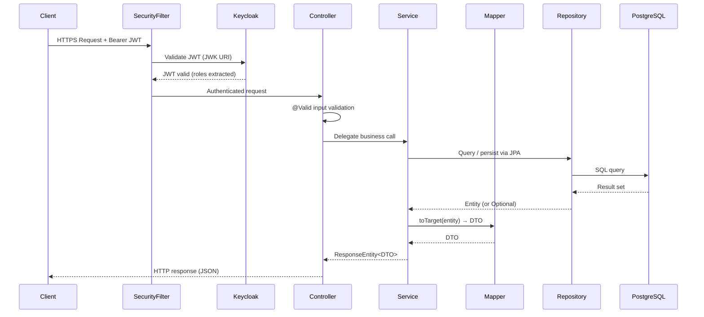
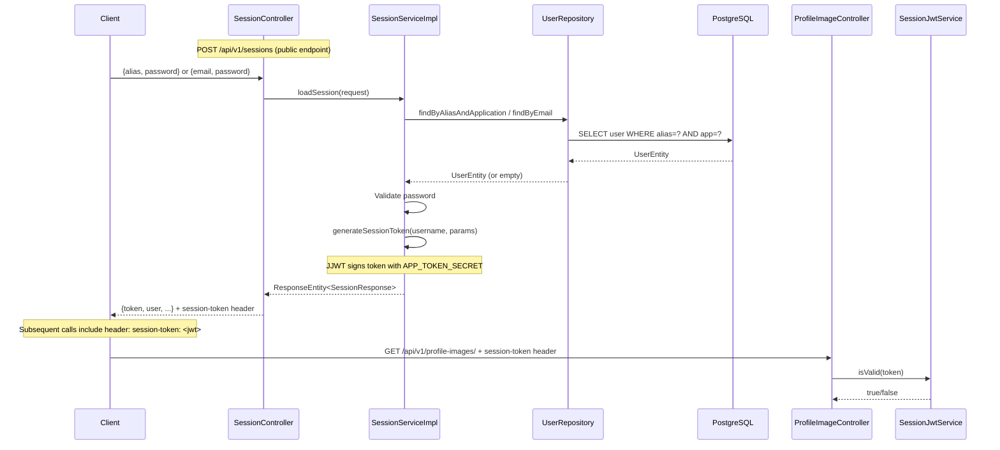
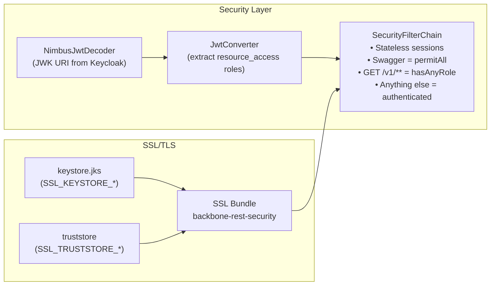
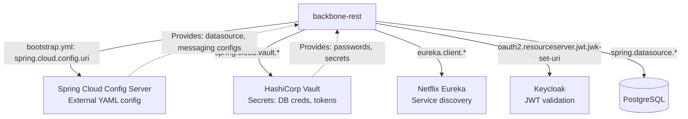

# System Architecture — backbone-rest

---

## 1. High-Level Architecture



---

## 2. Layered Architecture

The service follows a strict layered design within each domain module:

```
┌───────────────────────────────────────────────────────────┐
│                   HTTP / REST Layer                        │
│  *Api (interface) + *Controller (implementation)          │
│  • Declares OpenAPI annotations (@Operation, @ApiResponse)│
│  • Validates inputs (@Valid, @NotNull, @NotBlank)          │
│  • Routes to Service layer                                 │
└──────────────────────────┬────────────────────────────────┘
                           │
┌──────────────────────────▼────────────────────────────────┐
│                   Service Layer                            │
│  *Service (interface) + *ServiceImpl (implementation)      │
│  • Owns business logic and validation                      │
│  • Returns ResponseEntity<?> directly                      │
│  • Uses MessageUtil for user-facing messages               │
│  • Annotated with @Service, @Transactional where needed    │
└──────────────────────────┬────────────────────────────────┘
                           │
┌──────────────────────────▼────────────────────────────────┐
│                   Mapper Layer                             │
│  *Mapper (MapStruct interface)                             │
│  • Converts between domain entities and Transfer Objects   │
│  • Uses expression mappings for complex relations          │
│  • Config via MapperAppConfig (from prx-commons-services)  │
└──────────────────────────┬────────────────────────────────┘
                           │
┌──────────────────────────▼────────────────────────────────┐
│                   Persistence Layer                        │
│  JPA Entities + Spring Data Repositories                   │
│  • Entities defined in external module: prx-persistence    │
│  • Repositories scanned via @EnableJpaRepositories         │
│  • Database: PostgreSQL (H2 for tests)                     │
└───────────────────────────────────────────────────────────┘
```

---

## 3. Domain Module Layout

Every business domain follows this canonical package structure:

```
v1/<domain>/
├── api/
│   ├── controller/
│   │   ├── *Api.java         ← Interface: @Tag, @Operation, @ApiResponse, default methods
│   │   └── *Controller.java  ← @RestController: implements *Api, delegates to service
│   └── to/
│       └── *.java            ← Transfer Objects (request/response records or POJOs)
├── mapper/
│   └── *Mapper.java          ← MapStruct @Mapper interface
└── service/
    ├── *Service.java         ← Interface
    └── *ServiceImpl.java     ← @Service implementation
```

### Domain modules present

| Domain | Package | Base Path |
|--------|---------|-----------|
| application | `v1.application` | `/api/v1/applications` |
| contacts | `v1.contacts` | `/api/v1/contacts` |
| contacttypes | `v1.contacttypes` | `/api/v1/contact-types` |
| features | `v1.features` | `/api/v1/features` |
| people | `v1.people` | `/api/v1/people` |
| profileimage | `v1.profileimage` | `/api/v1/profile-images` |
| report | `v1.report` | `/api/v1/report` |
| roles | `v1.roles` | `/api/v1/roles` |
| session | `v1.session` | `/api/v1/sessions` |
| users | `v1.users` | `/api/v1/users` |

---

## 4. External Module Dependencies

The app intentionally delegates entities and repositories to two private PRX libraries resolved from Repsy:

```
┌────────────────────────────────────────────────────────────┐
│  backbone-rest (this app)                                  │
│                                                            │
│  @EntityScan("com.umdc.persistence")        ──────────────► prx-persistence (0.0.3)
│  @EnableJpaRepositories("com.umdc.persistence")             │  UserEntity, PersonEntity,
│                                                            │  RoleEntity, FeatureEntity,
│  @SpringBootApplication(                                   │  ApplicationEntity,
│    scanBasePackages = {                                     │  ApplicationRoleUserEntity,
│      "com.prx.backoffice",                                  │  ContactEntity,
│      "com.umdc.commons.services"  ──────────────────────►   │  ContactTypeEntity, etc.
│    })                                                      │
│                                                prx-commons (0.0.4)
│                                                            │  Domain POJOs (User, Role,
│                                                            │  Person, Contact, Feature, etc.)
│                                                            │
│                                                commons-services (0.0.1)
│                                                            │  MapperAppConfig,
│                                                            │  shared service interfaces
└────────────────────────────────────────────────────────────┘
```

> **Important:** JPA entities and Spring Data repositories are **not** in this repository. They are injected at runtime via the external `prx-persistence` library.

---

## 5. Request Processing Flow



---

## 6. Session Token Flow

Sessions expose a second, application-specific JWT layer (distinct from Keycloak):



---

## 7. Security Architecture



---

## 8. Cloud Infrastructure Integration



---

## 9. AOP & Cross-Cutting Concerns

| Concern | Implementation |
|---------|---------------|
| **Logging** | `@LogDefault` annotation (`LogDefault.java`) + SLF4J/Log4j2 in controllers and services |
| **Input validation** | Jakarta Bean Validation (`@Valid`, `@NotNull`, `@NotBlank`, `@Email`) on controller parameters |
| **Error messages** | `MessageUtil` bean reads message keys from Spring `@Value` properties |
| **Transaction management** | `@Transactional` on service methods that write to the database |
| **CORS** | `@CrossOrigin(origins = "*")` on individual controllers |

---

## 10. Component Dependency Map

```
PrxBackofficeRestApplication
    ├── SecurityConfig
    │   ├── JwtConverter ← JwtConverterProperties
    │   ├── NimbusJwtDecoder ← JWK URI
    │   └── RestTemplate ← KeystoreUtil ← SecurityProperties
    ├── UserController → UserServiceImpl
    │   ├── UserRepository (prx-persistence)
    │   ├── RoleRepository (prx-persistence)
    │   ├── ApplicationRepository (prx-persistence)
    │   ├── ApplicationRoleUserRepository (prx-persistence)
    │   └── UserMapper → PersonMapper, RoleMapper, ApplicationRoleUserMapper
    ├── SessionController → SessionServiceImpl
    │   ├── UserRepository (prx-persistence)
    │   ├── JwtConfigProperties
    │   ├── UserMapper
    │   └── UserAliasMapper
    ├── RoleController → RoleServiceImpl
    │   └── RoleRepository (prx-persistence)
    ├── FeatureController → FeatureServiceImpl
    │   └── FeatureRepository (prx-persistence)
    ├── PersonController → PersonServiceImpl
    │   └── PersonRepository (prx-persistence)
    ├── ContactController → ContactServiceImpl
    │   └── ContactRepository (prx-persistence)
    ├── ContactTypeController → ContactTypeServiceImpl
    │   └── ContactTypeRepository (prx-persistence)
    ├── ApplicationController → ApplicationServiceImpl
    │   └── ApplicationRepository (prx-persistence)
    ├── ProfileImageController → ProfileImageServiceImpl
    └── DocumentController → DocumentServiceImpl
```

