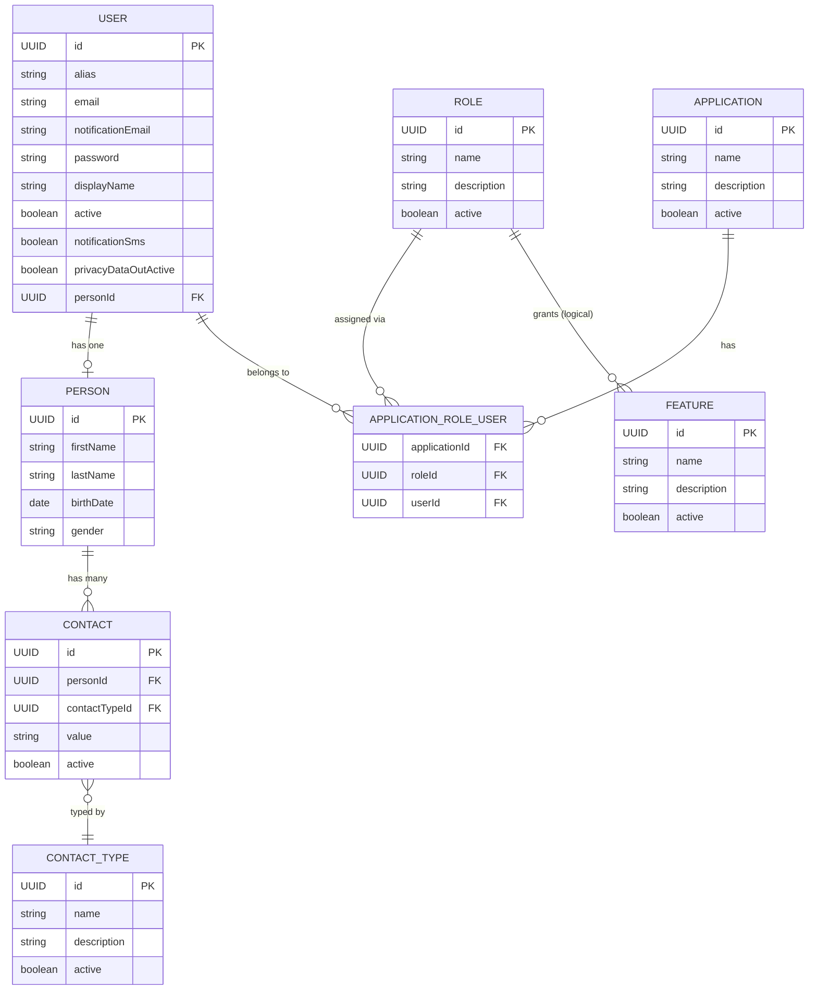

# Data Model — backbone-rest

> **Note:** JPA entity classes and Spring Data repositories live in the external `prx-persistence` library (v0.0.3). Domain POJOs (used as API transfer objects / shared models) live in `prx-commons` (v0.0.4). This document describes the logical data model inferred from controller/service/mapper code.

---

## 1. Entity Relationship Diagram



---

## 2. Entity Descriptions

### 2.1 USER

Represents a system user (an account that can authenticate).

| Field | Type | Description |
|-------|------|-------------|
| `id` | UUID | Primary key |
| `alias` | String | Login username (unique per application) |
| `email` | String | Primary email address (unique per application) |
| `notificationEmail` | String | Secondary email for notifications |
| `password` | String | Hashed password |
| `displayName` | String | Human-readable name for UI display |
| `active` | boolean | Whether the account is active |
| `notificationSms` | boolean | SMS notification preference |
| `privacyDataOutActive` | boolean | Privacy / data sharing consent flag |
| `personId` | UUID (FK) | Reference to associated PERSON record |

**Key operations:**
- `findByAliasAndApplication(alias, applicationId)` — used for alias uniqueness check and session login
- `findByEmailAndApplication(email, applicationId)` — used for email uniqueness check and session login

---

### 2.2 PERSON

Stores personal / biographical data, decoupled from the authentication account.

| Field | Type | Description |
|-------|------|-------------|
| `id` | UUID | Primary key |
| `firstName` | String | First name |
| `lastName` | String | Last (family) name |
| `birthDate` | LocalDate | Date of birth |
| `gender` | String | Gender identifier |

One PERSON can be linked to one USER (1:1), and can have many CONTACTs (1:N).

---

### 2.3 ROLE

Represents a named permission group that can be assigned to users within an application context.

| Field | Type | Description |
|-------|------|-------------|
| `id` | UUID | Primary key |
| `name` | String | Role name (e.g. `ADMIN`, `USER`) |
| `description` | String | Human-readable description |
| `active` | boolean | Whether the role is active |

---

### 2.4 FEATURE

Represents a system capability or feature toggle that can be associated with a role.

| Field | Type | Description |
|-------|------|-------------|
| `id` | UUID | Primary key |
| `name` | String | Feature name |
| `description` | String | Human-readable description |
| `active` | boolean | Whether the feature is active |

---

### 2.5 APPLICATION

Represents a registered client application within the PRX platform.

| Field | Type | Description |
|-------|------|-------------|
| `id` | UUID | Primary key |
| `name` | String | Application identifier name |
| `description` | String | Description |
| `active` | boolean | Whether the application is active |

---

### 2.6 APPLICATION_ROLE_USER (Junction / Composite)

This is the key many-to-many-to-many relationship that ties a USER to a ROLE within an APPLICATION context.

| Field | Type | Description |
|-------|------|-------------|
| `applicationId` | UUID (FK) | Application reference |
| `roleId` | UUID (FK) | Role reference |
| `userId` | UUID (FK) | User reference |

**Composite key:** `ApplicationRoleUserEntityId { applicationId, roleId, userId }`

This allows:
- A user to have different roles in different applications
- A user to be linked to multiple applications simultaneously
- Role assignments scoped per application

---

### 2.7 CONTACT

Stores contact information for a person (email, phone, address, etc.).

| Field | Type | Description |
|-------|------|-------------|
| `id` | UUID | Primary key |
| `personId` | UUID (FK) | Associated person |
| `contactTypeId` | UUID (FK) | Type of contact (e.g. email, mobile) |
| `value` | String | The contact value (e.g. phone number, email address) |
| `active` | boolean | Whether this contact is active |

---

### 2.8 CONTACT_TYPE

A reference/catalogue entity defining the taxonomy of contact types.

| Field | Type | Description |
|-------|------|-------------|
| `id` | UUID | Primary key |
| `name` | String | Type name (e.g. "Mobile Phone", "Work Email") |
| `description` | String | Description |
| `active` | boolean | Whether the type is active |

---

## 3. Transfer Objects (TOs)

Transfer Objects are defined in each domain's `api/to/` package and are distinct from JPA entities.

| TO Class | Domain | Description |
|----------|--------|-------------|
| `UserTO` | users | Full user representation for API responses |
| `UserCreateRequest` | users | Request body for creating a user |
| `UserCreateResponse` | users | Response body after user creation |
| `PutUserUpdateRequest` | users | Request body for partial user update |
| `UserAliasTO` | session | Represents a user alias record |
| `SessionRequest` | session | Alias + password login request |
| `SessionEmailRequest` | session | Email + password login request |
| `SessionResponse` | session | Session response including token and user data |
| `PersonRequest` | people | Wrapper for person creation/update |
| `RoleRequest` | roles | Wrapper for role creation/update |
| `FeatureRequest` | features | Wrapper for feature creation/update |
| `ContactTypeRequest` | contacttypes | Wrapper for contact type creation |
| `ApplicationCreateRequest` | application | Wrapper for application creation |
| `PostProfileImageResponse` | profileimage | Response after image upload (contains reference) |
| `GetProfileImageReferenceResponse` | profileimage | Response with image reference URL |
| `TemplateDocumentModel` | report | Model for document placeholder mapping |

---

## 4. Mapper Inventory

MapStruct mappers convert between JPA entities (from `prx-persistence`) and Transfer Objects or domain POJOs (from `prx-commons`):

| Mapper | Source → Target |
|--------|----------------|
| `UserMapper` | `UserEntity` ↔ `UserTO`, `UserCreateRequest` → `UserEntity`, `UserEntity` → `UserCreateResponse` |
| `UserAliasMapper` | `UserAliasEntity` ↔ `UserAliasTO` |
| `PersonMapper` | `PersonEntity` ↔ `Person` (pojo) |
| `RoleMapper` | `RoleEntity` ↔ `Role` (pojo) |
| `ApplicationRoleUserMapper` | `ApplicationRoleUserEntity` ↔ roles/applications lists in `UserTO` |

### Complex Mapping Example

`UserMapper.toTarget()` maps:
- `applicationRoleUser` list → `roles` (list of Role POJOs)
- `applicationRoleUser` list → `applications` (list of Application POJOs)

`UserMapper.toSource()` uses a custom expression:
```java
@Mapping(target = "applicationRoleUser",
         expression = "java(ApplicationRoleUserMapper.getApplicationRoleUser(user))")
```

---

## 5. Database Notes

| Aspect | Detail |
|--------|--------|
| **Primary keys** | UUID-based (all entities) |
| **Composite key** | `ApplicationRoleUserEntityId` (applicationId + roleId + userId) |
| **DB engine** | PostgreSQL (production), H2 in-memory (tests) |
| **JPA init** | `defer-datasource-initialization: true` in bootstrap.yml |
| **Metadata access** | `hibernate.boot.allow_jdbc_metadata_access: true` to handle JDBC metadata |
| **Transactions** | `@Transactional` on write operations in service implementations |
| **Schema management** | Schema DDL not managed here; controlled by `prx-persistence` or external migration tool |

