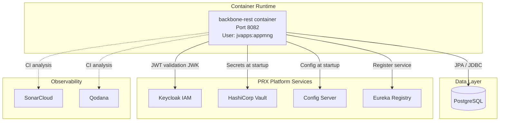

# Deployment Guide — backbone-rest

---

## 1. Prerequisites

| Requirement | Details |
|-------------|---------|
| Java | 21 (Amazon Corretto recommended) |
| Maven | 3.x (no wrapper in repo — `mvn` must be on `PATH`) |
| Docker | For containerised deployment |
| Repsy credentials | `REPSY_ACCOUNT_USER` and `REPSY_ACCOUNT_PASSWORD` env vars |
| PostgreSQL | Production database |
| Keycloak | OAuth2/OIDC identity provider |
| HashiCorp Vault | Secrets management |
| Spring Cloud Config Server | Centralised configuration |
| Netflix Eureka | Service discovery registry |
| SSL certificates | `keystore.jks`, app/auth/config-server `.crt` files |

---

## 2. Environment Variables

All configuration is injected via environment variables. The following table lists **all required** variables:

### Application

| Variable | Example | Description |
|----------|---------|-------------|
| `APP_PORT` | `8082` | HTTP/HTTPS server port |
| `APP_TOKEN_SECRET` | `<base64-secret>` | HMAC signing key for session JWTs |
| `APP_TOKEN_EXPIRATION` | `3600000` | Session JWT TTL in milliseconds |
| `SPRING_BOOT_PROFILE_ACTIVE` | `qa` | Active Spring profile |
| `SPRING_BOOT_CLOUD_BOOTSTRAP_ENABLED` | `true` | Enable bootstrap context |
| `SPRING_CLOUD_CONFIG_LABEL` | `Develop` | Config server branch/label |

### Auth / Keycloak

| Variable | Example | Description |
|----------|---------|-------------|
| `AUTH_SERVER_URI` | `https://keycloak.prx.test/realms/prx` | Keycloak issuer URI (also used as JWK set base) |
| `AUTH_CERT_URI` | `/protocol/openid-connect/certs` | JWK endpoint path (appended to `AUTH_SERVER_URI`) |
| `AUTH_CLIENT_ID` | `backbone-rest-client` | OAuth2 client ID |
| `AUTH_CLIENT_SECRET` | `<secret>` | OAuth2 client secret |

### SSL

| Variable | Example | Description |
|----------|---------|-------------|
| `SSL_KEYSTORE_LOCATION` | `keystore.jks` | Classpath location of keystore |
| `SSL_KEYSTORE_PASSWORD` | `<password>` | Keystore password |
| `SSL_KEYSTORE_TYPE` | `JKS` | Keystore type |
| `SSL_TRUSTSTORE_LOCATION` | `keystore.jks` | Classpath location of truststore |
| `SSL_TRUSTSTORE_PASSWORD` | `<password>` | Truststore password |
| `SSL_TRUSTSTORE_TYPE` | `JKS` | Truststore type |

### Vault

| Variable | Example | Description |
|----------|---------|-------------|
| `VAULT_TOKEN` | `<token>` | HashiCorp Vault access token |
| `VAULT_SERVER_URL` | `https://vault.prx.test` | Vault server URL |
| `VAULT_ENABLED` | `true` | Enable Vault integration at runtime |

### Config Server

| Variable | Example | Description |
|----------|---------|-------------|
| `CNFS_URI` | `https://config.prx.test` | Spring Cloud Config Server URI |
| `CNFS_PORT` | `443` | Config Server port |

### Build / Repsy

| Variable | Example | Description |
|----------|---------|-------------|
| `REPSY_ACCOUNT_USER` | `lmata` | Repsy Maven repository username |
| `REPSY_ACCOUNT_PASSWORD` | `<password>` | Repsy Maven repository password |

---

## 3. Build Steps

### 3.1 Compile Only (fast check)

```bash
export REPSY_ACCOUNT_USER=<user>
export REPSY_ACCOUNT_PASSWORD=<password>
mvn -DskipTests compile
```

### 3.2 Run Unit Tests

```bash
mvn test
```

> PMD runs at the `test` phase. Any PMD violation **fails the build**.

### 3.3 Run a Single Test Class

```bash
mvn -Dtest=UserServiceImplTest test
```

### 3.4 Package (fat JAR)

```bash
mvn -DskipTests package
```

Output: `target/backbone-rest.jar`

### 3.5 JVM Start Arguments

```bash
java \
  -Dspring.application.name=backbone-rest \
  -Dspring.profiles.active=qa \
  -Dspring.config.import=optional:configserver:${CNFS_URI}/ \
  -Dspring.cloud.config.label=Develop \
  -Dapi.info.version=0.0.2 \
  -Dspring.cloud.vault.enabled=true \
  --add-opens java.base/java.time=ALL-UNNAMED \
  -jar target/backbone-rest.jar
```

---

## 4. Docker Build & Run

### 4.1 Build the Docker Image

```bash
docker build \
  --build-arg JAR_FILE=backbone-rest.jar \
  -t lamata/backbone-rest:0.0.3 .
```

> Certificates (`keystore.jks`, `*.crt`) must be present at the project root at build time.

### 4.2 Run the Container

```bash
docker run -d \
  --name backbone-rest \
  -p 8082:8082 \
  -e APP_PORT=8082 \
  -e APP_TOKEN_SECRET=<secret> \
  -e APP_TOKEN_EXPIRATION=3600000 \
  -e AUTH_SERVER_URI=https://keycloak.prx.test/realms/prx \
  -e AUTH_CERT_URI=/protocol/openid-connect/certs \
  -e AUTH_CLIENT_ID=backbone-rest-client \
  -e AUTH_CLIENT_SECRET=<secret> \
  -e SSL_KEYSTORE_LOCATION=keystore.jks \
  -e SSL_KEYSTORE_PASSWORD=<password> \
  -e SSL_KEYSTORE_TYPE=JKS \
  -e SSL_TRUSTSTORE_LOCATION=keystore.jks \
  -e SSL_TRUSTSTORE_PASSWORD=<password> \
  -e SSL_TRUSTSTORE_TYPE=JKS \
  -e VAULT_TOKEN=<token> \
  -e VAULT_SERVER_URL=https://vault.prx.test \
  -e VAULT_ENABLED=true \
  -e CNFS_URI=https://config.prx.test \
  -e CNFS_PORT=443 \
  -e SPRING_BOOT_PROFILE_ACTIVE=qa \
  -e SPRING_BOOT_CLOUD_BOOTSTRAP_ENABLED=true \
  -e SPRING_CLOUD_CONFIG_LABEL=Develop \
  lamata/backbone-rest:0.0.3
```

### 4.3 Push to Registry

```bash
docker push lamata/backbone-rest -u <USER_REGISTRY> -p <TOKEN>
```

### 4.4 Pull from Registry

```bash
docker pull lamata/backbone-rest -u <USER_REGISTRY> -p <TOKEN>
```

---

## 5. Dockerfile Anatomy

```dockerfile
FROM amazoncorretto:21-alpine3.20          # Java 21 base on Alpine
LABEL version="0.0.3"
WORKDIR /usr/local/runme

COPY target/backbone-rest.jar backbone-rest.jar
COPY keystore.jks keystore.jks
COPY *.crt .                               # Copy TLS certificates

# Non-root user for security
RUN addgroup -S appmng && adduser -S jvapps -G appmng
RUN chown -R jvapps:appmng . && chmod -R 740 .

# Import certs into JVM truststore
RUN keytool -import -alias prx-qa          -keystore <jvm-cacerts> -file prx-qa.crt ...
RUN keytool -import -alias prx-qa.manager  -keystore <jvm-cacerts> -file prx-qa.manager.crt ...
RUN keytool -import -alias srmn            -keystore <jvm-cacerts> -file srmn.crt ...
RUN keytool -import -alias prx-qa.config-server -keystore <jvm-cacerts> -file prx-qa.config-server.crt ...
RUN rm *.crt                               # Clean up after import

# Image directories for profile photos
RUN mkdir /opt/images && mkdir /opt/images/LTHB

USER jvapps:appmng
EXPOSE 8082

CMD ["java", "-Dspring.cloud.vault.enabled=${VAULT_ENABLED}", \
     "-Dspring.application.name=backbone-rest", \
     "-jar", "backbone-rest.jar"]
```

---

## 6. CI/CD Pipeline (GitLab)

The project uses `.gitlab-ci.yml` with two stages:

### SonarCloud Analysis

Triggered on: `merge_requests`, `master`, `Develop`

```bash
mvn verify sonar:sonar \
  -Dspring.cloud.vault.enabled=false \
  -Dsonar.projectKey=prx-open_backbone-rest \
  -s ci_settings.xml
```

| Setting | Value |
|---------|-------|
| Sonar organisation | `prx-open` |
| Project key | `prx-open_backbone-rest` |
| Maven image | `maven:3.9.9-eclipse-temurin-21` |

### JetBrains Qodana

Triggered on: `merge_requests`, `master`, `Develop`

| Setting | Value |
|---------|-------|
| Image | `jetbrains/qodana-jvm-community:2024.1` |
| Report output | `.qodana/results/` |
| Code quality format | `gl-code-quality-report.json` |

---

## 7. Health & Observability

Spring Boot Actuator is enabled. Key endpoints:

| Path | Description |
|------|-------------|
| `/actuator/health` | Service health check |
| `/actuator/info` | Build and app metadata |
| `/actuator/metrics` | Application metrics |

---

## 8. Artifact Distribution

Releases are deployed to the **Repsy private Maven repository**:

```xml
<distributionManagement>
  <repository>
    <id>PRX-Repsy</id>
    <url>https://repo.repsy.io/mvn/${repsy.account.user}/${repsy.account.password}</url>
  </repository>
</distributionManagement>
```

Deploy command:
```bash
mvn deploy -s ci_settings.xml
```

---

## 9. Default Environment (Development Starter)

`src/main/resources/default.env` provides minimal values for local development:

```dotenv
SPRING_BOOT_PROFILE_ACTIVE=dev
SPRING_CLOUD_CONFIG_LABEL=Develop
CONFIG_SERVER_URL=https://prx-qa.config-server.tst
```

> Most production values (secrets, certificates) must come from Vault or your local `.env` override.

---

## 10. Deployment Topology



