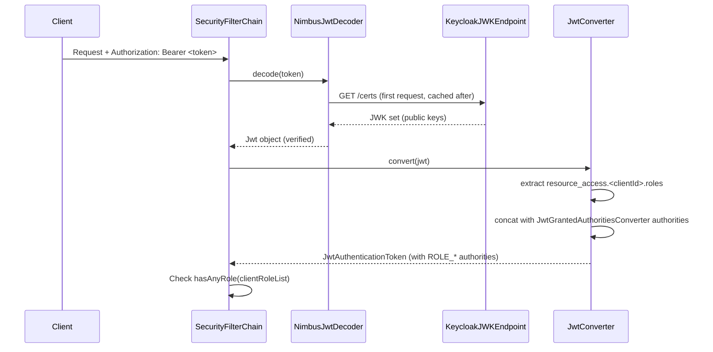
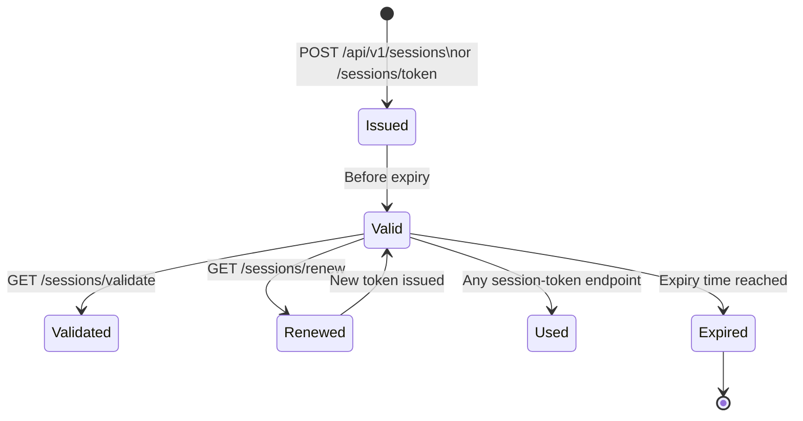

# Security Design — backbone-rest

---

## 1. Security Overview

backbone-rest operates with **two independent JWT authentication layers**:

```
┌──────────────────────────────────────────────────────────────┐
│  Layer 1 — Keycloak OAuth2 Resource Server (Inbound)         │
│  ─────────────────────────────────────────────────────────   │
│  • Every inbound request must carry an Authorization Bearer  │
│    token issued by Keycloak.                                 │
│  • Validated via NimbusJwtDecoder using Keycloak JWK URI.    │
│  • Roles are extracted from resource_access.<clientId>.roles │
│  • Enforced by Spring SecurityFilterChain.                   │
└──────────────────────────────────────────────────────────────┘

┌──────────────────────────────────────────────────────────────┐
│  Layer 2 — App-Specific Session JWT (Session endpoints)      │
│  ─────────────────────────────────────────────────────────   │
│  • Generated by SessionServiceImpl on successful login.      │
│  • Signed with APP_TOKEN_SECRET (HMAC / JJWT).              │
│  • Passed in the session-token HTTP header.                  │
│  • Required by profile image and other session-aware APIs.   │
└──────────────────────────────────────────────────────────────┘
```

---

## 2. OAuth2 Resource Server (Keycloak)

### 2.1 Configuration

```yaml
# bootstrap.yml
spring:
  security:
    oauth2:
      resourceserver:
        jwt:
          issuer-uri: ${AUTH_SERVER_URI}
          jwk-set-uri: ${AUTH_SERVER_URI}${AUTH_CERT_URI}
```

### 2.2 Token Validation Flow



### 2.3 Role Extraction — JwtConverter

The `JwtConverter` class reads Keycloak's `resource_access` claim:

```json
{
  "resource_access": {
    "backbone-rest-client": {
      "roles": ["ADMIN", "USER"]
    }
  }
}
```

Each role is prefixed with `ROLE_` to match Spring Security's convention:
- `"ADMIN"` → `ROLE_ADMIN`
- `"USER"` → `ROLE_USER`

The `resourceId` is configured via `JwtConverterProperties` (typically `backbone-rest-client`).

---

## 3. Security Filter Chain Rules

```java
// SecurityConfig.java (simplified)
http.authorizeHttpRequests(auth -> auth
    .requestMatchers(SWAGGER_LIST).permitAll()           // Swagger UI: open
    .requestMatchers(GET, "/v1/**").hasAnyRole(clientRoles)  // GET endpoints: role check
    .anyRequest().authenticated()                        // Everything else: authenticated
)
.oauth2ResourceServer(oauth2 -> oauth2.jwt(jwt -> jwt.jwtAuthenticationConverter(jwtConverter)));
```

| Path Pattern | Rule |
|-------------|------|
| `/swagger-ui/**` | Permit all (no auth required) |
| `/v3/api-docs/**` | Permit all (no auth required) |
| `/swagger-resources/**` | Permit all (no auth required) |
| `GET /v1/**` | `hasAnyRole` from `app.clientRoles` config |
| Any other request | Must be `authenticated` (valid JWT) |

> Sessions endpoints (`/v1/sessions/token`, `/v1/sessions/validate`) are listed in `app.api.excludes` for exemption from token requirement.

---

## 4. Session JWT (App-Specific)

### 4.1 Token Generation

`SessionServiceImpl` generates a JJWT-signed token upon successful user authentication:

```
Algorithm : HMAC SHA-256 (or stronger, based on key size)
Key source: APP_TOKEN_SECRET (Base64-encoded secret from env/Vault)
Expiry    : APP_TOKEN_EXPIRATION (milliseconds, from env/Vault)
Claims    : sub=<username>, type="session-token", + custom params
```

### 4.2 Configuration

```yaml
# bootstrap.yml
prx:
  jwt:
    secret: ${APP_TOKEN_SECRET}
    expirationMs: ${APP_TOKEN_EXPIRATION}
```

### 4.3 Token Lifecycle



### 4.4 SessionJwtService Interface

| Method | Description |
|--------|-------------|
| `generateSessionToken(username, params)` | Creates and signs a new JWT |
| `isValid(token)` | Checks type claim and expiry |
| `isTokenExpired(token)` | Returns true if `exp` < now |
| `getKeycloakUserIdFromToken(token)` | Extracts `sub` claim |
| `getUsernameFromToken(token)` | Extracts username from token |
| `getTokenClaims(token)` | Returns all JWT claims |

---

## 5. SSL / TLS Configuration

### 5.1 Server SSL

The embedded Tomcat is configured for **TLSv1.3 only**:

```yaml
server:
  ssl:
    enabled: true
    bundle: backbone-rest-security
    enabled-protocols: TLSv1.3
    compression:
      enabled: true
```

### 5.2 SSL Bundle

```yaml
spring:
  ssl:
    bundle:
      jks:
        backbone-rest-security:
          keystore:
            location: classpath:${SSL_KEYSTORE_LOCATION}
            password: ${SSL_KEYSTORE_PASSWORD}
            type: ${SSL_KEYSTORE_TYPE}
          truststore:
            location: classpath:${SSL_TRUSTSTORE_LOCATION}
            password: ${SSL_TRUSTSTORE_PASSWORD}
            type: ${SSL_TRUSTSTORE_TYPE}
```

### 5.3 Certificate Chain (Docker)

The Docker image imports four certificates into the JVM truststore during build:

| Alias | Certificate | Purpose |
|-------|------------|---------|
| `prx-qa` | `prx-qa.crt` | PRX application cert |
| `prx-qa.manager.tst` | `prx-qa.manager.crt` | Keycloak auth server cert |
| `srmn` | `srmn.crt` | Service monitor cert |
| `prx-qa.config-server` | `prx-qa.config-server.crt` | Config server cert |

---

## 6. Secrets Management (HashiCorp Vault)

Sensitive values (DB passwords, JWT secrets, SSL passwords) are managed in Vault:

```yaml
spring:
  cloud:
    vault:
      token: ${VAULT_TOKEN}
      uri: ${VAULT_SERVER_URL}
      kv:
        backend: PRX
        default-context: backbone-rest
      application-name: backbone-rest
```

The `spring-cloud-starter-vault-config` dependency fetches secrets at application startup from `PRX/backbone-rest` KV path.

---

## 7. Environment Variables — Security Related

| Variable | Purpose |
|----------|---------|
| `APP_TOKEN_SECRET` | HMAC signing key for session JWTs |
| `APP_TOKEN_EXPIRATION` | Session JWT TTL in milliseconds |
| `AUTH_SERVER_URI` | Keycloak issuer URI |
| `AUTH_CERT_URI` | Keycloak JWK endpoint path (appended to issuer URI) |
| `AUTH_CLIENT_ID` | OAuth2 client ID |
| `AUTH_CLIENT_SECRET` | OAuth2 client secret |
| `SSL_KEYSTORE_LOCATION` | Classpath location of keystore JKS file |
| `SSL_KEYSTORE_PASSWORD` | Keystore password |
| `SSL_KEYSTORE_TYPE` | Keystore type (e.g. JKS, PKCS12) |
| `SSL_TRUSTSTORE_LOCATION` | Classpath location of truststore |
| `SSL_TRUSTSTORE_PASSWORD` | Truststore password |
| `SSL_TRUSTSTORE_TYPE` | Truststore type |
| `VAULT_TOKEN` | HashiCorp Vault access token |
| `VAULT_SERVER_URL` | Vault server URL |

---

## 8. Known Security Considerations

| Area | Note |
|------|------|
| `@CrossOrigin(origins = "*")` | Controllers allow any origin; should be restricted in production |
| Password storage | Passwords processed in service layer — confirm hashing (BCrypt) is applied in `UserEntity` or service |
| Session token in header | `session-token` header is not a standard Bearer token; clients must handle separately |
| CSRF | Disabled (stateless REST + JWT — acceptable for API-only services) |
| Session creation policy | `STATELESS` — no HTTP sessions created |
| Swagger UI | Publicly accessible — does not expose sensitive data but reveals API surface |

